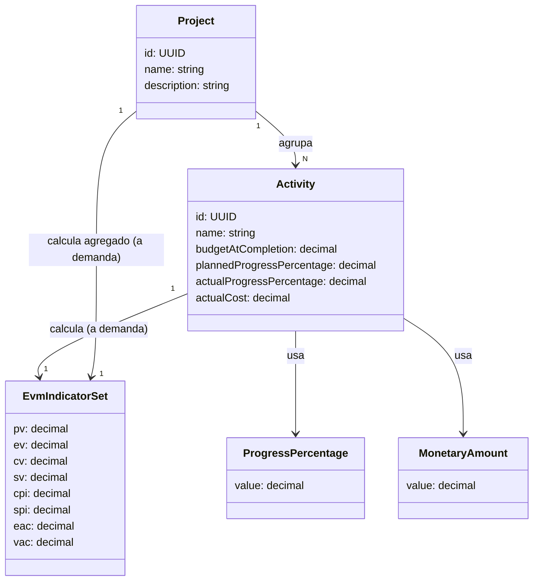

> Cada `app` o `extension` es un Contexto Delimitado (Bounded Context) y tiene su propio `domain-model.md`, su propio lenguaje ubicuo interno y sus propias reglas de negocio — no se comparte entre contextos. Este documento es la base para nombrar archivos, código y su estructura. Lo crea SPEC (vía EDITOR) la primera vez que aparece un contexto delimitado nuevo, a partir de la propuesta que IDEA cerró en `draft.md`.

---

> **Nomenclatura obligatoria:** `DB` (inglés) se reserva siempre para base de datos/database; `BD`/`BDs` se reserva siempre para Contexto Delimitado/Bounded Context — nunca se usan de forma intercambiable ni se mezclan en el mismo documento.

---

# Modelo de dominio: EVM Project Tool (apps/backend)

## Resumen

Concentra toda la lógica de negocio, validaciones y el cálculo de los indicadores de Valor Ganado (EVM, estándar PMI) de proyectos y actividades. Sirve al actor "líder de proyecto". Responsabilidad única: dado un `Project` y sus `Activity`, calcular en tiempo real (sin persistir) el conjunto de indicadores EVM por actividad y consolidados por proyecto, con interpretación textual de CPI/SPI.

## Diagrama mermaid

## Glosario de lenguaje ubicuo

| Término | Definición |
|---------|-----------|
| Project | Esfuerzo temporal que agrupa actividades. Agregado / entidad raíz del contexto. |
| Activity | Paquete de trabajo medible dentro de un proyecto; equivalente simplificado de Control Account/Work Package del lenguaje ubicuo PMI, sin descomposición en WBS formal. |
| EvmIndicatorSet | Conjunto de indicadores EVM (PV, EV, CV, SV, CPI, SPI, EAC, VAC) e interpretaciones textuales, calculado a demanda a partir de una `Activity` o agregando las `Activity` de un `Project`; no se persiste. |
| BAC | Budget At Completion — presupuesto total al completar, atributo `budgetAtCompletion` de `Activity`. |
| AC | Actual Cost — costo real, atributo `actualCost` de `Activity`. |
| PV | Planned Value — valor planificado, componente calculado de `EvmIndicatorSet`. |
| EV | Earned Value — valor ganado, componente calculado de `EvmIndicatorSet`. |
| CV | Cost Variance — variación de costo, componente calculado de `EvmIndicatorSet`. |
| SV | Schedule Variance — variación de cronograma, componente calculado de `EvmIndicatorSet`. |
| CPI | Cost Performance Index — índice de desempeño de costo, componente calculado de `EvmIndicatorSet`. |
| SPI | Schedule Performance Index — índice de desempeño de cronograma, componente calculado de `EvmIndicatorSet`. |
| EAC | Estimate At Completion — estimado al completar, componente calculado de `EvmIndicatorSet`. |
| VAC | Variance At Completion — variación al completar, componente calculado de `EvmIndicatorSet`. |
| ProgressPercentage | Objeto de valor que representa un porcentaje de avance físico, decimal 0.0 a 100.0. |
| MonetaryAmount | Objeto de valor simplificado: cantidad decimal no negativa, sin moneda explícita. |
| Project (Agregado/Entidad raíz) | `Project` es la entidad raíz del agregado de este Contexto Delimitado; agrupa y da contexto a las `Activity`. |

## Entidades

- **Project** — Agregado / Entidad Raíz; representa el esfuerzo temporal que agrupa actividades.
- **Activity** — Entidad; paquete de trabajo medible perteneciente a un `Project`.
- **EvmIndicatorSet** — Objeto de Valor calculado, no persistido; agrupa los indicadores EVM y sus interpretaciones textuales.
- **ProgressPercentage** — Objeto de Valor; porcentaje de avance físico (0.0 a 100.0).
- **MonetaryAmount** — Objeto de Valor simplificado; cantidad decimal no negativa, sin moneda explícita.

## Atributos

### Project

| Atributo | Tipo | Obligatorio |
|----------|------|-------------|
| id | UUID | Sí |
| name | string | Sí |
| description | string | No |

### Activity

| Atributo | Tipo | Obligatorio |
|----------|------|-------------|
| id | UUID | Sí |
| name | string | Sí |
| budgetAtCompletion (BAC) | decimal | Sí |
| plannedProgressPercentage | decimal | Sí |
| actualProgressPercentage | decimal | Sí |
| actualCost (AC) | decimal | Sí |

### EvmIndicatorSet

| Atributo | Tipo | Obligatorio |
|----------|------|-------------|
| pv (PV) | decimal o null | Calculado |
| ev (EV) | decimal o null | Calculado |
| cv (CV) | decimal o null | Calculado |
| sv (SV) | decimal o null | Calculado |
| cpi (CPI) | decimal o null | Calculado |
| spi (SPI) | decimal o null | Calculado |
| eac (EAC) | decimal o null | Calculado |
| vac (VAC) | decimal o null | Calculado |

### ProgressPercentage

| Atributo | Tipo | Obligatorio |
|----------|------|-------------|
| value | decimal (0.0–100.0) | Sí |

### MonetaryAmount

| Atributo | Tipo | Obligatorio |
|----------|------|-------------|
| value | decimal (>= 0) | Sí |

## Relaciones y multiplicidad

- **Project** `1:N` **Activity** — un proyecto agrupa muchas actividades; una actividad pertenece a un único proyecto.
- **Activity** `1:1` **EvmIndicatorSet** — calculado a demanda, no almacenado; cada actividad, al leerse, produce su propio conjunto de indicadores.
- **Project** `1:1` **EvmIndicatorSet** — calculado a demanda, agregado; cada proyecto, al leerse, produce un conjunto de indicadores consolidado agregando sus actividades.

## Reglas de negocio

- **RN-09 [Manejo de división por cero]**: cuando `AC = 0`, `CPI` no es calculable — se expone como `null` con interpretación textual explícita ("Sin costo real registrado — CPI no aplicable"), nunca excepción ni `Infinity`. En cascada, si `CPI` es `null`, `EAC` y `VAC` también son `null` con la misma razón. Cuando `PV = 0`, `SPI` no es calculable — mismo tratamiento (`null` + "Sin avance planificado a la fecha — SPI no aplicable").
- **RN-10 [Rango válido de porcentajes]**: `plannedProgressPercentage` y `actualProgressPercentage` deben estar entre 0 y 100 inclusive.
- **RN-11 [No negatividad de valores monetarios]**: `budgetAtCompletion` y `actualCost` deben ser >= 0.
