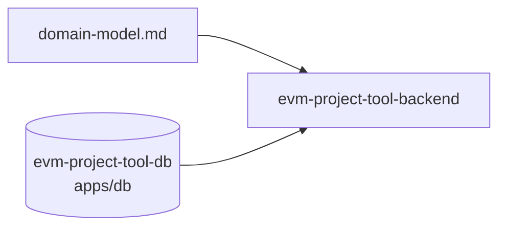

# Specs: apps/backend

> API REST y lógica de negocio EVM.

## Grafo de specs

## Tabla de specs

| Spec | Estado | Creación | Paralelizable con | Ruta | Depende de |
|---|:---:|:---:|:---:|---|---|
| [evm-project-tool-backend] | `Pendiente` | `Aprobado` | `B` | `evm-project-tool-backend/summary.md` | `../../db/evm-project-tool-db/summary.md` |
