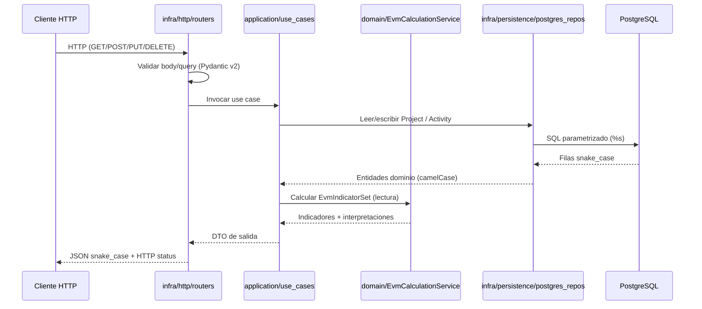

# Technical Design Document: evm-project-tool-backend

## 1. Metadata & Traceability
- **Spec:** `evm-project-tool-backend`
- **Requirements Ref:** `requirements.md` (spec: `evm-project-tool-backend`)
- **Target Stack:** Python 3.14.7, FastAPI 0.141.1, Pydantic v2, uv 0.12.9, psycopg 3.2.10, ruff 0.16.3, arquitectura hexagonal (`domain` / `application` / `infra`)

---

## 2. Architecture & System Overview

### 2.1 Architectural Approach
API REST FastAPI con arquitectura hexagonal en `apps/backend/`. Tres capas con dependencias hacia el centro:

| Capa | Responsabilidad | Artefactos principales |
|------|-----------------|------------------------|
| **domain/** | Entidades, objetos de valor, reglas EVM (RN-01..RN-13), sin dependencias externas | `Project`, `Activity`, `EvmIndicatorSet`, `EvmCalculationService` |
| **application/** | Orquestación de casos de uso; define puertos (interfaces) hacia persistencia | Use cases (`create_project`, `list_projects`, …) + `ports/in` (repositorios) |
| **infra/** | Adaptadores: HTTP (FastAPI) y persistencia (psycopg) | Routers, schemas Pydantic, repos PostgreSQL, `main.py` |

Flujo de dependencia: `infra` → `application` → `domain`. El dominio nunca importa FastAPI ni psycopg.

### 2.2 Component Diagram / Module Interaction



### 2.5 Decisiones cerradas (heredadas de IDEA / requirements)
- **Sin ORM:** acceso a PostgreSQL exclusivamente con SQL directo y placeholders `%s` parametrizados (psycopg 3). Motivo: control explícito de queries, alineación con unit-spec db.
- **Pydantic v2 obligatorio:** todos los schemas de request/response en `infra/http/schemas/` usan Pydantic v2 (`BaseModel`, `Field`, `model_validator`). Motivo: stack fijado y validación HTTP 422 uniforme.
- **Indicadores NO persistidos:** `EvmIndicatorSet` se calcula en cada lectura; no hay tabla ni columna de indicadores. Motivo: decisión de alcance cerrada (sin histórico/tendencia).
- **EAC solo tasa típica:** `EAC = BAC / CPI` (RN-07). No se implementan TCPI, ETC ni modelos alternativos de EAC. Motivo: out of scope explícito.
- **Sin auth:** no hay middleware de autenticación ni autorización. Motivo: out of scope; CORS configurable sustituye control de acceso por origen.
- **`lefthook.yml`:** la unit-spec db (`evm-project-tool-db`) ya tiene **Tarea 1.1** para crear `lefthook.yml` en la raíz del repositorio con `backend-lint`, `backend-format`, `frontend-lint` y `frontend-format`. El bloque `pre-commit` ya cubre `apps/backend/` (ruff check + ruff format). **Este spec backend NO duplica esa tarea; no se requiere tarea adicional de lefthook en backend.**

### 2.6 Riesgos y mitigaciones

| Riesgo | Impacto | Mitigación |
|:---|:---|:---|
| Consolidación incorrecta (promediar CPI/SPI en lugar de agregar bases) | Alto — indicadores de proyecto erróneos | Lógica centralizada en `EvmCalculationService.aggregate(project_activities)` con tests EC-03 y RN-12 |
| División por cero (AC=0, PV=0) devuelve `Infinity` o HTTP 500 | Alto — API inestable | RN-09 implementada en dominio; retorno `null` + interpretación; WARNING en logs; tests EC-01, EC-02 |
| SQL injection por concatenación de input | Crítico | Prohibición explícita; code review + ruff; solo `%s` con tuplas de parámetros |
| Pool de conexiones agotado bajo carga | Medio | `psycopg_pool.ConnectionPool` con tamaño configurable vía env; cierre graceful en shutdown de FastAPI |

---

## 3. Data Models & Schema Design

### 3.1 Domain Entities (Core Business Objects)
Entidades alineadas con [`../../domain-model.md`](../../domain-model.md):

| Entidad dominio (camelCase) | Tipo | Persistida | Descripción |
|-----------------------------|------|------------|-------------|
| `Project` | Agregado raíz | Sí (`projects`) | Agrupa actividades; en lectura produce `EvmIndicatorSet` consolidado (RN-12) |
| `Activity` | Entidad | Sí (`activities`) | Paquete de trabajo con BAC, avances y AC |
| `EvmIndicatorSet` | Objeto de valor | No | PV, EV, CV, SV, CPI, SPI, EAC, VAC + interpretaciones CPI/SPI |
| `ProgressPercentage` | Objeto de valor | No (embebido en Activity) | Decimal 0.0–100.0 |
| `MonetaryAmount` | Objeto de valor | No (embebido en Activity) | Decimal ≥ 0 |

Servicio de dominio puro: `EvmCalculationService` — métodos `calculate_for_activity(activity) -> EvmIndicatorSet` y `aggregate(activities: list[Activity]) -> EvmIndicatorSet`.

### 3.2 Database Schema & Persistence
- **Referencia esquema DB:** [`../../db/evm-project-tool-db/db-design.dbml`](../../db/evm-project-tool-db/db-design.dbml) y [`../../db/evm-project-tool-db/design.md`](../../db/evm-project-tool-db/design.md) §3.2.
- **Tablas consumidas:** `projects`, `activities` (DDL y constraints definidos por unit-spec db; este backend no crea migraciones).
- **Campos persistidos por entidad:**

**`projects`**

| Columna DB (snake_case) | Atributo dominio (camelCase) | Tipo |
|-------------------------|------------------------------|------|
| `id` | `id` | UUID |
| `name` | `name` | string |
| `description` | `description` | string \| null |
| `created_at` | `createdAt` | datetime |
| `updated_at` | `updatedAt` | datetime |

**`activities`**

| Columna DB (snake_case) | Atributo dominio (camelCase) | Tipo |
|-------------------------|------------------------------|------|
| `id` | `id` | UUID |
| `project_id` | `projectId` | UUID |
| `name` | `name` | string |
| `budget_at_completion` | `budgetAtCompletion` | decimal |
| `planned_progress_percentage` | `plannedProgressPercentage` | decimal |
| `actual_progress_percentage` | `actualProgressPercentage` | decimal |
| `actual_cost` | `actualCost` | decimal |
| `created_at` | `createdAt` | datetime |
| `updated_at` | `updatedAt` | datetime |

### 3.3 Mapeo snake_case DB ↔ camelCase dominio ↔ snake_case API JSON
- **Repositorios (`infra/persistence/`):** filas PostgreSQL → entidades dominio en camelCase.
- **Schemas HTTP (`infra/http/schemas/`):** serialización JSON en **snake_case** (convención REST Python/FastAPI) mediante `model_config = ConfigDict(populate_by_name=True)` y aliases o nombres snake_case en campos Pydantic.
- **Indicadores en respuesta API:** claves snake_case (`cpi_interpretation`, `budget_at_completion`, etc.).

Ejemplo de traducción en capa infra:

```
DB row.budget_at_completion  →  domain Activity.budgetAtCompletion  →  JSON "budget_at_completion"
```

---

## 4. Interfaces, Contracts & API Specifications

### 4.1 Internal Service Interfaces / Ports

**Puertos de entrada (application/ports/in/):**

| Puerto | Métodos | Implementado por |
|--------|---------|------------------|
| `ProjectRepository` | `create`, `get_by_id`, `list_all`, `update`, `delete` | `PostgresProjectRepository` |
| `ActivityRepository` | `create`, `get_by_id`, `list_by_project_id`, `update`, `delete`, `exists_project` | `PostgresActivityRepository` |

**Use cases (application/use_cases/):**

| Use case | REQ | Descripción |
|----------|-----|-------------|
| `create_project` | REQ-01 | Valida name no vacío; persiste proyecto |
| `list_projects` | REQ-01 | Lista todos los proyectos (sin indicadores) |
| `get_project` | REQ-01, REQ-05 | Detalle + `consolidated_indicators` (RN-12/RN-13) |
| `update_project` | REQ-01 | Actualiza name/description |
| `delete_project` | REQ-01 | Elimina; 404 si no existe |
| `list_activities` | REQ-02, REQ-03 | Lista actividades del proyecto con indicadores por fila |
| `create_activity` | REQ-02 | Valida RN-10/RN-11; 404 si project_id inexistente |
| `get_activity` | REQ-02, REQ-03 | Detalle con indicadores |
| `update_activity` | REQ-02 | Actualiza campos de actividad |
| `delete_activity` | REQ-02 | Elimina; 404 si no existe |

### 4.2 External API / RPC / Event Schemas

**Base path:** `/api/v1`

**Documentación interactiva:**
- Swagger UI primario: `/api-docs`
- Redirect opcional: `/swagger-ui` → `/api-docs`
- OpenAPI JSON: `/openapi.json`

**CORS:** variable de entorno `CORS_ORIGINS` — lista separada por comas (ej. `http://localhost:5173,http://localhost:3000`). Sin wildcard `*` en producción.

**Variables de entorno requeridas:**

| Variable | Uso |
|----------|-----|
| `DATABASE_URL` | Cadena de conexión PostgreSQL para `ConnectionPool` |
| `CORS_ORIGINS` | Orígenes permitidos (comma-separated) |
| `LOG_LEVEL` | Opcional; default `INFO` |

#### Contrato OpenAPI 3.1 (referencia para frontend)

```yaml
openapi: 3.1.0
info:
  title: EVM Project Tool API
  version: 1.0.0
  description: API REST para gestión de proyectos/actividades y cálculo EVM en lectura.
servers:
  - url: /api/v1
paths:
  /projects:
    get:
      operationId: listProjects
      summary: Listar proyectos
      tags: [Projects]
      responses:
        '200':
          description: Lista de proyectos
          content:
            application/json:
              schema:
                type: array
                items:
                  $ref: '#/components/schemas/ProjectResponse'
    post:
      operationId: createProject
      summary: Crear proyecto
      tags: [Projects]
      requestBody:
        required: true
        content:
          application/json:
            schema:
              $ref: '#/components/schemas/ProjectCreateRequest'
      responses:
        '201':
          description: Proyecto creado
          content:
            application/json:
              schema:
                $ref: '#/components/schemas/ProjectResponse'
        '422':
          $ref: '#/components/responses/ValidationError'

  /projects/{project_id}:
    parameters:
      - $ref: '#/components/parameters/ProjectId'
    get:
      operationId: getProject
      summary: Detalle de proyecto con indicadores consolidados
      tags: [Projects]
      responses:
        '200':
          description: Proyecto con indicadores consolidados (RN-12)
          content:
            application/json:
              schema:
                $ref: '#/components/schemas/ProjectDetailResponse'
        '404':
          $ref: '#/components/responses/NotFound'
    put:
      operationId: updateProject
      summary: Actualizar proyecto
      tags: [Projects]
      requestBody:
        required: true
        content:
          application/json:
            schema:
              $ref: '#/components/schemas/ProjectUpdateRequest'
      responses:
        '200':
          description: Proyecto actualizado
          content:
            application/json:
              schema:
                $ref: '#/components/schemas/ProjectResponse'
        '404':
          $ref: '#/components/responses/NotFound'
        '422':
          $ref: '#/components/responses/ValidationError'
    delete:
      operationId: deleteProject
      summary: Eliminar proyecto
      tags: [Projects]
      responses:
        '204':
          description: Proyecto eliminado
        '404':
          $ref: '#/components/responses/NotFound'

  /projects/{project_id}/activities:
    parameters:
      - $ref: '#/components/parameters/ProjectId'
    get:
      operationId: listActivitiesByProject
      summary: Listar actividades con indicadores
      tags: [Activities]
      responses:
        '200':
          description: Actividades del proyecto con indicadores por actividad
          content:
            application/json:
              schema:
                type: array
                items:
                  $ref: '#/components/schemas/ActivityWithIndicatorsResponse'
        '404':
          $ref: '#/components/responses/NotFound'
    post:
      operationId: createActivity
      summary: Crear actividad en proyecto
      tags: [Activities]
      requestBody:
        required: true
        content:
          application/json:
            schema:
              $ref: '#/components/schemas/ActivityCreateRequest'
      responses:
        '201':
          description: Actividad creada con indicadores calculados
          content:
            application/json:
              schema:
                $ref: '#/components/schemas/ActivityWithIndicatorsResponse'
        '404':
          $ref: '#/components/responses/NotFound'
        '422':
          $ref: '#/components/responses/ValidationError'

  /activities/{activity_id}:
    parameters:
      - $ref: '#/components/parameters/ActivityId'
    get:
      operationId: getActivity
      summary: Detalle de actividad con indicadores
      tags: [Activities]
      responses:
        '200':
          description: Actividad con indicadores
          content:
            application/json:
              schema:
                $ref: '#/components/schemas/ActivityWithIndicatorsResponse'
        '404':
          $ref: '#/components/responses/NotFound'
    put:
      operationId: updateActivity
      summary: Actualizar actividad
      tags: [Activities]
      requestBody:
        required: true
        content:
          application/json:
            schema:
              $ref: '#/components/schemas/ActivityUpdateRequest'
      responses:
        '200':
          description: Actividad actualizada con indicadores recalculados
          content:
            application/json:
              schema:
                $ref: '#/components/schemas/ActivityWithIndicatorsResponse'
        '404':
          $ref: '#/components/responses/NotFound'
        '422':
          $ref: '#/components/responses/ValidationError'
    delete:
      operationId: deleteActivity
      summary: Eliminar actividad
      tags: [Activities]
      responses:
        '204':
          description: Actividad eliminada
        '404':
          $ref: '#/components/responses/NotFound'

components:
  parameters:
    ProjectId:
      name: project_id
      in: path
      required: true
      schema:
        type: string
        format: uuid
    ActivityId:
      name: activity_id
      in: path
      required: true
      schema:
        type: string
        format: uuid

  schemas:
    ProjectCreateRequest:
      type: object
      required: [name]
      properties:
        name:
          type: string
          minLength: 1
        description:
          type: string
          nullable: true

    ProjectUpdateRequest:
      type: object
      required: [name]
      properties:
        name:
          type: string
          minLength: 1
        description:
          type: string
          nullable: true

    ProjectResponse:
      type: object
      required: [id, name, created_at, updated_at]
      properties:
        id:
          type: string
          format: uuid
        name:
          type: string
        description:
          type: string
          nullable: true
        created_at:
          type: string
          format: date-time
        updated_at:
          type: string
          format: date-time

    ProjectDetailResponse:
      allOf:
        - $ref: '#/components/schemas/ProjectResponse'
        - type: object
          required: [consolidated_indicators]
          properties:
            consolidated_indicators:
              $ref: '#/components/schemas/EvmIndicators'

    ActivityCreateRequest:
      type: object
      required:
        - name
        - budget_at_completion
        - planned_progress_percentage
        - actual_progress_percentage
        - actual_cost
      properties:
        name:
          type: string
          minLength: 1
        budget_at_completion:
          type: number
          minimum: 0
        planned_progress_percentage:
          type: number
          minimum: 0
          maximum: 100
        actual_progress_percentage:
          type: number
          minimum: 0
          maximum: 100
        actual_cost:
          type: number
          minimum: 0

    ActivityUpdateRequest:
      type: object
      required:
        - name
        - budget_at_completion
        - planned_progress_percentage
        - actual_progress_percentage
        - actual_cost
      properties:
        name:
          type: string
          minLength: 1
        budget_at_completion:
          type: number
          minimum: 0
        planned_progress_percentage:
          type: number
          minimum: 0
          maximum: 100
        actual_progress_percentage:
          type: number
          minimum: 0
          maximum: 100
        actual_cost:
          type: number
          minimum: 0

    ActivityWithIndicatorsResponse:
      type: object
      required:
        - id
        - project_id
        - name
        - budget_at_completion
        - planned_progress_percentage
        - actual_progress_percentage
        - actual_cost
        - created_at
        - updated_at
        - indicators
      properties:
        id:
          type: string
          format: uuid
        project_id:
          type: string
          format: uuid
        name:
          type: string
        budget_at_completion:
          type: number
        planned_progress_percentage:
          type: number
        actual_progress_percentage:
          type: number
        actual_cost:
          type: number
        created_at:
          type: string
          format: date-time
        updated_at:
          type: string
          format: date-time
        indicators:
          $ref: '#/components/schemas/EvmIndicators'

    EvmIndicators:
      type: object
      required:
        - pv
        - ev
        - cv
        - sv
        - cpi
        - spi
        - eac
        - vac
        - cpi_interpretation
        - spi_interpretation
      properties:
        pv:
          type: number
        ev:
          type: number
        cv:
          type: number
        sv:
          type: number
        cpi:
          type: number
          nullable: true
        spi:
          type: number
          nullable: true
        eac:
          type: number
          nullable: true
        vac:
          type: number
          nullable: true
        cpi_interpretation:
          type: string
        spi_interpretation:
          type: string
      example:
        pv: 100.0
        ev: 80.0
        cv: 10.0
        sv: -5.0
        cpi: 1.2
        spi: 0.95
        eac: 833.33
        vac: 166.67
        cpi_interpretation: Bajo presupuesto
        spi_interpretation: Atrasado

    HTTPValidationError:
      type: object
      properties:
        detail:
          type: array
          items:
            type: object
            properties:
              loc:
                type: array
                items:
                  oneOf:
                    - type: string
                    - type: integer
              msg:
                type: string
              type:
                type: string

    HTTPError:
      type: object
      properties:
        detail:
          type: string

  responses:
    ValidationError:
      description: Error de validación Pydantic (RN-10, RN-11, name vacío)
      content:
        application/json:
          schema:
            $ref: '#/components/schemas/HTTPValidationError'
    NotFound:
      description: Recurso no encontrado
      content:
        application/json:
          schema:
            $ref: '#/components/schemas/HTTPError'
          example:
            detail: Project not found
```

#### Reglas de interpretación CPI / SPI (REQ-04)

| Condición | `cpi_interpretation` |
|-----------|----------------------|
| `cpi` es `null` (RN-09: AC = 0 o proyecto sin actividades RN-13) | `"Sin costo real registrado — CPI no aplicable"` |
| `cpi > 1` | `"Bajo presupuesto"` |
| `cpi = 1` | `"En presupuesto"` |
| `cpi < 1` | `"Sobre presupuesto"` |

| Condición | `spi_interpretation` |
|-----------|----------------------|
| `spi` es `null` (RN-09: PV = 0 o proyecto sin actividades RN-13) | `"Sin avance planificado a la fecha — SPI no aplicable"` |
| `spi > 1` | `"Adelantado"` |
| `spi = 1` | `"En plan"` |
| `spi < 1` | `"Atrasado"` |

#### Códigos HTTP

| Código | Cuándo |
|--------|--------|
| 200 | Lectura / actualización exitosa |
| 201 | Creación exitosa |
| 204 | Eliminación exitosa (sin body) |
| 404 | `project_id` o `activity_id` inexistente; DELETE de recurso inexistente |
| 422 | Validación Pydantic (name vacío, porcentajes fuera 0–100, BAC/AC negativos) — formato estándar FastAPI `{ "detail": [...] }` |

---

## 5. Implementation Target Structure (File Mapping)

```
apps/backend/
├── .gitignore
├── pyproject.toml                                    (uv, deps fijadas: fastapi==0.141.1, pydantic>=2, psycopg[pool]==3.2.10, ruff==0.16.3)
├── Dockerfile                                        (multi-stage: ghcr.io/astral-sh/uv:python3.14-trixie-slim → python:3.14-slim-trixie)
├── src/
│   └── evm_project_tool/
│       ├── domain/
│       │   ├── __init__.py
│       │   ├── project.py                            (entidad Project)
│       │   ├── activity.py                           (entidad Activity + value objects)
│       │   ├── evm_indicator_set.py                  (EvmIndicatorSet + interpretaciones)
│       │   └── evm_calculation_service.py              (RN-01..RN-13, EC-01..EC-09)
│       ├── application/
│       │   ├── __init__.py
│       │   ├── ports/
│       │   │   ├── __init__.py
│       │   │   └── in/
│       │   │       ├── project_repository.py         (Protocol)
│       │   │       └── activity_repository.py        (Protocol)
│       │   └── use_cases/
│       │       ├── __init__.py
│       │       ├── create_project.py
│       │       ├── list_projects.py
│       │       ├── get_project.py
│       │       ├── update_project.py
│       │       ├── delete_project.py
│       │       ├── list_activities.py
│       │       ├── create_activity.py
│       │       ├── get_activity.py
│       │       ├── update_activity.py
│       │       └── delete_activity.py
│       └── infra/
│           ├── __init__.py
│           ├── http/
│           │   ├── __init__.py
│           │   ├── main.py                           (FastAPI app, CORS, lifespan pool)
│           │   ├── dependencies.py                   (inyección use cases + pool)
│           │   ├── routers/
│           │   │   ├── __init__.py
│           │   │   ├── projects_router.py
│           │   │   └── activities_router.py
│           │   └── schemas/
│           │       ├── __init__.py
│           │       ├── project_schemas.py
│           │       ├── activity_schemas.py
│           │       └── evm_schemas.py
│           └── persistence/
│               ├── __init__.py
│               ├── connection.py                     (ConnectionPool psycopg)
│               ├── postgres_project_repository.py
│               ├── postgres_activity_repository.py
│               └── mappers.py                          (snake_case ↔ camelCase)
└── tests/
    ├── __init__.py
    ├── unit/
    │   ├── domain/
    │   │   └── test_evm_calculation_service.py       (EC-01..EC-09)
    │   └── application/
    │       └── test_use_cases.py
    └── integration/
        ├── conftest.py                               (PostgreSQL real o testcontainer)
        ├── test_projects_api.py
        └── test_activities_api.py
```

**Alcance explícito del footprint:** solo `apps/backend/`. **NO** incluir `lefthook.yml` (raíz, ya en db spec), **NO** incluir `apps/db/`, `apps/frontend/`, `apps/infrastructure/`.

### 5.1 Barrido de términos críticos
sin términos críticos afectados

---

## 6. Traceability Matrix: Requirements to Design

| Requirement ID | Design Section | Implementation File(s) |
|:---|:---|:---|
| REQ-01 (CRUD proyectos) | §4.2 `/projects`, `/projects/{project_id}` | `projects_router.py`, `create_project.py`, `list_projects.py`, `get_project.py`, `update_project.py`, `delete_project.py`, `postgres_project_repository.py` |
| REQ-02 (CRUD actividades) | §4.2 `/projects/{project_id}/activities`, `/activities/{activity_id}` | `activities_router.py`, use cases `*_activity.py`, `postgres_activity_repository.py` |
| REQ-03 (indicadores por actividad, no persistidos) | §3.1, §4.2 `EvmIndicators` en activity responses | `evm_calculation_service.py`, `evm_indicator_set.py`, `get_activity.py`, `list_activities.py` |
| REQ-04 (interpretación CPI/SPI) | §4.2 tablas interpretación | `evm_indicator_set.py` |
| REQ-05 (consolidado proyecto RN-12/RN-13) | §4.2 `ProjectDetailResponse.consolidated_indicators` | `evm_calculation_service.py` (`aggregate`), `get_project.py` |
| REQ-07 (Swagger UI) | §4.2 `/api-docs` | `main.py` |
| RN-01..RN-08 | §3.1 `EvmCalculationService` | `evm_calculation_service.py` |
| RN-09 (null por división) | §4.2 `EvmIndicators` nullable | `evm_calculation_service.py`, `evm_indicator_set.py` |
| RN-10, RN-11 (validación) | §4.2 schemas + 422 | `activity_schemas.py`, `project_schemas.py` |
| RN-12 (agregación) | §3.1 `aggregate()` | `evm_calculation_service.py` |
| RN-13 (proyecto vacío) | §4.2 GET project 200 con nulls | `get_project.py`, `evm_calculation_service.py` |
| EC-01..EC-09 | §8 tests unitarios | `tests/unit/domain/test_evm_calculation_service.py` |

---

## 7. Error Handling, Edge Cases & Performance Constraints

### 7.1 Error Strategy & Failure Modes
- **422 Validación:** Pydantic v2 en routers rechaza entradas inválidas antes del use case (name vacío, porcentajes, montos negativos). Formato JSON estándar FastAPI con array `detail`.
- **404 Not Found:** use cases consultan repositorio; si entidad ausente → excepción de dominio/aplicación traducida a `HTTPException(404, detail="...")`. DELETE idempotente en semántica REST: segundo DELETE → 404.
- **500:** reservado para fallos de infraestructura (DB caída, pool agotado). Reglas de negocio (RN-09, RN-13) **nunca** producen 500.
- **Logging (observabilidad):**
  - INFO en mutaciones (create/update/delete) con `id` / `project_id`.
  - WARNING cuando indicador resulte `null` por RN-09.
  - INFO en respuestas 422 y 404.

### 7.2 Security & Isolation
- **SQL parametrizado:** todas las queries usan `%s`; prohibido f-string o concatenación con input de usuario.
- **Secretos por env:** `DATABASE_URL` y demás credenciales nunca en código ni repositorio.
- **CORS:** parseo de `CORS_ORIGINS`; rechazar configuración `*` en entorno productivo (validación en startup de `main.py`).
- **Sin auth:** API pública dentro del perímetro de red; responsabilidad de infraestructura desplegar detrás de firewall/VPN si aplica.
- **Idempotencia PUT/DELETE:** PUT reemplaza estado completo del recurso (campos requeridos en body); DELETE repetido sobre recurso ya eliminado → 404 (no 204 silencioso en segunda llamada).

---

## 8. Testing Strategy & Verification Plan

### 8.1 Unit Tests
- **`EvmCalculationService`:** cubrir EC-01..EC-09 y RN-01..RN-13 en `tests/unit/domain/test_evm_calculation_service.py`.
- **Use cases:** mocks de repositorios; verificar orquestación y propagación de errores 404.
- **Cobertura mínima:** ≥ 80 % en `domain/` + `application/` (medido con `pytest-cov`).

### 8.2 Integration Tests
- PostgreSQL real o testcontainer; aplicar migraciones de `apps/db/` en fixture.
- **≥ 1 test por endpoint REST** (10 endpoints): happy path + 404/422 donde aplique.
- Archivos: `tests/integration/test_projects_api.py`, `tests/integration/test_activities_api.py`.

### 8.3 Contract / E2E Tests
- No aplica a nivel de esta unidad — E2E cross-unidad (`docker compose up` completo) es responsabilidad de `evm-project-tool-infrastructure`.
- El contrato OpenAPI §4.2 es la referencia de contract testing manual/automático del frontend.

---

## 9. Design Review Checklist
- [ ] La arquitectura respeta la separación domain/application/infra sin fugas de responsabilidad.
- [ ] No hay sobre-ingeniería: la solución es la más simple que resuelve el requerimiento.
- [ ] Todo requerimiento de `requirements.md` tiene un ítem correspondiente en la matriz de trazabilidad §6.
- [ ] La estrategia de seguridad cubre las amenazas relevantes del caso (SQL injection, secretos, CORS).
- [ ] Si el spec cambia la semántica de un término crítico, el barrido de §5.1 cubre TODAS sus menciones en contratos y plantillas y ninguna queda con el modelo viejo.
- [ ] §2.5 recoge todas las decisiones cerradas de IDEA/requirements y ninguna se reabrió en el diseño; §2.6 mantiene los riesgos heredados vigentes más los que introduce el diseño.
- [ ] Footprint limitado a `apps/backend/`; sin duplicar `lefthook.yml` ni unidades hermanas.

---

> Este es el documento del CÓMO — detalla toda la parte técnica y el plan de implementación del backend EVM. Stack fijado: Python 3.14.7, FastAPI 0.141.1, Pydantic v2, uv 0.12.9, psycopg 3.2.10, ruff 0.16.3.
