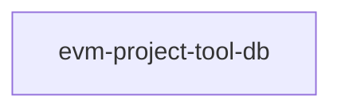

# Specs: apps/db

> Persistencia de proyectos y actividades de la herramienta EVM Project Tool.

## Grafo de specs

## Tabla de specs

| Spec | Estado | Creación | Paralelizable con | Ruta | Depende de |
|---|:---:|:---:|:---:|---|---|
| [evm-project-tool-db] | `Pendiente` | `Aprobado` | `—` | `evm-project-tool-db/summary.md` | — |
