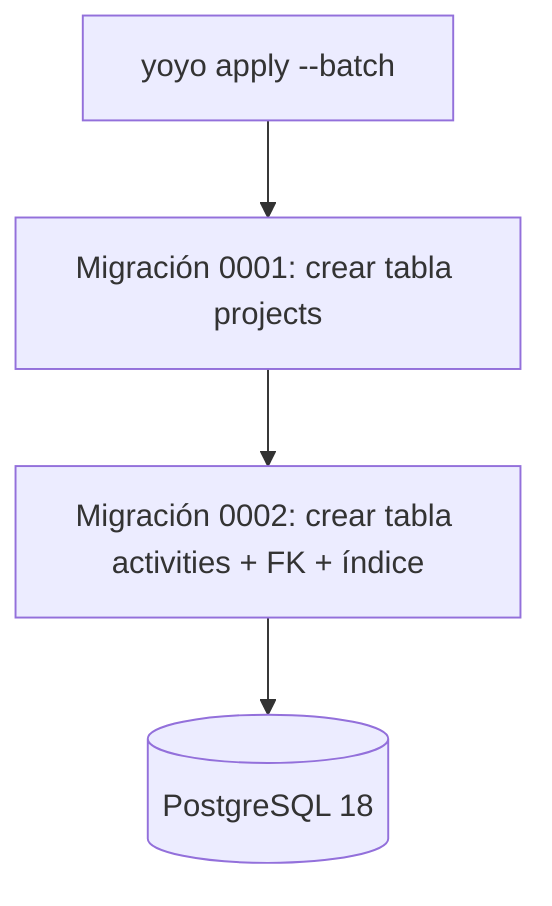

# Technical Design Document: evm-project-tool-db

## 1. Metadata & Traceability
- **Spec:** `evm-project-tool-db`
- **Requirements Ref:** `requirements.md` (spec: `evm-project-tool-db`)
- **Target Stack:** PostgreSQL 18 / `yoyo-migrations` 9.0.0 (SQL puro)

---

## 2. Architecture & System Overview

### 2.1 Architectural Approach
Esta unidad no tiene lógica de negocio ni arquitectura hexagonal (domain/application/infra) — es exclusivamente esquema y migraciones SQL puras. La única responsabilidad es definir el DDL (Data Definition Language) de las tablas `projects` y `activities` con sus constraints de integridad, y versionar ese DDL en migraciones aplicables con `yoyo apply --batch`. Ningún ORM: el acceso SQL de aplicación (SELECT/INSERT/UPDATE/DELETE parametrizados) es responsabilidad de `evm-project-tool-backend`, no de esta unidad.

### 2.2 Component Diagram / Module Interaction


### 2.5 Decisiones cerradas (heredadas de IDEA)
- Los indicadores EVM (PV, EV, CV, SV, CPI, SPI, EAC, VAC) NO se persisten — se calculan en tiempo real en el backend. Motivo: decisión explícita de alcance de `draft.md`, sin requerimiento de histórico/tendencia.
- Sin tabla de snapshots ni versión histórica de indicadores. Motivo: mismo punto anterior.
- Motor: PostgreSQL 18 (imagen Docker `postgres:18`), tipos `UUID` (`gen_random_uuid()` nativo) y `TIMESTAMPTZ`. Motivo: stack fijado por IDEA tras investigación de LEARN.
- Migraciones con `yoyo-migrations` 9.0.0, SQL puro, comando `yoyo apply --batch`. Motivo: decisión de stack cerrada por IDEA, compatibilidad con Python 3.14 confirmada por validación manual del USUARIO.
- `lefthook.yml`: contenido de la sección `pre-commit` ya cerrado por IDEA (ver `draft.md` § "Arquitectura y stack técnico" → "Configuración de verificación local"), se copia tal cual sobre la plantilla base `.makia/core/harness/templates/lefthook.example.yml` (que ya trae la sección `commit-msg` lista). No se reabre esta decisión.

### 2.6 Riesgos y mitigaciones

| Riesgo | Impacto | Mitigación |
|:---|:---|:---|
| Migraciones no idempotentes o mal ordenadas rompen ambientes nuevos | Alto — bloquea `evm-project-tool-backend` y toda la capacidad | Migraciones numeradas y secuenciales (`0001_...`, `0002_...`), cada una con su rollback SQL explícito, probadas con `yoyo apply --batch` sobre base de datos vacía antes de cerrar la tarea |
| `yoyo-migrations` 9.0.0 + Python 3.14: riesgo de compatibilidad | Ya mitigado | Confirmado compatible por validación manual del USUARIO (ver `draft.md` § "Riesgos y mitigaciones" — librería en Python puro, sin extensiones C) |

---

## 3. Data Models & Schema Design

### 3.1 Domain Entities (Core Business Objects)
No aplica — esta unidad no define entidades de dominio en código; el modelo conceptual (`Project`, `Activity`) vive en `domain-model.md` de `apps/backend/` (../../backend/domain-model.md), dueño del dominio. Esta unidad solo materializa su forma de persistencia.

### 3.2 Database Schema & Persistence
- **Target Database / Storage:** PostgreSQL 18.
- **Migrations / DDL:**

Migración `0001_create_projects_table.sql`:

```sql
CREATE TABLE projects (
    id UUID PRIMARY KEY DEFAULT gen_random_uuid(),
    name VARCHAR NOT NULL,
    description TEXT,
    created_at TIMESTAMPTZ NOT NULL DEFAULT now(),
    updated_at TIMESTAMPTZ NOT NULL DEFAULT now()
);
```

Migración `0002_create_activities_table.sql`:

```sql
CREATE TABLE activities (
    id UUID PRIMARY KEY DEFAULT gen_random_uuid(),
    project_id UUID NOT NULL REFERENCES projects(id) ON DELETE CASCADE,
    name VARCHAR NOT NULL,
    budget_at_completion NUMERIC(14,2) NOT NULL CHECK (budget_at_completion >= 0),
    planned_progress_percentage NUMERIC(5,2) NOT NULL CHECK (planned_progress_percentage BETWEEN 0 AND 100),
    actual_progress_percentage NUMERIC(5,2) NOT NULL CHECK (actual_progress_percentage BETWEEN 0 AND 100),
    actual_cost NUMERIC(14,2) NOT NULL CHECK (actual_cost >= 0),
    created_at TIMESTAMPTZ NOT NULL DEFAULT now(),
    updated_at TIMESTAMPTZ NOT NULL DEFAULT now()
);

CREATE INDEX idx_activities_project_id ON activities(project_id);
```

IMPLEMENT debe verificar en `learning.md` de IDEA (si documenta la convención exacta de archivo de yoyo 9.0.0) o en la documentación oficial de `yoyo-migrations` al momento de IMPLEMENT, ya que SPEC no investiga, la convención de archivo exacta de yoyo 9.0.0 (archivo único con step marcado, o archivo `.sql` acompañado de `.rollback.sql`).

`updated_at` no tiene trigger automático de actualización en este DDL base — si `evm-project-tool-backend` requiere que `updated_at` se actualice automáticamente en cada UPDATE, esa lógica (trigger SQL o actualización explícita desde la aplicación) es responsabilidad de la unidad que la necesite; no está en el alcance de `requirements.md` de esta unidad, que solo exige el valor inicial automático vía `DEFAULT now()` (RN-05).

---

## 4. Interfaces, Contracts & API Specifications

### 4.1 Internal Service Interfaces / Ports
No aplica — esta unidad no expone interfaces de servicio ni API externa; es solo esquema de base de datos. El contrato de acceso SQL (queries parametrizadas) lo define `evm-project-tool-backend` en su propio `design.md`.

### 4.2 External API / RPC / Event Schemas
No aplica — esta unidad no expone interfaces de servicio ni API externa; es solo esquema de base de datos. El contrato de acceso SQL (queries parametrizadas) lo define `evm-project-tool-backend` en su propio `design.md`.

---

## 5. Implementation Target Structure (File Mapping)
```
apps/db/
├── .gitignore                                    (nuevo — entradas propias de yoyo-migrations: caché, archivos de estado local si aplica)
├── migrations/
│   ├── 0001_create_projects_table.sql            (nuevo)
│   └── 0002_create_activities_table.sql          (nuevo)
lefthook.yml                                       (nuevo — raíz del repositorio, contenido cerrado por IDEA en draft.md)
```

El nombre exacto de archivo de cada migración (y si requiere un `.rollback.sql` separado) sigue la convención real de `yoyo-migrations` 9.0.0 verificada por IMPLEMENT/CODE al momento de escribir la migración — este mapa fija el contenido DDL y el orden (`0001` antes que `0002`), no la sintaxis exacta de archivo de yoyo.

### 5.1 Barrido de términos críticos
sin términos críticos afectados

---

## 6. Traceability Matrix: Requirements to Design
| Requirement ID | Design Section | Implementation File(s) |
|:---|:---|:---|
| REQ-1.1, REQ-1.2, REQ-1.3 | §3.2 Database Schema | `apps/db/migrations/0001_create_projects_table.sql` |
| REQ-2.1 a REQ-2.5 | §3.2 Database Schema | `apps/db/migrations/0002_create_activities_table.sql` |
| REQ-3.1, REQ-3.2 | §3.2 Database Schema | `apps/db/migrations/0001_create_projects_table.sql`, `apps/db/migrations/0002_create_activities_table.sql` |
| REQ-4.1 | §5 Implementation Target Structure | `lefthook.yml` |

---

## 7. Error Handling, Edge Cases & Performance Constraints

### 7.1 Error Strategy & Failure Modes
Toda validación de integridad (RN-01 a RN-05) se aplica a nivel de constraint de base de datos (`NOT NULL`, `CHECK`, `FOREIGN KEY ... ON DELETE CASCADE`), no en código de aplicación — esta unidad no tiene código de aplicación. Cualquier violación de constraint devuelve el error nativo de PostgreSQL (p. ej. `23503` violación de FK, `23514` violación de CHECK); la traducción de ese error a una respuesta HTTP 422/404 es responsabilidad de `evm-project-tool-backend`.

### 7.2 Security & Isolation
Sin superficie de ataque propia de aplicación (no hay endpoints ni input de usuario directo en esta unidad). Las credenciales de conexión a PostgreSQL se inyectan por variable de entorno vía `docker-compose`/`.env` (definidas por `evm-project-tool-infrastructure`), nunca hardcodeadas en las migraciones ni comiteadas al repositorio. Idempotencia: aplicar las migraciones (`yoyo apply --batch`) es naturalmente idempotente — `yoyo-migrations` registra qué migraciones ya se aplicaron y no las repite.

---

## 8. Testing Strategy & Verification Plan

### 8.1 Unit Tests
No aplica en el sentido tradicional — no hay lógica de aplicación que testear unitariamente en esta unidad.

### 8.2 Integration Tests
Verificación de que `yoyo apply --batch` aplica ambas migraciones sin error sobre una base de datos PostgreSQL 18 vacía, y que los constraints (`NOT NULL`, `CHECK`, `FOREIGN KEY ... ON DELETE CASCADE`) rechazan exactamente los casos EC-01 a EC-04 de `requirements.md` al intentar insertar datos inválidos directamente contra el esquema.

### 8.3 Contract / E2E Tests
No aplica a nivel de esta unidad — la E2E cross-unidad (`docker compose up` completo) es responsabilidad de `evm-project-tool-infrastructure`.

---

## 9. Design Review Checklist
- [ ] La arquitectura respeta la separación domain/application/infra sin fugas de responsabilidad.
- [ ] No hay sobre-ingeniería: la solución es la más simple que resuelve el requerimiento.
- [ ] Todo requerimiento de `requirements.md` tiene un ítem correspondiente en la matriz de trazabilidad.
- [ ] La estrategia de seguridad cubre las amenazas relevantes del caso.
- [ ] Si el spec cambia la semántica de un término crítico, el barrido de §5 cubre TODAS sus menciones en contratos y plantillas y ninguna queda con el modelo viejo.
- [ ] §2.5 recoge todas las decisiones cerradas de `draft.md` y ninguna se reabrió en el diseño; §2.6 mantiene los riesgos heredados vigentes más los que introduce el diseño.

Nota: el ítem de separación domain/application/infra no aplica a esta unidad (sin lógica de aplicación, solo esquema SQL).

---

> Este es el documento del CÓMO — detalla toda la parte técnica y el plan de implementación sin dejar nada por fuera. Las referencias de lenguaje/stack en los ejemplos (TypeScript, SQL, Rust, Flutter, etc.) son ilustrativas — usa el stack real fijado en `draft.md`/`learning.md` de la idea.
