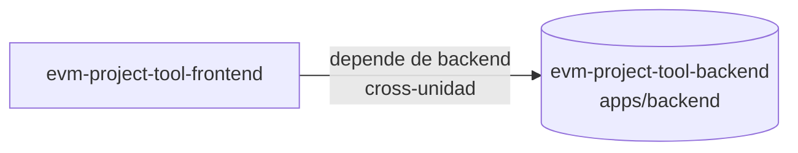

# Specs: apps/frontend

> Dashboard React presentación EVM.

## Grafo de specs

## Tabla de specs

| Spec | Estado | Creación | Paralelizable con | Ruta | Depende de |
|---|:---:|:---:|:---:|---|---|
| [evm-project-tool-frontend] | `Pendiente` | `Aprobado` | `C` | `evm-project-tool-frontend/summary.md` | `../../backend/evm-project-tool-backend/summary.md` |
