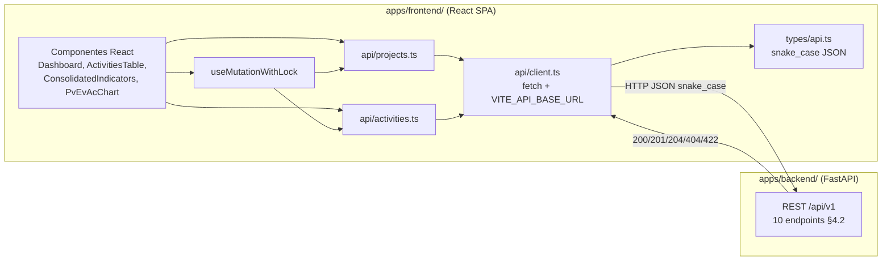

# Technical Design Document: evm-project-tool-frontend

## 1. Metadata & Traceability

| Campo | Valor |
|-------|-------|
| **Spec slug** | `evm-project-tool-frontend` |
| **Requirements ref** | `requirements.md` (spec: `evm-project-tool-frontend`) |
| **Backend contract ref** | [`../../backend/evm-project-tool-backend/design.md`](../../backend/evm-project-tool-backend/design.md) §4.2 |
| **Domain model ref (conceptual, no duplicar)** | [`../../backend/domain-model.md`](../../backend/domain-model.md) |
| **Target stack** | React 19.3.0, TypeScript 7.0.2, Vite 8.0.10, Node.js 24 LTS, Recharts 3.10.1, ESLint 10.10.0, Prettier 3.9.6, Docker `node:24-slim` → `nginx:stable-alpine` |

---

## 2. Architecture & System Overview

### 2.1 Enfoque arquitectónico

Capa de **presentación pura** en `apps/frontend/`. El frontend no contiene dominio propio, ni reglas de negocio EVM, ni validaciones de negocio más allá de restricciones HTML5 de captura. Toda la lógica de cálculo, consolidación e interpretación textual reside en el backend; la UI consume el contrato REST/OpenAPI y renderiza los datos recibidos.

| Capa frontend | Responsabilidad | Artefactos principales |
|---------------|-----------------|------------------------|
| **components/** | UI declarativa: tablas, gráficas, modales, badges | `Dashboard`, `ActivitiesTable`, `CpiSpiBadge`, … |
| **api/** | Cliente HTTP tipado 1:1 con endpoints backend | `client.ts`, `projects.ts`, `activities.ts` |
| **types/** | Interfaces TypeScript que espejan schemas JSON del backend | `api.ts` (snake_case) |
| **hooks/** | Comportamiento transversal de UI (anti double-submit) | `useMutationWithLock` |

Flujo de dependencia: `components` → `api` → `types`. Ningún componente calcula indicadores EVM localmente.

### 2.2 Diagrama de componentes



---

### 2.5 Decisiones cerradas (heredadas de IDEA)

| Decisión | Detalle | Motivo |
|----------|---------|--------|
| **Stack versiones fijadas** | React 19.3.0, TypeScript 7.0.2, Vite 8.0.10, Node 24, Recharts 3.10.1, ESLint 10.10.0, Prettier 3.9.6 | Cerrado en IDEA `draft.md` §Arquitectura y stack técnico |
| **Recharts 3.10.1** | Gráfica PV/EV/AC con `BarChart`/`ComposedChart` agrupado por actividad | Elegida por IDEA: React-first, SVG, compatible con React 19 |
| **ESLint 10.10.0 + Prettier 3.9.6** | Flat config `eslint.config.js` + `.prettierrc` | Elegidos sobre Biome por mayor evidencia de fuente primaria (IDEA) |
| **Sin lógica EVM en cliente** | El frontend nunca calcula PV, EV, CPI, SPI, EAC, VAC ni interpretaciones | Regla explícita de alcance: backend es dueño del dominio |
| **Runtime nginx** | Build estático Vite (`dist/`) servido por `nginx:stable-alpine` en contenedor multi-stage | Patrón SPA estándar; sin Node en runtime de producción |
| **Docker multi-stage** | Stage 1: `node:24-slim` (install + `npm run build`); Stage 2: `nginx:stable-alpine` (copia `dist/` + `nginx.conf`) | Imágenes ligeras y desacopladas del toolchain de build |
| **`lefthook.yml` NO duplicar** | La unit-spec db (`evm-project-tool-db`) ya tiene **Tarea 1.1** para crear `lefthook.yml` en la raíz con `backend-lint`, `backend-format`, **`frontend-lint`** y **`frontend-format`**. **Este spec frontend NO duplica esa tarea.** | Responsabilidad única en db spec; hooks frontend ya cubiertos |

---

### 2.6 Riesgos y mitigaciones

| Riesgo | Impacto | Mitigación |
|--------|---------|------------|
| Duplicar lógica EVM en el cliente (promediar CPI/SPI, recalcular indicadores) | Alto — UI muestra datos incorrectos | Prohibición explícita §2.1; tipos espejan respuesta API; code review |
| Doble envío de formularios (create/edit/delete) | Medio — mutaciones duplicadas | Hook `useMutationWithLock` + componente `LoadingButton` deshabilitado durante petición |
| CORS mal configurado en despliegue | Medio — dashboard no carga datos | Variable `VITE_API_BASE_URL` documentada; CORS es responsabilidad backend (`CORS_ORIGINS`) |
| Indicadores `null` mal renderizados (CPI/SPI no aplicables) | Medio — confusión del usuario | `CpiSpiBadge` siempre muestra `cpi_interpretation`/`spi_interpretation` como texto; icono neutro en `null` |
| Desalineación contrato frontend/backend | Alto — errores de parseo o campos faltantes | Tipos en `src/types/api.ts` espejan schemas §4.2 backend; un método API por endpoint |

---

## 3. Data Models & Schema Design

### 3.1 Principio de modelado

Las interfaces TypeScript en `src/types/api.ts` **espejan los schemas JSON del backend** (snake_case). No existen entidades de dominio propias (`Project`, `Activity` en camelCase de dominio). El frontend consume y renderiza la forma wire del API.

### 3.2 Interfaces TypeScript (`src/types/api.ts`)

```typescript
/** Indicadores EVM — espejo de EvmIndicators (backend §4.2) */
export interface EvmIndicators {
  pv: number;
  ev: number;
  cv: number;
  sv: number;
  cpi: number | null;
  spi: number | null;
  eac: number | null;
  vac: number | null;
  cpi_interpretation: string;
  spi_interpretation: string;
}

/** ProjectResponse — listado y mutaciones sin indicadores */
export interface ProjectResponse {
  id: string;
  name: string;
  description: string | null;
  created_at: string;
  updated_at: string;
}

/** ProjectDetailResponse — GET /projects/{project_id} */
export interface ProjectDetailResponse extends ProjectResponse {
  consolidated_indicators: EvmIndicators;
}

/** ActivityWithIndicatorsResponse — lecturas y mutaciones de actividad */
export interface ActivityWithIndicatorsResponse {
  id: string;
  project_id: string;
  name: string;
  budget_at_completion: number;
  planned_progress_percentage: number;
  actual_progress_percentage: number;
  actual_cost: number;
  created_at: string;
  updated_at: string;
  indicators: EvmIndicators;
}

/** ProjectCreateRequest / ProjectUpdateRequest */
export interface ProjectCreateRequest {
  name: string;
  description?: string | null;
}

export interface ProjectUpdateRequest {
  name: string;
  description?: string | null;
}

/** ActivityCreateRequest / ActivityUpdateRequest */
export interface ActivityCreateRequest {
  name: string;
  budget_at_completion: number;
  planned_progress_percentage: number;
  actual_progress_percentage: number;
  actual_cost: number;
}

export interface ActivityUpdateRequest {
  name: string;
  budget_at_completion: number;
  planned_progress_percentage: number;
  actual_progress_percentage: number;
  actual_cost: number;
}

/** Errores HTTP estándar FastAPI */
export interface HttpValidationError {
  detail: Array<{
    loc: (string | number)[];
    msg: string;
    type: string;
  }>;
}

export interface HttpError {
  detail: string;
}
```

### 3.3 Convención de nombres

| Capa | Convención | Ejemplo |
|------|------------|---------|
| JSON wire (API) | snake_case | `budget_at_completion`, `cpi_interpretation` |
| TypeScript interfaces | snake_case (igual que JSON) | `ActivityWithIndicatorsResponse.budget_at_completion` |
| Props React / variables locales UI | camelCase permitido solo en props internas no serializadas | `isLoading`, `onSubmit` |

---

## 4. Interfaces, Contracts & API Specifications

### 4.1 Cliente HTTP

| Aspecto | Decisión |
|---------|----------|
| Librería | `fetch` nativo (sin axios obligatorio; axios permitido si IMPLEMENT lo prefiere, pero `fetch` es el default documentado) |
| Base URL | Variable de entorno `VITE_API_BASE_URL` (ej. `http://localhost:8000/api/v1` en desarrollo) |
| Headers | `Content-Type: application/json` en mutaciones |
| Módulos | `api/client.ts` (wrapper genérico: parse JSON, propagar status, tipar errores), `api/projects.ts`, `api/activities.ts` |
| Convención métodos | Un método exportado por `operationId` del backend §4.2 |

**Firma sugerida de `api/client.ts`:**

```typescript
export class ApiError extends Error {
  constructor(
    public status: number,
    public body: HttpValidationError | HttpError | unknown,
  ) {
    super(`API error ${status}`);
  }
}

export async function apiFetch<T>(
  path: string,
  options?: RequestInit,
): Promise<T> { /* ... */ }
```

### 4.2 Contrato REST — 10 endpoints (transcripción resumida de backend §4.2)

**Base path:** `{VITE_API_BASE_URL}` → `/api/v1`

| # | Método | Path | operationId | Request body | Response exitosa | Errores |
|---|--------|------|-------------|--------------|------------------|---------|
| 1 | `GET` | `/projects` | `listProjects` | — | `200` → `ProjectResponse[]` | — |
| 2 | `POST` | `/projects` | `createProject` | `ProjectCreateRequest` | `201` → `ProjectResponse` | `422` ValidationError |
| 3 | `GET` | `/projects/{project_id}` | `getProject` | — | `200` → `ProjectDetailResponse` (incluye `consolidated_indicators`) | `404` NotFound |
| 4 | `PUT` | `/projects/{project_id}` | `updateProject` | `ProjectUpdateRequest` | `200` → `ProjectResponse` | `404`, `422` |
| 5 | `DELETE` | `/projects/{project_id}` | `deleteProject` | — | `204` sin body | `404` |
| 6 | `GET` | `/projects/{project_id}/activities` | `listActivitiesByProject` | — | `200` → `ActivityWithIndicatorsResponse[]` | `404` |
| 7 | `POST` | `/projects/{project_id}/activities` | `createActivity` | `ActivityCreateRequest` | `201` → `ActivityWithIndicatorsResponse` | `404`, `422` |
| 8 | `GET` | `/activities/{activity_id}` | `getActivity` | — | `200` → `ActivityWithIndicatorsResponse` | `404` |
| 9 | `PUT` | `/activities/{activity_id}` | `updateActivity` | `ActivityUpdateRequest` | `200` → `ActivityWithIndicatorsResponse` | `404`, `422` |
| 10 | `DELETE` | `/activities/{activity_id}` | `deleteActivity` | — | `204` sin body | `404` |

**Documentación interactiva backend (referencia para desarrolladores):**
- Swagger UI: `/api-docs`
- OpenAPI JSON: `/openapi.json`

**Reglas de interpretación CPI/SPI (solo display — valores calculados por backend):**

| Condición | `cpi_interpretation` |
|-----------|----------------------|
| `cpi` es `null` | `"Sin costo real registrado — CPI no aplicable"` |
| `cpi > 1` | `"Bajo presupuesto"` |
| `cpi = 1` | `"En presupuesto"` |
| `cpi < 1` | `"Sobre presupuesto"` |

| Condición | `spi_interpretation` |
|-----------|----------------------|
| `spi` es `null` | `"Sin avance planificado a la fecha — SPI no aplicable"` |
| `spi > 1` | `"Adelantado"` |
| `spi = 1` | `"En plan"` |
| `spi < 1` | `"Atrasado"` |

**Códigos HTTP relevantes para la UI:**

| Código | Cuándo | Acción UI |
|--------|--------|-----------|
| 200 | Lectura / actualización exitosa | Renderizar datos |
| 201 | Creación exitosa | Cerrar modal, refrescar listados |
| 204 | Eliminación exitosa | Quitar fila / refrescar |
| 404 | Recurso inexistente | `ErrorBanner` con mensaje del `detail` |
| 422 | Validación Pydantic | `ErrorBanner` con mensajes de `detail[]` |

### 4.3 Mapeo métodos cliente → endpoints

| Archivo | Método exportado | Endpoint |
|---------|------------------|----------|
| `api/projects.ts` | `listProjects()` | #1 |
| `api/projects.ts` | `createProject(body)` | #2 |
| `api/projects.ts` | `getProject(projectId)` | #3 |
| `api/projects.ts` | `updateProject(projectId, body)` | #4 |
| `api/projects.ts` | `deleteProject(projectId)` | #5 |
| `api/activities.ts` | `listActivitiesByProject(projectId)` | #6 |
| `api/activities.ts` | `createActivity(projectId, body)` | #7 |
| `api/activities.ts` | `getActivity(activityId)` | #8 |
| `api/activities.ts` | `updateActivity(activityId, body)` | #9 |
| `api/activities.ts` | `deleteActivity(activityId)` | #10 |

---

## 5. Implementation Target Structure (File Mapping)

```
apps/frontend/
├── .gitignore
├── package.json                          (deps fijadas: react@19.3.0, recharts@3.10.1, …)
├── vite.config.ts                        (proxy dev opcional hacia backend)
├── tsconfig.json
├── tsconfig.app.json
├── tsconfig.node.json
├── eslint.config.js                      (ESLint 10 flat config)
├── .prettierrc                           (Prettier 3.9.6)
├── Dockerfile                            (multi-stage: node:24-slim → nginx:stable-alpine)
├── nginx.conf                            (SPA fallback index.html, gzip estático)
├── index.html
├── public/
│   └── favicon.svg
└── src/
    ├── main.tsx                          (ReactDOM.createRoot, StrictMode)
    ├── App.tsx                           (layout raíz, ProjectSelector, Dashboard)
    ├── vite-env.d.ts                     (tipado import.meta.env.VITE_API_BASE_URL)
    ├── types/
    │   └── api.ts                        (interfaces §3.2)
    ├── api/
    │   ├── client.ts                     (apiFetch, ApiError)
    │   ├── projects.ts                   (endpoints #1–#5)
    │   └── activities.ts                 (endpoints #6–#10)
    ├── hooks/
    │   └── useMutationWithLock.ts        (anti double-submit)
    └── components/
        ├── Dashboard.tsx                 (orquesta tabla, consolidado, gráfica, modales)
        ├── ProjectSelector.tsx           (lista proyectos, selecciona project_id activo)
        ├── ActivitiesTable.tsx           (columnas: actividad, BAC, avances, AC, PV/EV/CV/SV/CPI/SPI/EAC/VAC, badges)
        ├── ConsolidatedIndicators.tsx    (bloque desde GET project detail consolidated_indicators)
        ├── CpiSpiBadge.tsx               (color + icono + texto interpretación)
        ├── PvEvAcChart.tsx               (Recharts BarChart/ComposedChart grouped bars: pv, ev, ac)
        ├── ActivityFormModal.tsx         (create/edit; validación HTML5 number; submit lock)
        ├── ErrorBanner.tsx               (422/404/network errors)
        └── LoadingButton.tsx             (botón deshabilitado + spinner durante mutación)
```

**Alcance explícito del footprint:** solo `apps/frontend/`. **NO** incluir `lefthook.yml` (raíz, ya en db spec Tarea 1.1), **NO** incluir `apps/backend/`, **NO** incluir `apps/db/`, **NO** incluir `apps/infrastructure/`.

### 5.1 Barrido de términos críticos

sin términos críticos afectados

---

## 6. Traceability Matrix: Requirements to Design

| Requirement ID | Design Section | Implementation File(s) |
|:---|:---|:---|
| REQ-01 (CRUD proyectos — consumo UI) | §4.2 endpoints #1–#5, §5 `api/projects.ts`, `ProjectSelector` | `api/projects.ts`, `ProjectSelector.tsx` |
| REQ-02 (CRUD actividades — consumo UI) | §4.2 endpoints #6–#10, §5 `api/activities.ts`, `ActivityFormModal` | `api/activities.ts`, `ActivityFormModal.tsx`, `ActivitiesTable.tsx` |
| REQ-03 (indicadores por actividad en UI) | §3.2 `ActivityWithIndicatorsResponse.indicators`, §5 `ActivitiesTable` | `ActivitiesTable.tsx`, `types/api.ts` |
| REQ-04 (interpretación CPI/SPI visible) | §4.2 tablas interpretación, §5 `CpiSpiBadge` | `CpiSpiBadge.tsx`, `ConsolidatedIndicators.tsx` |
| REQ-05 (consolidado proyecto en UI) | §4.2 `ProjectDetailResponse.consolidated_indicators`, §5 `ConsolidatedIndicators` | `ConsolidatedIndicators.tsx`, `api/projects.ts` (`getProject`) |
| REQ-06 (dashboard visual) | §2.2 diagrama, §5 componentes dashboard | `Dashboard.tsx`, `ActivitiesTable.tsx`, `PvEvAcChart.tsx`, `CpiSpiBadge.tsx` |
| RN-09 (display null CPI/SPI) | §5 `CpiSpiBadge` mapeo visual null | `CpiSpiBadge.tsx` |
| Seguridad UI (anti double-submit) | §7.2, §5 `useMutationWithLock`, `LoadingButton` | `hooks/useMutationWithLock.ts`, `LoadingButton.tsx`, `ActivityFormModal.tsx` |
| Validación captura (HTML5) | §7.2 inputs number | `ActivityFormModal.tsx` |
| Errores 422/404 | §7.1 | `ErrorBanner.tsx`, `api/client.ts` |

---

## 7. Error Handling, Edge Cases & UX Constraints

### 7.1 Estrategia de errores en UI

| Escenario | Origen | Comportamiento UI |
|-----------|--------|-------------------|
| **422 Validación** | Backend Pydantic (`HTTPValidationError`) | `ErrorBanner` lista mensajes de `detail[].msg`; formulario permanece abierto con campos intactos |
| **404 Not Found** | Proyecto/actividad inexistente (`HttpError.detail`) | `ErrorBanner` con texto del `detail`; si proyecto activo desaparece, resetear selección y recargar listado |
| **Error de red** | `fetch` rechazado, timeout, CORS | `ErrorBanner` genérico: *"No se pudo conectar con el servidor. Verifique que el backend esté en ejecución."* |
| **204 DELETE** | Sin body | Cerrar modal si aplica; refrescar listado de actividades/proyectos |
| **Indicadores null (RN-09)** | Respuesta 200 con `cpi`/`spi` null | Mostrar `"—"` o vacío en celda numérica; **siempre** mostrar texto de interpretación en `CpiSpiBadge` |

**Flujo post-mutación:** tras create/update/delete exitoso, el dashboard **refresca** datos del proyecto activo (`getProject` + `listActivitiesByProject`) para reflejar indicadores recalculados por el backend.

### 7.2 Seguridad & restricciones UI

| Control | Implementación |
|---------|----------------|
| **Anti double-submit** | `useMutationWithLock` mantiene `isLocked` durante petición; `LoadingButton` deshabilitado; modal no cierra hasta respuesta |
| **Inputs numéricos** | `<input type="number">` con `min={0}`, `max={100}` en porcentajes, `step="any"` en montos; validación HTML5 nativa antes de submit |
| **Sin secretos en frontend** | Solo `VITE_API_BASE_URL` pública; nunca credenciales DB ni tokens en código o `.env` commiteado |
| **Sin lógica de negocio** | Prohibido calcular EVM en cliente; solo formatear números para display (locale/decimales) |
| **XSS** | React escapa por defecto; no usar `dangerouslySetInnerHTML` |

### 7.3 Componente `CpiSpiBadge` — accesibilidad y mapeo visual

El badge **siempre** renderiza el texto de interpretación (`cpi_interpretation` o `spi_interpretation`) como contenido visible accesible. El color y el icono son complemento, nunca el único canal de información (REQ-06).

| Estado del indicador | Condición | Color sugerido | Icono sugerido | Texto (obligatorio) |
|----------------------|-----------|----------------|----------------|---------------------|
| **No aplicable** | valor `null` | Gris neutro (`neutral`) | Icono neutral (ej. guion/minus en círculo) | Texto backend RN-09 (ej. *"Sin costo real registrado — CPI no aplicable"*) |
| **Favorable costo** | CPI > 1 | Verde | Check / flecha arriba | `cpi_interpretation` (*"Bajo presupuesto"*) |
| **Neutral costo** | CPI = 1 | Gris/verde tenue | Check neutro | `cpi_interpretation` (*"En presupuesto"*) |
| **Desfavorable costo** | CPI < 1 | Rojo o amber | Warning / flecha abajo | `cpi_interpretation` (*"Sobre presupuesto"*) |
| **Favorable cronograma** | SPI > 1 | Verde | Check / flecha arriba | `spi_interpretation` (*"Adelantado"*) |
| **Neutral cronograma** | SPI = 1 | Gris/verde tenue | Check neutro | `spi_interpretation` (*"En plan"*) |
| **Desfavorable cronograma** | SPI < 1 | Rojo o amber | Warning / flecha abajo | `spi_interpretation` (*"Atrasado"*) |

Atributos de accesibilidad sugeridos: `role="status"`, `aria-label` combinando nombre del indicador + interpretación textual.

### 7.4 Componentes dashboard — responsabilidades

| Componente | Fuente de datos | Responsabilidad |
|------------|-----------------|-----------------|
| `ProjectSelector` | `listProjects()` | Dropdown/lista de proyectos; emite `project_id` activo |
| `ConsolidatedIndicators` | `getProject(id).consolidated_indicators` | Bloque KPI consolidado del proyecto |
| `ActivitiesTable` | `listActivitiesByProject(project_id)` | Tabla con columnas: actividad, BAC, `% planificado`, `% real`, AC, PV, EV, CV, SV, CPI, SPI, EAC, VAC + `CpiSpiBadge` en CPI/SPI |
| `PvEvAcChart` | Misma lista de actividades | Recharts grouped bar por actividad con series `pv`, `ev`, `ac` (de `indicators`) |
| `ActivityFormModal` | — / actividad seleccionada | Create/edit; campos snake_case mapeados a request body; submit vía `createActivity`/`updateActivity` |
| `Dashboard` | Compone los anteriores | Estado `activeProjectId`, loading global, refresh coordinado |

---

## 8. Testing Strategy & Verification Plan

### 8.1 Tests de componente (opcionales)

No hay obligación de porcentaje de cobertura en frontend (IDEA cierra cobertura ≥80% solo en capa de negocio backend). Si IMPLEMENT incluye tests:

| Herramienta | Uso |
|-------------|-----|
| **Vitest** | Runner de tests unitarios/componente |
| **React Testing Library (RTL)** | Renderizado y queries accesibles |

**Casos sugeridos (no exhaustivos):**

- `CpiSpiBadge`: renderiza interpretación textual cuando `cpi` es `null`; aplica clase favorable/desfavorable según valor.
- `ActivityFormModal`: botón submit deshabilitado mientras `useMutationWithLock.isLocked`.
- `ErrorBanner`: muestra mensajes 422 parseados de `HTTPValidationError`.

### 8.2 Verificación manual / E2E

E2E cross-unidad (`docker compose up` completo) es responsabilidad de `evm-project-tool-infrastructure`. El frontend se valida manualmente contra backend real: seleccionar proyecto → ver tabla + consolidado + gráfica → crear/editar actividad → ver indicadores actualizados.

---

## 9. Design Review Checklist

- [ ] La arquitectura es presentación pura: cero cálculo EVM en cliente.
- [ ] No hay sobre-ingeniería: un método API por endpoint, tipos espejo del backend.
- [ ] Todo requerimiento de `requirements.md` tiene ítem en la matriz de trazabilidad §6.
- [ ] `CpiSpiBadge` muestra color + icono + **texto de interpretación** (nunca solo color).
- [ ] Anti double-submit implementado en mutaciones (`useMutationWithLock` + `LoadingButton`).
- [ ] Footprint limitado a `apps/frontend/`; sin duplicar `lefthook.yml` ni unidades hermanas.
- [ ] §2.5 recoge decisiones cerradas de IDEA; §2.6 mantiene riesgos heredados y los del diseño frontend.
- [ ] Contrato §4.2 coincide con [`../../backend/evm-project-tool-backend/design.md`](../../backend/evm-project-tool-backend/design.md) §4.2 (10 endpoints, schemas snake_case).
- [ ] Si el spec cambia la semántica de un término crítico, el barrido §5.1 cubre TODAS sus menciones; de lo contrario permanece *"sin términos críticos afectados"*.

---

> Este es el documento del CÓMO — detalla la implementación técnica del dashboard EVM en React. Stack fijado: React 19.3.0, TypeScript 7.0.2, Vite 8.0.10, Node 24, Recharts 3.10.1, ESLint 10.10.0, Prettier 3.9.6, Docker `node:24-slim` → `nginx:stable-alpine`.
