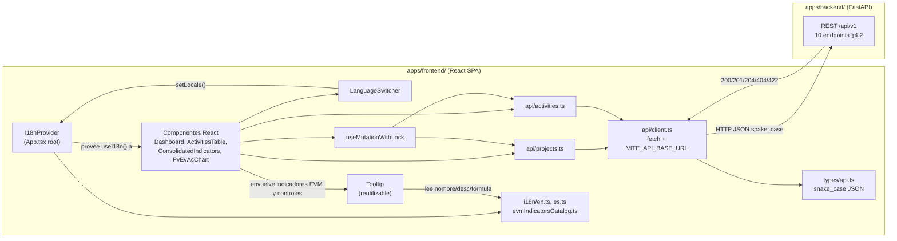

# Technical Design Document: evm-project-tool-frontend

## 1. Metadata & Traceability

| Campo | Valor |
|-------|-------|
| **Spec slug** | `evm-project-tool-frontend` |
| **Requirements ref** | `requirements.md` (spec: `evm-project-tool-frontend`) |
| **Backend contract ref** | [`../../backend/evm-project-tool-backend/design.md`](../../backend/evm-project-tool-backend/design.md) §4.2 |
| **Domain model ref (conceptual, no duplicar)** | [`../../backend/domain-model.md`](../../backend/domain-model.md) |
| **Target stack** | React 19.3.0, TypeScript 7.0.2, Vite 8.0.10, Node.js 24 LTS, Recharts 3.10.1, ESLint 10.10.0, Prettier 3.9.6, Docker `node:24-slim` → `nginx:stable-alpine` |
| **i18n** | **Sin librería externa.** Solución propia: React Context (`I18nProvider`) + diccionarios TS tipados `en.ts`/`es.ts`. Decisión cerrada — ver §2.7. |

---

## 2. Architecture & System Overview

### 2.1 Enfoque arquitectónico

Capa de **presentación pura** en `apps/frontend/`. El frontend no contiene dominio propio, ni reglas de negocio EVM, ni validaciones de negocio más allá de restricciones HTML5 de captura. Toda la lógica de cálculo, consolidación e interpretación textual reside en el backend; la UI consume el contrato REST/OpenAPI y renderiza los datos recibidos.

| Capa frontend | Responsabilidad | Artefactos principales |
|---------------|-----------------|------------------------|
| **components/** | UI declarativa: tablas, gráficas, modales, badges | `Dashboard`, `ActivitiesTable`, `CpiSpiBadge`, … |
| **api/** | Cliente HTTP tipado 1:1 con endpoints backend | `client.ts`, `projects.ts`, `activities.ts` |
| **types/** | Interfaces TypeScript que espejan schemas JSON del backend | `api.ts` (snake_case) |
| **hooks/** | Comportamiento transversal de UI (anti double-submit) | `useMutationWithLock` |
| **i18n/** | Internacionalización: diccionarios, provider, catálogo de indicadores EVM | `I18nProvider.tsx`, `useI18n.ts`, `en.ts`, `es.ts`, `evmIndicatorsCatalog.ts` |

Flujo de dependencia: `components` → `api` → `types`; `components` → `i18n`. Ningún componente calcula indicadores EVM localmente ni traduce siglas EVM.

### 2.2 Diagrama de componentes



---

### 2.5 Decisiones cerradas (heredadas de IDEA)

| Decisión | Detalle | Motivo |
|----------|---------|--------|
| **Stack versiones fijadas** | React 19.3.0, TypeScript 7.0.2, Vite 8.0.10, Node 24, Recharts 3.10.1, ESLint 10.10.0, Prettier 3.9.6 | Cerrado en IDEA `draft.md` §Arquitectura y stack técnico |
| **Recharts 3.10.1** | Gráfica PV/EV/AC con `BarChart`/`ComposedChart` agrupado por actividad | Elegida por IDEA: React-first, SVG, compatible con React 19 |
| **ESLint 10.10.0 + Prettier 3.9.6** | Flat config `eslint.config.js` + `.prettierrc` | Elegidos sobre Biome por mayor evidencia de fuente primaria (IDEA) |
| **Sin lógica EVM en cliente** | El frontend nunca calcula PV, EV, CPI, SPI, EAC, VAC ni interpretaciones | Regla explícita de alcance: backend es dueño del dominio |
| **Runtime nginx** | Build estático Vite (`dist/`) servido por `nginx:stable-alpine` en contenedor multi-stage | Patrón SPA estándar; sin Node en runtime de producción |
| **Docker multi-stage** | Stage 1: `node:24-slim` (install + `npm run build`); Stage 2: `nginx:stable-alpine` (copia `dist/` + `nginx.conf`) | Imágenes ligeras y desacopladas del toolchain de build |
| **`lefthook.yml` NO duplicar** | La unit-spec db (`evm-project-tool-db`) ya tiene **Tarea 1.1** para crear `lefthook.yml` en la raíz con `backend-lint`, `backend-format`, **`frontend-lint`** y **`frontend-format`**. **Este spec frontend NO duplica esa tarea.** | Responsabilidad única en db spec; hooks frontend ya cubiertos |
| **i18n sin librería externa** | React Context propio (`I18nProvider`) + diccionarios TS `en.ts`/`es.ts` + hook `useI18n()` | KISS: solo 2 idiomas, sin pluralización ni formato ICU exigido por requirements; i18next/react-intl/FormatJS son sobre-ingeniería para este alcance y no están instalados |
| **Persistencia de idioma: `sessionStorage`** | El locale activo se guarda en `sessionStorage` bajo una clave fija; se lee al montar `I18nProvider` | RN-UI-10 exige persistencia "solo de sesión"; `sessionStorage` cubre ese requisito y además sobrevive a un refresh de página (F5) dentro de la misma pestaña, a diferencia de estado en memoria puro que se perdería con cualquier recarga; se descarta `localStorage` por persistir entre sesiones de navegador, lo cual violaría RN-UI-10 |
| **Tooltip sin librería de posicionamiento** | Componente propio `Tooltip.tsx` con posicionamiento CSS simple (absoluto, encima del trigger, con fallback a debajo si no cabe) | KISS: no se requiere anclaje a scroll containers complejos, drag, ni colisión avanzada; una librería tipo Popper/Floating UI añade peso y dependencia para un caso de uso simple de un dashboard interno |

---

### 2.6 Riesgos y mitigaciones

| Riesgo | Impacto | Mitigación |
|--------|---------|------------|
| Duplicar lógica EVM en el cliente (promediar CPI/SPI, recalcular indicadores) | Alto — UI muestra datos incorrectos | Prohibición explícita §2.1; tipos espejan respuesta API; code review |
| Doble envío de formularios (create/edit/delete) | Medio — mutaciones duplicadas | Hook `useMutationWithLock` + componente `LoadingButton` deshabilitado durante petición |
| CORS mal configurado en despliegue | Medio — dashboard no carga datos | Variable `VITE_API_BASE_URL` documentada; CORS es responsabilidad backend (`CORS_ORIGINS`) |
| Indicadores `null` mal renderizados (CPI/SPI no aplicables) | Medio — confusión del usuario | `CpiSpiBadge` siempre muestra un texto de interpretación derivado localmente vía `getCpiInterpretationKey`/`getSpiInterpretationKey` + i18n (RN-UI-13, §2.7.6), no el campo `cpi_interpretation`/`spi_interpretation` del API; icono neutro en `null` |
| Desalineación contrato frontend/backend | Alto — errores de parseo o campos faltantes | Tipos en `src/types/api.ts` espejan schemas §4.2 backend; un método API por endpoint |
| Inconsistencia de traducciones al agregar textos nuevos sin pasar por el catálogo i18n | Medio — strings hardcodeados o mezcla de idiomas | Único archivo de claves tipado (`i18n/types.ts`) que obliga a declarar la clave en ambos diccionarios (`en.ts`/`es.ts`); ESLint/code review rechaza strings literales fuera de `t()` en JSX de texto visible |
| Tooltip tapando contenido en viewports pequeños (mobile) | Bajo/Medio — indicador oculto detrás del tooltip | Posicionamiento simple con fallback (encima → debajo si no cabe verticalmente); `max-width` acotado; z-index único centralizado |
| Traducir por error una sigla EVM (ej. mostrar "VP" en vez de "PV") | Medio — confusión con lenguaje PMI estándar (RN-UI-11) | Catálogo de siglas (`evmIndicatorsCatalog.ts`) es una única fuente invariable en inglés, separada del catálogo de nombres/descripciones traducidos; los componentes nunca interpolan la sigla dentro de `t()` |

---

### 2.7 Internacionalización (i18n) — arquitectura y catálogo

#### 2.7.1 Mecanismo elegido (decisión cerrada)

**React Context propio**, sin librería externa (ni i18next, ni react-intl/FormatJS, ni ningún paquete nuevo en `package.json`). Justificación KISS:

- Solo 2 idiomas (ES/EN), sin necesidad de negociación de idiomas adicionales.
- Sin pluralización compleja ni formato ICU (números/fechas los formatea el propio componente con `Intl.NumberFormat` nativo si hace falta, no el catálogo de traducción).
- El volumen de strings de la app es pequeño (dashboard EVM de una sola pantalla + modal), no justifica el peso ni la curva de configuración de una librería de i18n completa.
- Evita añadir una dependencia de build/runtime nueva a un frontend que hoy no tiene ninguna librería de i18n instalada.

#### 2.7.2 Estructura de diccionarios

Claves organizadas por dominio funcional, en objetos anidados tipados:

```typescript
// src/i18n/types.ts
export interface Dictionary {
  common: {
    loading: string;
    save: string;
    cancel: string;
    delete: string;
    edit: string;
    create: string;
    errorGeneric: string;
    errorNetwork: string;
  };
  dashboard: {
    title: string;
    selectProject: string;
    noProjectsFound: string;
  };
  activityForm: {
    titleCreate: string;
    titleEdit: string;
    fieldName: string;
    fieldBudgetAtCompletion: string;
    fieldPlannedProgress: string;
    fieldActualProgress: string;
    fieldActualCost: string;
    submitLabel: string;
  };
  activitiesTable: {
    columnActivity: string;
    columnBudget: string;
    columnPlannedProgress: string;
    columnActualProgress: string;
    columnActualCost: string;
  };
  consolidatedIndicators: {
    title: string;
  };
  cpiSpiBadge: {
    cpiLabel: string;
    spiLabel: string;
  };
  languageSwitcher: {
    labelEs: string;
    labelEn: string;
    ariaLabel: string;
  };
}

/** Unión de claves "dominio.clave" válidas — usada por t() para autocompletar y evitar typos */
export type TranslationKey = {
  [D in keyof Dictionary]: `${D & string}.${keyof Dictionary[D] & string}`;
}[keyof Dictionary];

export type Locale = 'es' | 'en';
```

`en.ts` y `es.ts` exportan cada uno un objeto `const dictionary: Dictionary = { ... }` con **todas** las claves de `Dictionary` (TypeScript falla en build si falta una clave en cualquiera de los dos idiomas — no hay claves opcionales). Esto es lo que cierra el riesgo de "inconsistencia de traducciones" de §2.6.

Los **nombres completos de indicadores EVM** y sus **descripciones/fórmulas** (usados por `Tooltip`) **no** viven en `Dictionary`: viven en un catálogo separado, tipado independientemente, precisamente para mantener la sigla invariable aislada del texto traducido (RN-UI-11). Ver §2.7.3.

#### 2.7.3 Catálogo de indicadores EVM (`src/i18n/evmIndicatorsCatalog.ts`)

```typescript
export type EvmIndicatorCode =
  | 'PV' | 'EV' | 'AC' | 'CV' | 'SV'
  | 'CPI' | 'SPI' | 'EAC' | 'VAC' | 'BAC' | 'ETC' | 'TCPI';

export interface EvmIndicatorCatalogEntry {
  /** Sigla EVM — SIEMPRE en inglés, invariable, nunca traducida (RN-UI-11) */
  code: EvmIndicatorCode;
  nameEs: string;
  nameEn: string;
  descriptionEs: string;
  descriptionEn: string;
  /** Fórmula en notación de siglas (las siglas dentro de la fórmula tampoco se traducen) */
  formula?: string;
}

export const evmIndicatorsCatalog: Record<EvmIndicatorCode, EvmIndicatorCatalogEntry> = {
  PV:   { code: 'PV',   nameEs: 'Valor Planificado',                         nameEn: 'Planned Value',
          descriptionEs: 'Valor presupuestado del trabajo programado a la fecha.',
          descriptionEn: 'Budgeted value of the work scheduled to date.' },
  EV:   { code: 'EV',   nameEs: 'Valor Ganado',                              nameEn: 'Earned Value',
          descriptionEs: 'Valor presupuestado del trabajo realmente completado.',
          descriptionEn: 'Budgeted value of the work actually completed.' },
  AC:   { code: 'AC',   nameEs: 'Costo Real',                                nameEn: 'Actual Cost',
          descriptionEs: 'Costo realmente incurrido por el trabajo completado.',
          descriptionEn: 'Cost actually incurred for the work completed.' },
  CV:   { code: 'CV',   nameEs: 'Variación de Costo',                        nameEn: 'Cost Variance',
          descriptionEs: 'Diferencia entre el valor ganado y el costo real.',
          descriptionEn: 'Difference between earned value and actual cost.',
          formula: 'CV = EV - AC' },
  SV:   { code: 'SV',   nameEs: 'Variación de Cronograma',                   nameEn: 'Schedule Variance',
          descriptionEs: 'Diferencia entre el valor ganado y el valor planificado.',
          descriptionEn: 'Difference between earned value and planned value.',
          formula: 'SV = EV - PV' },
  CPI:  { code: 'CPI',  nameEs: 'Índice de Desempeño del Costo',             nameEn: 'Cost Performance Index',
          descriptionEs: 'Eficiencia de costo del trabajo realizado.',
          descriptionEn: 'Cost efficiency of the work performed.',
          formula: 'CPI = EV / AC' },
  SPI:  { code: 'SPI',  nameEs: 'Índice de Desempeño del Cronograma',        nameEn: 'Schedule Performance Index',
          descriptionEs: 'Eficiencia de cronograma del trabajo realizado.',
          descriptionEn: 'Schedule efficiency of the work performed.',
          formula: 'SPI = EV / PV' },
  EAC:  { code: 'EAC',  nameEs: 'Estimación a la Conclusión',                nameEn: 'Estimate at Completion',
          descriptionEs: 'Costo total esperado al finalizar el trabajo.',
          descriptionEn: 'Expected total cost of the work when completed.',
          formula: 'EAC = BAC / CPI' },
  VAC:  { code: 'VAC',  nameEs: 'Variación a la Conclusión',                 nameEn: 'Variance at Completion',
          descriptionEs: 'Diferencia proyectada entre presupuesto y costo final estimado.',
          descriptionEn: 'Projected difference between budget and estimated final cost.',
          formula: 'VAC = BAC - EAC' },
  BAC:  { code: 'BAC',  nameEs: 'Presupuesto a la Conclusión',               nameEn: 'Budget at Completion',
          descriptionEs: 'Presupuesto total aprobado para el trabajo.',
          descriptionEn: 'Total approved budget for the work.' },
  ETC:  { code: 'ETC',  nameEs: 'Estimación hasta la Conclusión',            nameEn: 'Estimate to Complete',
          descriptionEs: 'Costo esperado para terminar el trabajo restante.',
          descriptionEn: 'Expected cost to finish the remaining work.',
          formula: 'ETC = EAC - AC' },
  TCPI: { code: 'TCPI', nameEs: 'Índice de Desempeño del Trabajo por Completar', nameEn: 'To-Complete Performance Index',
          descriptionEs: 'Eficiencia de costo requerida para completar el trabajo restante dentro del presupuesto.',
          descriptionEn: 'Cost efficiency required to finish the remaining work within budget.',
          formula: 'TCPI = (BAC - EV) / (BAC - AC)' },
};
```

**Nota de alcance:** la UI actual (§4.2, §3.2) solo muestra PV, EV, AC, CV, SV, CPI, SPI, EAC, VAC en `ActivitiesTable`/`ConsolidatedIndicators`/`PvEvAcChart`; BAC, ETC y TCPI se incluyen en el catálogo porque `budget_at_completion` (BAC) ya aparece en formularios/tabla y por completitud del vocabulario PMI, disponible para uso futuro sin requerir otra decisión de diseño.

#### 2.7.4 Hook/contexto de consumo

```typescript
// src/i18n/useI18n.ts
export interface I18nContextValue {
  locale: Locale;
  setLocale: (locale: Locale) => void;
  /** Traduce una clave "dominio.clave" del Dictionary (NO usar para siglas EVM) */
  t: (key: TranslationKey) => string;
}

export function useI18n(): I18nContextValue;
```

`I18nProvider` (`src/i18n/I18nProvider.tsx`) envuelve **todo el árbol** desde `App.tsx`:

```tsx
// App.tsx (esquema, no implementación)
<I18nProvider>
  <Dashboard />
</I18nProvider>
```

Cualquier componente bajo `I18nProvider` accede a `const { locale, setLocale, t } = useI18n();`.

#### 2.7.5 Detección de idioma inicial (REQ-13)

Orden de resolución al montar `I18nProvider`, cerrado y sin ambigüedad:

1. Si existe un valor válido (`'es'` o `'en'`) en `sessionStorage` bajo la clave `evm_locale` → usarlo (cambio de idioma persistido durante la pestaña/sesión, sobrevive F5).
2. Si no existe, leer `navigator.language` (y `navigator.languages[0]` como respaldo), tomar el prefijo de 2 letras antes de `-`: si es `'es'` → locale inicial `'es'`; si es `'en'` → locale inicial `'en'`.
3. Si el prefijo no es `'es'` ni `'en'` (cualquier otro idioma de navegador) → fallback `'en'` (cierra EC-15 / REQ-13).

Cada llamada a `setLocale(nextLocale)` actualiza el estado de React (re-render inmediato, sin recarga de página — cierra RN-UI-10 "cambio inmediato sin recargar") y escribe el nuevo valor en `sessionStorage['evm_locale']`.

**Persistencia — decisión cerrada:** `sessionStorage`, no `localStorage`, no memoria pura de React. `sessionStorage` se limpia al cerrar la pestaña/navegador, cumpliendo "persistencia solo de sesión" (RN-UI-10), y evita perder la selección del usuario ante un simple F5, que sería el comportamiento con estado en memoria puro.

#### 2.7.6 Derivación local de interpretación CPI/SPI (RN-UI-13)

**Decisión de negocio ya aprobada (RN-UI-13, cerrada en `requirements.md`):** la UI **ignora** el string literal `cpi_interpretation`/`spi_interpretation` devuelto por el backend y **deriva su propio texto** de interpretación a partir del valor numérico/`null` de `cpi`/`spi`, clasificándolo en una de 4 categorías fijas y localizando el texto vía el mecanismo i18n propio de §2.7.

**Módulo y firmas cerradas:**

```typescript
// src/i18n/evmInterpretation.ts
export type EvmInterpretationKey =
  | 'cpiNull' | 'cpiAboveOne' | 'cpiEqualOne' | 'cpiBelowOne'
  | 'spiNull' | 'spiAboveOne' | 'spiEqualOne' | 'spiBelowOne';

export function getCpiInterpretationKey(cpi: number | null): EvmInterpretationKey {
  if (cpi === null) return 'cpiNull';
  if (cpi > 1) return 'cpiAboveOne';
  if (cpi === 1) return 'cpiEqualOne';
  return 'cpiBelowOne';
}

export function getSpiInterpretationKey(spi: number | null): EvmInterpretationKey {
  if (spi === null) return 'spiNull';
  if (spi > 1) return 'spiAboveOne';
  if (spi === 1) return 'spiEqualOne';
  return 'spiBelowOne';
}
```

**Naturaleza puramente presentacional (no viola RN-UI-01):** `getCpiInterpretationKey`/`getSpiInterpretationKey` no calculan CPI ni SPI — reciben un valor numérico o `null` **ya calculado por el backend** y solo lo clasifican en una de 4 categorías fijas (idéntica tabla de condiciones que hoy documenta el backend en §4.2). El frontend sigue sin contener lógica de negocio EVM: no hay división, no hay fórmula, no hay acceso a `pv`/`ev`/`ac`. Es el mismo tipo de operación que un `switch` de rango para elegir un color de badge.

**Claves i18n (`Dictionary`/`TranslationKey`, `src/i18n/types.ts`):** se agrega un nuevo namespace `evmInterpretation` con las 8 claves de `EvmInterpretationKey`:

```typescript
// añadido a Dictionary en src/i18n/types.ts
evmInterpretation: {
  cpiNull: string;
  cpiAboveOne: string;
  cpiEqualOne: string;
  cpiBelowOne: string;
  spiNull: string;
  spiAboveOne: string;
  spiEqualOne: string;
  spiBelowOne: string;
};
```

Traducciones cerradas (`es.ts`/`en.ts`), usando exactamente los textos ya fijados en `requirements.md`/§4.2 para español y sus equivalentes en inglés definidos aquí:

| Clave | `es.ts` | `en.ts` |
|-------|---------|---------|
| `evmInterpretation.cpiNull` | "Sin costo real registrado — CPI no aplicable" | "No actual cost recorded — CPI not applicable" |
| `evmInterpretation.cpiAboveOne` | "Bajo presupuesto" | "Under budget" |
| `evmInterpretation.cpiEqualOne` | "En presupuesto" | "On budget" |
| `evmInterpretation.cpiBelowOne` | "Sobre presupuesto" | "Over budget" |
| `evmInterpretation.spiNull` | "Sin avance planificado a la fecha — SPI no aplicable" | "No planned progress to date — SPI not applicable" |
| `evmInterpretation.spiAboveOne` | "Adelantado" | "Ahead of schedule" |
| `evmInterpretation.spiEqualOne` | "En plan" | "On schedule" |
| `evmInterpretation.spiBelowOne` | "Atrasado" | "Behind schedule" |

**Consumo cerrado:** `CpiSpiBadge.tsx` y `ConsolidatedIndicators.tsx` obtienen el texto con `t(`evmInterpretation.${getCpiInterpretationKey(cpi)}`)` / `t(`evmInterpretation.${getSpiInterpretationKey(spi)}`)` — **nunca** leen `indicators.cpi_interpretation` ni `indicators.spi_interpretation` del API. Estos dos campos siguen existiendo en el tipo `EvmIndicators` (§3.2) por fidelidad al contrato REST (el backend los sigue enviando en la respuesta), pero **ningún componente de presentación los consume**; quedan documentados como campos "recibidos pero no usados en UI" (ver nota en §3.2).

---

### 2.8 Componente Tooltip reutilizable — diseño

**Nombre y ubicación:** `src/components/Tooltip.tsx`.

**Props cerradas:**

```typescript
export interface TooltipProps {
  nameEs: string;
  nameEn: string;
  description: string;
  /** Notación de fórmula, ej. "CPI = EV / AC". Omitir si el indicador/control no tiene fórmula. */
  formula?: string;
  /** Elemento disparador (trigger): texto de la sigla EVM, icono, o control no obvio */
  children: ReactNode;
}
```

`Tooltip` internamente usa `useI18n().locale` para decidir si mostrar `nameEs`/`description` en español o `nameEn`/`description` (equivalente inglés) — pero **no traduce** el contenido: quien invoca `Tooltip` pasa ya ambos idiomas resueltos (típicamente desde `evmIndicatorsCatalog.ts` para indicadores EVM, o literales locales para controles no-EVM).

**Comportamiento (cerrado):**

| Aspecto | Decisión |
|---------|----------|
| Apertura | `onMouseEnter` (hover) **y** `onFocus` (foco de teclado, Tab) sobre el trigger |
| Cierre | `onMouseLeave`, `onBlur`, y tecla `Escape` (listener `onKeyDown` mientras el tooltip está abierto) |
| Posicionamiento | CSS absoluto, por defecto **encima** del trigger, centrado horizontalmente; si `getBoundingClientRect()` del trigger indica que no hay espacio vertical suficiente arriba (< umbral fijo, ej. 80px desde el borde superior del viewport), se posiciona **debajo**. Sin librería de posicionamiento externa (Popper/Floating UI) — ver justificación KISS §2.5 |
| Accesibilidad | El contenido del tooltip tiene `id` único generado por instancia (`useId()` de React) y `role="tooltip"`; el trigger recibe `aria-describedby={contentId}` mientras el tooltip está visible |
| Ancho máximo | `max-width` fijo (ej. 260px) para evitar que tape gran parte del viewport en mobile (mitiga riesgo §2.6) |

**Patrón de uso sobre un indicador EVM** (ejemplo concreto que CODE debe replicar sin variación):

```tsx
import { evmIndicatorsCatalog } from '../i18n/evmIndicatorsCatalog';

const cpi = evmIndicatorsCatalog.CPI;
<Tooltip nameEs={cpi.nameEs} nameEn={cpi.nameEn} description={locale === 'es' ? cpi.descriptionEs : cpi.descriptionEn} formula={cpi.formula}>
  <span>CPI</span>
</Tooltip>
```

El texto visible dentro del trigger es **siempre la sigla invariable** (`CPI`), nunca el nombre traducido. El nombre completo localizado, la descripción y la fórmula **solo** aparecen dentro del tooltip (RN-UI-11/REQ-15). No se concatena `" — " + nombre` en superficie.

El patrón de uso cerrado para indicadores EVM es el wrapper `EvmIndicatorLabel` (no duplicar `Tooltip` + catálogo en cada vista):

```tsx
import { EvmIndicatorLabel } from './EvmIndicatorLabel';

<EvmIndicatorLabel code="CPI" />
```

`EvmIndicatorLabel` resuelve `getEvmTooltipContent(code, locale)` y envuelve la sigla en `Tooltip`. Este es el patrón único que `ActivitiesTable`, `ConsolidatedIndicators`, `CpiSpiBadge` y `PvEvAcChart` (leyenda) deben usar.

En la gráfica PV/EV/AC, el overlay nativo de Recharts al hover de barras **no** puede hospedar el `Tooltip` interactivo; usa un contenido propio (`ChartHoverTooltip`) con la misma información (sigla, nombre localizado, valor, fórmula si aplica). La leyenda sí usa `EvmIndicatorLabel`.

`Tooltip` se renderiza con `createPortal` a `document.body` y posición `fixed` anclada al trigger, para no recortarse por `overflow` de tabla o gráfica.

**Controles no obvios (no indicadores EVM):** se reutiliza el mismo `Tooltip` genérico, pasando literales locales en vez de una entrada del catálogo EVM. Ejemplo — el icono de estado en `CpiSpiBadge`:

```tsx
const cpiInterpretationText = t(`evmInterpretation.${getCpiInterpretationKey(cpi)}`);

<Tooltip
  nameEs="Estado del indicador"
  nameEn="Indicator status"
  description={cpiInterpretationText}
>
  <StatusIcon />
</Tooltip>
```

(Nota: el texto de interpretación **no** viene del backend (`cpi_interpretation`/`spi_interpretation` del API se ignoran en presentación) — se deriva localmente del valor numérico/`null` de `cpi`/`spi` vía `getCpiInterpretationKey`/`getSpiInterpretationKey` y se localiza con `t()`, ver RN-UI-13 §2.7.6.)

---

### 2.9 Selector de idioma — diseño

**Nombre y ubicación:** `src/components/LanguageSwitcher.tsx`.

**Posición en el layout (cerrada):** cabecera de `App.tsx`, esquina superior derecha, en la misma barra que `ProjectSelector` (a la derecha de este), siempre visible — no dentro de un menú desplegable ni oculto tras un icono de configuración.

**Forma del control (cerrada):** toggle de dos botones **"ES | EN"**, no `<select>`. Justificación: con solo 2 opciones, un `<select>` añade un clic extra (abrir el desplegable) frente a un toggle de un solo clic; el toggle también permite mostrar visualmente cuál idioma está activo (estado `aria-pressed`/clase activa) sin abrir nada.

```tsx
// Patrón cerrado
<div role="group" aria-label={t('languageSwitcher.ariaLabel')}>
  <button aria-pressed={locale === 'es'} onClick={() => setLocale('es')}>ES</button>
  <button aria-pressed={locale === 'en'} onClick={() => setLocale('en')}>EN</button>
</div>
```

Conecta directamente con `useI18n().setLocale('es' | 'en')`; no hay estado local propio en `LanguageSwitcher` más allá de leer `locale` de `useI18n()` para resaltar el botón activo.

---

## 3. Data Models & Schema Design

### 3.1 Principio de modelado

Las interfaces TypeScript en `src/types/api.ts` **espejan los schemas JSON del backend** (snake_case). No existen entidades de dominio propias (`Project`, `Activity` en camelCase de dominio). El frontend consume y renderiza la forma wire del API.

### 3.2 Interfaces TypeScript (`src/types/api.ts`)

```typescript
/** Indicadores EVM — espejo de EvmIndicators (backend §4.2) */
export interface EvmIndicators {
  pv: number;
  ev: number;
  cv: number;
  sv: number;
  cpi: number | null;
  spi: number | null;
  eac: number | null;
  vac: number | null;
  /** Recibido del backend por fidelidad al contrato REST, pero NO se usa en presentación — la UI deriva su propia interpretación vía getCpiInterpretationKey() + i18n (RN-UI-13, §2.7.6) */
  cpi_interpretation: string;
  /** Recibido del backend por fidelidad al contrato REST, pero NO se usa en presentación — la UI deriva su propia interpretación vía getSpiInterpretationKey() + i18n (RN-UI-13, §2.7.6) */
  spi_interpretation: string;
}

/** ProjectResponse — listado y mutaciones sin indicadores */
export interface ProjectResponse {
  id: string;
  name: string;
  description: string | null;
  created_at: string;
  updated_at: string;
}

/** ProjectDetailResponse — GET /projects/{project_id} */
export interface ProjectDetailResponse extends ProjectResponse {
  consolidated_indicators: EvmIndicators;
}

/** ActivityWithIndicatorsResponse — lecturas y mutaciones de actividad */
export interface ActivityWithIndicatorsResponse {
  id: string;
  project_id: string;
  name: string;
  budget_at_completion: number;
  planned_progress_percentage: number;
  actual_progress_percentage: number;
  actual_cost: number;
  created_at: string;
  updated_at: string;
  indicators: EvmIndicators;
}

/** ProjectCreateRequest / ProjectUpdateRequest */
export interface ProjectCreateRequest {
  name: string;
  description?: string | null;
}

export interface ProjectUpdateRequest {
  name: string;
  description?: string | null;
}

/** ActivityCreateRequest / ActivityUpdateRequest */
export interface ActivityCreateRequest {
  name: string;
  budget_at_completion: number;
  planned_progress_percentage: number;
  actual_progress_percentage: number;
  actual_cost: number;
}

export interface ActivityUpdateRequest {
  name: string;
  budget_at_completion: number;
  planned_progress_percentage: number;
  actual_progress_percentage: number;
  actual_cost: number;
}

/** Errores HTTP estándar FastAPI */
export interface HttpValidationError {
  detail: Array<{
    loc: (string | number)[];
    msg: string;
    type: string;
  }>;
}

export interface HttpError {
  detail: string;
}
```

### 3.3 Convención de nombres

| Capa | Convención | Ejemplo |
|------|------------|---------|
| JSON wire (API) | snake_case | `budget_at_completion`, `cpi_interpretation` |
| TypeScript interfaces | snake_case (igual que JSON) | `ActivityWithIndicatorsResponse.budget_at_completion` |
| Props React / variables locales UI | camelCase permitido solo en props internas no serializadas | `isLoading`, `onSubmit` |

---

## 4. Interfaces, Contracts & API Specifications

### 4.1 Cliente HTTP

| Aspecto | Decisión |
|---------|----------|
| Librería | `fetch` nativo (sin axios obligatorio; axios permitido si IMPLEMENT lo prefiere, pero `fetch` es el default documentado) |
| Base URL | Variable de entorno `VITE_API_BASE_URL` (ej. `http://localhost:8000/api/v1` en desarrollo) |
| Headers | `Content-Type: application/json` en mutaciones |
| Módulos | `api/client.ts` (wrapper genérico: parse JSON, propagar status, tipar errores), `api/projects.ts`, `api/activities.ts` |
| Convención métodos | Un método exportado por `operationId` del backend §4.2 |

**Firma sugerida de `api/client.ts`:**

```typescript
export class ApiError extends Error {
  constructor(
    public status: number,
    public body: HttpValidationError | HttpError | unknown,
  ) {
    super(`API error ${status}`);
  }
}

export async function apiFetch<T>(
  path: string,
  options?: RequestInit,
): Promise<T> { /* ... */ }
```

### 4.2 Contrato REST — 10 endpoints (transcripción resumida de backend §4.2)

**Base path:** `{VITE_API_BASE_URL}` → `/api/v1`

| # | Método | Path | operationId | Request body | Response exitosa | Errores |
|---|--------|------|-------------|--------------|------------------|---------|
| 1 | `GET` | `/projects` | `listProjects` | — | `200` → `ProjectResponse[]` | — |
| 2 | `POST` | `/projects` | `createProject` | `ProjectCreateRequest` | `201` → `ProjectResponse` | `422` ValidationError |
| 3 | `GET` | `/projects/{project_id}` | `getProject` | — | `200` → `ProjectDetailResponse` (incluye `consolidated_indicators`) | `404` NotFound |
| 4 | `PUT` | `/projects/{project_id}` | `updateProject` | `ProjectUpdateRequest` | `200` → `ProjectResponse` | `404`, `422` |
| 5 | `DELETE` | `/projects/{project_id}` | `deleteProject` | — | `204` sin body | `404` |
| 6 | `GET` | `/projects/{project_id}/activities` | `listActivitiesByProject` | — | `200` → `ActivityWithIndicatorsResponse[]` | `404` |
| 7 | `POST` | `/projects/{project_id}/activities` | `createActivity` | `ActivityCreateRequest` | `201` → `ActivityWithIndicatorsResponse` | `404`, `422` |
| 8 | `GET` | `/activities/{activity_id}` | `getActivity` | — | `200` → `ActivityWithIndicatorsResponse` | `404` |
| 9 | `PUT` | `/activities/{activity_id}` | `updateActivity` | `ActivityUpdateRequest` | `200` → `ActivityWithIndicatorsResponse` | `404`, `422` |
| 10 | `DELETE` | `/activities/{activity_id}` | `deleteActivity` | — | `204` sin body | `404` |

**Documentación interactiva backend (referencia para desarrolladores):**
- Swagger UI: `/api-docs`
- OpenAPI JSON: `/openapi.json`

**Reglas de interpretación CPI/SPI (solo display — valores calculados por backend):**

| Condición | `cpi_interpretation` |
|-----------|----------------------|
| `cpi` es `null` | `"Sin costo real registrado — CPI no aplicable"` |
| `cpi > 1` | `"Bajo presupuesto"` |
| `cpi = 1` | `"En presupuesto"` |
| `cpi < 1` | `"Sobre presupuesto"` |

| Condición | `spi_interpretation` |
|-----------|----------------------|
| `spi` es `null` | `"Sin avance planificado a la fecha — SPI no aplicable"` |
| `spi > 1` | `"Adelantado"` |
| `spi = 1` | `"En plan"` |
| `spi < 1` | `"Atrasado"` |

**Códigos HTTP relevantes para la UI:**

| Código | Cuándo | Acción UI |
|--------|--------|-----------|
| 200 | Lectura / actualización exitosa | Renderizar datos |
| 201 | Creación exitosa | Cerrar modal, refrescar listados |
| 204 | Eliminación exitosa | Quitar fila / refrescar |
| 404 | Recurso inexistente | `ErrorBanner` con mensaje del `detail` |
| 422 | Validación Pydantic | `ErrorBanner` con mensajes de `detail[]` |

### 4.3 Mapeo métodos cliente → endpoints

| Archivo | Método exportado | Endpoint |
|---------|------------------|----------|
| `api/projects.ts` | `listProjects()` | #1 |
| `api/projects.ts` | `createProject(body)` | #2 |
| `api/projects.ts` | `getProject(projectId)` | #3 |
| `api/projects.ts` | `updateProject(projectId, body)` | #4 |
| `api/projects.ts` | `deleteProject(projectId)` | #5 |
| `api/activities.ts` | `listActivitiesByProject(projectId)` | #6 |
| `api/activities.ts` | `createActivity(projectId, body)` | #7 |
| `api/activities.ts` | `getActivity(activityId)` | #8 |
| `api/activities.ts` | `updateActivity(activityId, body)` | #9 |
| `api/activities.ts` | `deleteActivity(activityId)` | #10 |

---

## 5. Implementation Target Structure (File Mapping)

```
apps/frontend/
├── .gitignore
├── package.json                          (deps fijadas: react@19.3.0, recharts@3.10.1, …)
├── vite.config.ts                        (proxy dev opcional hacia backend)
├── tsconfig.json
├── tsconfig.app.json
├── tsconfig.node.json
├── eslint.config.js                      (ESLint 10 flat config)
├── .prettierrc                           (Prettier 3.9.6)
├── Dockerfile                            (multi-stage: node:24-slim → nginx:stable-alpine)
├── nginx.conf                            (SPA fallback index.html, gzip estático)
├── index.html
├── public/
│   └── favicon.svg
└── src/
    ├── main.tsx                          (ReactDOM.createRoot, StrictMode)
    ├── App.tsx                           (layout raíz, I18nProvider, LanguageSwitcher, ProjectSelector, Dashboard)
    ├── vite-env.d.ts                     (tipado import.meta.env.VITE_API_BASE_URL)
    ├── types/
    │   └── api.ts                        (interfaces §3.2)
    ├── i18n/
    │   ├── types.ts                      (Dictionary, TranslationKey, Locale — §2.7.2)
    │   ├── en.ts                         (diccionario inglés completo)
    │   ├── es.ts                         (diccionario español completo)
    │   ├── evmIndicatorsCatalog.ts        (nombres + descripciones + fórmulas EVM por idioma — §2.7.3)
    │   ├── evmInterpretation.ts          (getCpiInterpretationKey/getSpiInterpretationKey — derivación local RN-UI-13, §2.7.6)
    │   ├── I18nProvider.tsx              (contexto, detección inicial, sessionStorage — §2.7.4/2.7.5)
    │   └── useI18n.ts                    (hook de consumo)
    ├── api/
    │   ├── client.ts                     (apiFetch, ApiError)
    │   ├── projects.ts                   (endpoints #1–#5)
    │   └── activities.ts                 (endpoints #6–#10)
    ├── hooks/
    │   └── useMutationWithLock.ts        (anti double-submit)
    └── components/
        ├── Dashboard.tsx                 (orquesta tabla, consolidado, gráfica, modales)
        ├── ProjectSelector.tsx           (lista proyectos, selecciona project_id activo)
        ├── ActivitiesTable.tsx           (columnas: actividad, BAC, avances, AC, PV/EV/CV/SV/CPI/SPI/EAC/VAC, badges, Tooltip por indicador)
        ├── ConsolidatedIndicators.tsx    (bloque desde GET project detail consolidated_indicators, Tooltip por indicador)
        ├── CpiSpiBadge.tsx               (color + icono + texto interpretación + Tooltip en icono)
        ├── PvEvAcChart.tsx               (Recharts BarChart grouped bars: pv, ev, ac; leyenda EvmIndicatorLabel; overlay hover con nombre/fórmula)
        ├── ActivityFormModal.tsx         (create/edit; validación HTML5 number; submit lock; textos vía t())
        ├── ErrorBanner.tsx               (422/404/network errors; textos vía t())
        ├── LoadingButton.tsx             (botón deshabilitado + spinner durante mutación)
        ├── Tooltip.tsx                   (tooltip reutilizable — §2.8)
        ├── EvmIndicatorLabel.tsx         (wrapper de Tooltip + catálogo; solo sigla en superficie)
        └── LanguageSwitcher.tsx          (selector ES|EN — §2.9)
```

**Alcance explícito del footprint:** solo `apps/frontend/`, incluyendo el nuevo directorio `src/i18n/` y los nuevos componentes `Tooltip.tsx`/`LanguageSwitcher.tsx`. **NO** incluir `lefthook.yml` (raíz, ya en db spec Tarea 1.1), **NO** incluir `apps/backend/`, **NO** incluir `apps/db/`, **NO** incluir `apps/infrastructure/`.

### 5.1 Barrido de términos críticos

sin términos críticos afectados

---

## 6. Traceability Matrix: Requirements to Design

| Requirement ID | Design Section | Implementation File(s) |
|:---|:---|:---|
| REQ-01 (CRUD proyectos — consumo UI) | §4.2 endpoints #1–#5, §5 `api/projects.ts`, `ProjectSelector` | `api/projects.ts`, `ProjectSelector.tsx` |
| REQ-02 (CRUD actividades — consumo UI) | §4.2 endpoints #6–#10, §5 `api/activities.ts`, `ActivityFormModal` | `api/activities.ts`, `ActivityFormModal.tsx`, `ActivitiesTable.tsx` |
| REQ-03 (indicadores por actividad en UI) | §3.2 `ActivityWithIndicatorsResponse.indicators`, §5 `ActivitiesTable` | `ActivitiesTable.tsx`, `types/api.ts` |
| REQ-04 (interpretación CPI/SPI visible) | §4.2 tablas interpretación, §5 `CpiSpiBadge` | `CpiSpiBadge.tsx`, `ConsolidatedIndicators.tsx` |
| REQ-05 (consolidado proyecto en UI) | §4.2 `ProjectDetailResponse.consolidated_indicators`, §5 `ConsolidatedIndicators` | `ConsolidatedIndicators.tsx`, `api/projects.ts` (`getProject`) |
| REQ-06 (dashboard visual) | §2.2 diagrama, §5 componentes dashboard | `Dashboard.tsx`, `ActivitiesTable.tsx`, `PvEvAcChart.tsx`, `CpiSpiBadge.tsx` |
| RN-09 (display null CPI/SPI) | §5 `CpiSpiBadge` mapeo visual null | `CpiSpiBadge.tsx` |
| RN-UI-10 / REQ-13 (idioma ES/EN, persistencia de sesión, cambio inmediato) | §2.7.1, §2.7.4, §2.7.5, §2.9 | `i18n/I18nProvider.tsx`, `i18n/useI18n.ts`, `i18n/types.ts`, `i18n/en.ts`, `i18n/es.ts`, `components/LanguageSwitcher.tsx` |
| RN-UI-11 / REQ-15 (sigla invariable en superficie; nombre en tooltip) | §2.7.3, §2.8 (patrón de uso) | `i18n/evmIndicatorsCatalog.ts`, `components/EvmIndicatorLabel.tsx`, `components/Tooltip.tsx`, `ActivitiesTable.tsx`, `ConsolidatedIndicators.tsx`, `CpiSpiBadge.tsx`, `PvEvAcChart.tsx` |
| RN-UI-12 / REQ-14 (tooltip accesible con nombre/descripción/fórmula) | §2.8 | `components/Tooltip.tsx`, `components/EvmIndicatorLabel.tsx`, `i18n/evmIndicatorsCatalog.ts` |
| RN-UI-13 (interpretación CPI/SPI derivada localmente, no leída del API) | §2.7.6 | `i18n/evmInterpretation.ts`, `components/CpiSpiBadge.tsx`, `components/ConsolidatedIndicators.tsx` |
| Seguridad UI (anti double-submit) | §7.2, §5 `useMutationWithLock`, `LoadingButton` | `hooks/useMutationWithLock.ts`, `LoadingButton.tsx`, `ActivityFormModal.tsx` |
| Validación captura (HTML5) | §7.2 inputs number | `ActivityFormModal.tsx` |
| Errores 422/404 | §7.1 | `ErrorBanner.tsx`, `api/client.ts` |

---

## 7. Error Handling, Edge Cases & UX Constraints

### 7.1 Estrategia de errores en UI

| Escenario | Origen | Comportamiento UI |
|-----------|--------|-------------------|
| **422 Validación** | Backend Pydantic (`HTTPValidationError`) | `ErrorBanner` lista mensajes de `detail[].msg`; formulario permanece abierto con campos intactos |
| **404 Not Found** | Proyecto/actividad inexistente (`HttpError.detail`) | `ErrorBanner` con texto del `detail`; si proyecto activo desaparece, resetear selección y recargar listado |
| **Error de red** | `fetch` rechazado, timeout, CORS | `ErrorBanner` genérico: *"No se pudo conectar con el servidor. Verifique que el backend esté en ejecución."* (clave `common.errorNetwork`, localizada) |
| **204 DELETE** | Sin body | Cerrar modal si aplica; refrescar listado de actividades/proyectos |
| **Indicadores null (RN-09)** | Respuesta 200 con `cpi`/`spi` null | Mostrar `"—"` o vacío en celda numérica; **siempre** mostrar texto de interpretación en `CpiSpiBadge` |

**Flujo post-mutación:** tras create/update/delete exitoso, el dashboard **refresca** datos del proyecto activo (`getProject` + `listActivitiesByProject`) para reflejar indicadores recalculados por el backend.

### 7.2 Seguridad & restricciones UI

| Control | Implementación |
|---------|----------------|
| **Anti double-submit** | `useMutationWithLock` mantiene `isLocked` durante petición; `LoadingButton` deshabilitado; modal no cierra hasta respuesta |
| **Inputs numéricos** | `<input type="number">` con `min={0}`, `max={100}` en porcentajes, `step="any"` en montos; validación HTML5 nativa antes de submit |
| **Sin secretos en frontend** | Solo `VITE_API_BASE_URL` pública; nunca credenciales DB ni tokens en código o `.env` commiteado |
| **Sin lógica de negocio** | Prohibido calcular EVM en cliente; solo formatear números para display (locale/decimales) |
| **XSS** | React escapa por defecto; no usar `dangerouslySetInnerHTML` |

### 7.3 Componente `CpiSpiBadge` — accesibilidad y mapeo visual

El badge **siempre** renderiza un texto de interpretación como contenido visible accesible. Ese texto **se deriva localmente** vía `getCpiInterpretationKey`/`getSpiInterpretationKey` + `t(evmInterpretation.<key>)` (RN-UI-13, §2.7.6) — **no** se lee `indicators.cpi_interpretation`/`indicators.spi_interpretation` del API. El color y el icono son complemento, nunca el único canal de información (REQ-06).

| Estado del indicador | Condición | Color sugerido | Icono sugerido | Texto (obligatorio) |
|----------------------|-----------|----------------|----------------|---------------------|
| **No aplicable** | valor `null` | Gris neutro (`neutral`) | Icono neutral (ej. guion/minus en círculo) | `t(evmInterpretation.cpiNull)` (*"Sin costo real registrado — CPI no aplicable"*) |
| **Favorable costo** | CPI > 1 | Verde | Check / flecha arriba | `t(evmInterpretation.cpiAboveOne)` (*"Bajo presupuesto"*) |
| **Neutral costo** | CPI = 1 | Gris/verde tenue | Check neutro | `t(evmInterpretation.cpiEqualOne)` (*"En presupuesto"*) |
| **Desfavorable costo** | CPI < 1 | Rojo o amber | Warning / flecha abajo | `t(evmInterpretation.cpiBelowOne)` (*"Sobre presupuesto"*) |
| **Favorable cronograma** | SPI > 1 | Verde | Check / flecha arriba | `t(evmInterpretation.spiAboveOne)` (*"Adelantado"*) |
| **Neutral cronograma** | SPI = 1 | Gris/verde tenue | Check neutro | `t(evmInterpretation.spiEqualOne)` (*"En plan"*) |
| **Desfavorable cronograma** | SPI < 1 | Rojo o amber | Warning / flecha abajo | `t(evmInterpretation.spiBelowOne)` (*"Atrasado"*) |

Atributos de accesibilidad sugeridos: `role="status"`, `aria-label` combinando nombre del indicador + interpretación textual. La sigla CPI/SPI en el badge usa `EvmIndicatorLabel` (§2.8); el texto de interpretación permanece visible.

### 7.4 Componentes dashboard — responsabilidades

| Componente | Fuente de datos | Responsabilidad |
|------------|-----------------|-----------------|
| `ProjectSelector` | `listProjects()` | Dropdown/lista de proyectos; emite `project_id` activo |
| `ConsolidatedIndicators` | `getProject(id).consolidated_indicators` | Bloque KPI consolidado; cada indicador usa `EvmIndicatorLabel` (solo sigla; tooltip con nombre/descripción/fórmula). CPI/SPI: `CpiSpiBadge layout="stacked"` (tres renglones: sigla, ícono, interpretación) con `max-width` de tarjeta; las celdas de grid tienen `min-width: 0` para no ensanchar la cuadrícula |
| `ActivitiesTable` | `listActivitiesByProject(project_id)` | Tabla con columnas: actividad, BAC, `% planificado`, `% real`, AC, PV, EV, CV, SV, CPI, SPI, EAC, VAC + `CpiSpiBadge` en CPI/SPI; encabezados EVM con `EvmIndicatorLabel`; botón Eliminar con contraste legible. Layout: `width: max-content; min-width: 100%`; celdas `white-space: nowrap` (el nombre de actividad puede envolver con `max-width`); wrapper `overflow-x: auto`. Badges CPI/SPI en una sola línea (`flex-wrap: nowrap`) |
| `PvEvAcChart` | Misma lista de actividades | Recharts grouped bar por actividad con series `pv`, `ev`, `ac`; leyenda con `EvmIndicatorLabel`; overlay hover con nombre localizado, valor y fórmula |
| `ActivityFormModal` | — / actividad seleccionada | Create/edit; campos snake_case mapeados a request body; submit vía `createActivity`/`updateActivity`; textos de labels vía `t()`; estado del formulario local al componente (no depende del `locale`, ver §7.5 EC-13) |
| `LanguageSwitcher` | `useI18n()` | Toggle ES/EN visible en cabecera; `setLocale` inmediato |
| `Tooltip` | Trigger + props estáticas | Contenido accesible por hover/foco, cierre con Escape; portal a `document.body` |
| `EvmIndicatorLabel` | Catálogo EVM + `locale` | Wrapper reutilizable: sigla inglesa en superficie + `Tooltip` |
| `Dashboard` | Compone los anteriores | Estado `activeProjectId`, loading global, refresh coordinado |

### 7.5 Edge cases de internacionalización (EC-13, EC-14, EC-15)

| Edge case | Comportamiento cerrado |
|-----------|------------------------|
| **EC-13** — cambio de idioma con formulario abierto sin guardar | El estado de los campos de `ActivityFormModal` vive en estado local de ese componente (`useState`/form state propio), completamente independiente del `locale` del `I18nContext`. Cambiar `locale` solo re-renderiza las etiquetas/textos vía `t()`; no desmonta ni resetea el formulario ni sus valores capturados |
| **EC-14** — tooltip sobre un indicador con valor `null` | El contenido de `Tooltip` (nombre ES/EN, descripción, fórmula) proviene siempre del catálogo estático `evmIndicatorsCatalog.ts`, nunca del valor numérico (`indicators.cpi`, etc.). El tooltip se comporta idéntico esté el indicador en `null` o con valor — el `null` solo afecta el número mostrado fuera del tooltip (§7.3), no el tooltip mismo |
| **EC-15** — idioma de navegador distinto de es/en | Mismo mecanismo de detección de §2.7.5: prefijo de `navigator.language` fuera de `{'es','en'}` → fallback `'en'` en el primer render de `I18nProvider` |

---

## 8. Testing Strategy & Verification Plan

### 8.1 Tests de componente (opcionales)

No hay obligación de porcentaje de cobertura en frontend (IDEA cierra cobertura ≥80% solo en capa de negocio backend). Si IMPLEMENT incluye tests:

| Herramienta | Uso |
|-------------|-----|
| **Vitest** | Runner de tests unitarios/componente |
| **React Testing Library (RTL)** | Renderizado y queries accesibles |

**Casos sugeridos (no exhaustivos):**

- `CpiSpiBadge`: renderiza interpretación textual cuando `cpi` es `null`; aplica clase favorable/desfavorable según valor.
- `ActivityFormModal`: botón submit deshabilitado mientras `useMutationWithLock.isLocked`.
- `ErrorBanner`: muestra mensajes 422 parseados de `HTTPValidationError`.
- `LanguageSwitcher`: al hacer clic en "EN" invoca `setLocale('en')` y los textos renderizados (vía `t()`) cambian sin desmontar el árbol.
- `Tooltip`: se abre al recibir foco de teclado (`focus` del trigger) y se cierra al presionar `Escape`.
- `EvmIndicatorLabel`: en superficie solo la sigla inglesa; el nombre localizado aparece al hover.
- `evmIndicatorsCatalog`: test de regresión simple que verifica que `code` de cada entrada coincide exactamente con la sigla en inglés esperada y que ningún `nameEs`/`nameEn` sobreescribe accidentalmente el campo `code`.

### 8.2 Verificación manual / E2E

E2E cross-unidad (`docker compose up` completo) es responsabilidad de `evm-project-tool-infrastructure`. El frontend se valida manualmente contra backend real: seleccionar proyecto → ver tabla + consolidado + gráfica → crear/editar actividad → ver indicadores actualizados → cambiar idioma con `LanguageSwitcher` y confirmar que toda la UI (incluida `ActivityFormModal` abierta) refleja el nuevo idioma sin perder datos capturados → verificar tooltip de un indicador EVM por hover y por Tab.

---

## 9. Design Review Checklist

- [ ] La arquitectura es presentación pura: cero cálculo EVM en cliente.
- [ ] No hay sobre-ingeniería: un método API por endpoint, tipos espejo del backend.
- [ ] Todo requerimiento de `requirements.md` tiene ítem en la matriz de trazabilidad §6.
- [ ] `CpiSpiBadge` muestra color + icono + **texto de interpretación** (nunca solo color).
- [ ] Anti double-submit implementado en mutaciones (`useMutationWithLock` + `LoadingButton`).
- [ ] Footprint limitado a `apps/frontend/`; sin duplicar `lefthook.yml` ni unidades hermanas.
- [ ] §2.5 recoge decisiones cerradas de IDEA; §2.6 mantiene riesgos heredados y los del diseño frontend.
- [ ] Contrato §4.2 coincide con [`../../backend/evm-project-tool-backend/design.md`](../../backend/evm-project-tool-backend/design.md) §4.2 (10 endpoints, schemas snake_case).
- [ ] Si el spec cambia la semántica de un término crítico, el barrido §5.1 cubre TODAS sus menciones; de lo contrario permanece *"sin términos críticos afectados"*.
- [ ] El catálogo de siglas EVM es invariable en inglés y separado del catálogo de nombres/descripciones traducidos (RN-UI-11).
- [ ] En superficie solo se muestra la sigla inglesa; nombre, descripción y fórmula van en `Tooltip` / `EvmIndicatorLabel` (RN-UI-11, RN-UI-12).
- [ ] El componente `Tooltip` es accesible por teclado (foco) y por hover, cierra con Escape, y está correctamente anunciado (`role="tooltip"`, `aria-describedby`) (RN-UI-12).
- [ ] La tabla de actividades se dimensiona al contenido (scroll horizontal, badges CPI/SPI en una línea) (CA-08.4).
- [ ] Los consolidados CPI/SPI usan layout apilado de tres renglones con ancho máximo de tarjeta (CA-08.5).
- [ ] El selector de idioma es visible sin necesidad de abrir un menú oculto y persiste solo durante la sesión del navegador vía `sessionStorage` (RN-UI-10).
- [ ] Ningún componente de presentación lee `indicators.cpi_interpretation`/`indicators.spi_interpretation` del API; la interpretación CPI/SPI se deriva localmente por valor numérico/null vía `getCpiInterpretationKey`/`getSpiInterpretationKey` + i18n (RN-UI-13).

---

> Este es el documento del CÓMO — detalla la implementación técnica del dashboard EVM en React. Stack fijado: React 19.3.0, TypeScript 7.0.2, Vite 8.0.10, Node 24, Recharts 3.10.1, ESLint 10.10.0, Prettier 3.9.6, Docker `node:24-slim` → `nginx:stable-alpine`. i18n: solución propia (React Context + diccionarios TS), sin librería externa.
