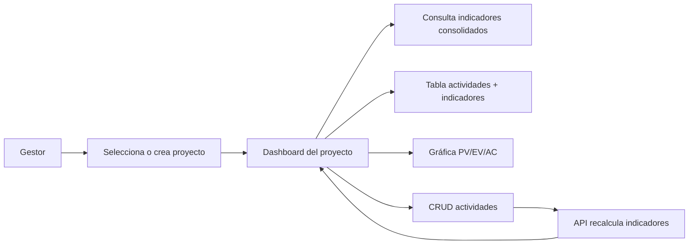

# Requirements — EVM Project Tool (Frontend)

## Nota de artefacto de aprobación

Este documento es la **fuente de verdad funcional** de la unidad de presentación `apps/frontend/` del EVM Project Tool. El usuario puede **aprobar o rechazar el alcance del frontend leyendo únicamente este archivo**, sin consultar design.md, tasks.md ni otros artefactos de SPEC.

**Criterios de aprobación:**

| Criterio | Condición de aprobación |
|----------|-------------------------|
| Alcance funcional | Todas las pantallas, flujos CRUD y visualizaciones descritos aquí cubren la necesidad de negocio de consultar y gestionar proyectos/actividades con indicadores EVM recibidos del backend. |
| Delimitación | In Scope / Out of Scope son explícitos y no solapan responsabilidades de backend, base de datos ni infraestructura. |
| Contrato API | Los endpoints, schemas y códigos de error referenciados coinciden exactamente con el contrato REST del backend (`../../backend/evm-project-tool-backend/design.md` §4.2). |
| Reglas UI | RN-UI-XX y edge cases EC-XX definen comportamiento observable ante datos nulos, errores HTTP y accesibilidad. |
| Requerimientos EARS | Cada REQ-XX es verificable de forma independiente (historia de usuario + criterios de aceptación). |

**Veredicto esperado tras implementación:** la UI cumple todos los REQ-XX, respeta RN-UI-XX y maneja EC-XX sin calcular métricas EVM en cliente.

---

## Spec slug

`evm-project-tool-frontend`

---

## Resumen

Frontend de presentación pura para el **EVM Project Tool**: permite a un gestor de proyecto **seleccionar o crear proyectos**, **administrar actividades** (CRUD) y **visualizar indicadores EVM** (consolidados del proyecto y por actividad) obtenidos exclusivamente del backend REST. Incluye **dashboard** con tabla de actividades, bloque de indicadores consolidados, indicación visual accesible de CPI/SPI y **gráfica comparativa PV/EV/AC** por actividad (Recharts).

La unidad **no implementa lógica de negocio EVM**; solo captura datos del usuario, invoca el API, muestra respuestas y gestiona estados de carga/error. El modelo de dominio compartido está definido en [`../../backend/domain-model.md`](../../backend/domain-model.md). Los requerimientos de API y validación server-side están en [`../../backend/evm-project-tool-backend/requirements.md`](../../backend/evm-project-tool-backend/requirements.md).

**Coordinación multi-unidad:** el orden de entrega es **db → backend → frontend → infrastructure**. Este frontend depende del contrato backend estable. El producto se considera completo cuando las cuatro unidades están implementadas y validadas conjuntamente (TEST/AUDIT de negocio backend + integración backend + E2E con compose de infraestructura).

**Stack fijado:** React 19.3.0, TypeScript 7.0.2, Vite 8.0.10, Node.js 24 LTS, Recharts 3.10.1, ESLint 10.10.0 (flat config), Prettier 3.9.6, contenedor Docker multi-stage (build `node:24-slim` → runtime `nginx:stable-alpine` sirviendo `dist/` estático).

---

## Problema

Los gestores de proyecto que aplican **Earned Value Management (EVM)** necesitan una interfaz que les permita:

- Ver de un vistazo el estado de coste y cronograma de un proyecto y de cada actividad.
- Registrar y actualizar actividades con presupuesto, avance planificado/real y coste real.
- Interpretar rápidamente si el proyecto va **sobre/bajo presupuesto** y **adelantado/atrasado** respecto al plan.

Hoy, sin una capa de presentación dedicada, esos datos y cálculos (realizados en backend) no son accesibles de forma clara para usuarios no técnicos. Se requiere una **interfaz web** que traduzca las respuestas del API en tablas, indicadores y gráficas comprensibles, con **accesibilidad** y **prevención de errores de uso** (doble envío, valores inválidos en formularios), **sin duplicar reglas de cálculo EVM** en el navegador.

---

## Solución

Aplicación web SPA (React + Vite) que:

1. **Lista y gestiona proyectos** (crear, ver detalle, editar, eliminar) consumiendo `/api/v1/projects`.
2. **Presenta un dashboard por proyecto** con actividades e indicadores por fila, indicadores consolidados del proyecto, estado visual CPI/SPI (color + ícono + texto) y gráfica PV/EV/AC.
3. **Permite CRUD de actividades** desde el dashboard; tras cada mutación, la UI refleja los indicadores recalculados **re-fetching** o usando la respuesta del API que ya incluye `indicators`.
4. **Muestra errores de validación y recursos no encontrados** del backend en lenguaje claro, preservando datos del formulario cuando corresponda.
5. Se **despliega como assets estáticos** tras build, servidos por nginx en contenedor Docker.

Toda métrica EVM (PV, EV, CV, SV, CPI, SPI, EAC, VAC e interpretaciones) **proviene del backend**; la UI solo formatea y presenta.

---

## Objetivos y criterios de éxito

| Objetivo | Criterio de éxito |
|----------|-------------------|
| Visibilidad EVM | El usuario ve indicadores consolidados y por actividad sin discrepancia con las respuestas del API. |
| Gestión de datos | CRUD completo de proyectos y actividades funcional contra todos los endpoints documentados. |
| Dashboard operativo | Tabla de actividades, bloque consolidado, gráfica PV/EV/AC y acciones CRUD integradas en una vista principal por proyecto. |
| Accesibilidad CPI/SPI | Ningún estado CPI/SPI se comunica únicamente por color; siempre incluye ícono y texto (interpretación del API o etiqueta equivalente). |
| Robustez de formularios | Anti doble-submit en guardar/eliminar; campos numéricos con restricciones HTML adecuadas; nulls del API mostrados como N/A o texto interpretativo, nunca NaN/Infinity. |
| Integración backend | Peticiones JSON snake_case a `/api/v1`; manejo de 422 y 404 según contrato. |
| Entrega desplegable | Build de producción genera `dist/` servible por nginx en imagen Docker documentada en restricciones operativas. |

---

## Actores y flujo de valor

### Actores

| Actor | Descripción |
|-------|-------------|
| **Gestor de proyecto** | Usuario principal. Crea proyectos, define actividades, consulta indicadores y toma decisiones basadas en CPI/SPI y gráficas. |
| **Backend EVM** | Sistema REST que persiste datos, calcula indicadores y devuelve interpretaciones. No es actor humano; es dependencia externa de la UI. |

### Flujo de valor principal



1. El gestor abre la aplicación y ve la lista de proyectos (`GET /projects`).
2. Crea un proyecto nuevo o selecciona uno existente (`POST /projects` o navegación a detalle).
3. En el dashboard del proyecto (`GET /projects/{id}` + `GET /projects/{id}/activities`) observa consolidados, tabla y gráfica.
4. Crea, edita o elimina actividades; la UI envía mutaciones y **actualiza la vista con datos del API** (respuesta directa o re-fetch).
5. Ante errores de validación o recurso inexistente, recibe feedback claro sin perder contexto innecesariamente.

---

## Delimitación de alcance

### In Scope

- Scaffolding Vite React-TS en `apps/frontend/` (`npm create vite@latest apps/frontend -- --template react-ts`).
- Cliente HTTP hacia base path `/api/v1` (configurable para dev/prod; dev típico proxy o URL apuntando al backend con CORS en `:5173`).
- Pantallas/flujos: listado y CRUD de proyectos; dashboard por proyecto; CRUD de actividades desde dashboard.
- Visualización de `EvmIndicators` e interpretaciones CPI/SPI **tal como las devuelve el API**.
- Gráfica comparativa PV, EV y AC por actividad con Recharts 3.10.1.
- Indicación visual accesible CPI/SPI (color + ícono + texto).
- Manejo UI de estados de carga, error 422/404 y valores null en indicadores.
- Anti doble-submit y inputs numéricos restringidos (RN-UI-03, RN-UI-04).
- Lint/format: ESLint 10.10.0 flat + Prettier 3.9.6.
- Dockerfile multi-stage: build con `node:24-slim`, runtime `nginx:stable-alpine` sirviendo `dist/`.
- Referencia al domain model compartido en [`../../backend/domain-model.md`](../../backend/domain-model.md).

### Out of Scope

- **Autenticación y autorización** (sin login, roles ni tokens en esta unidad).
- **Cálculo o fórmulas EVM en cliente** (PV, EV, CPI, SPI, EAC, VAC, interpretaciones).
- **Definición o generación de OpenAPI** (responsabilidad backend).
- **Esquema de base de datos y migraciones** (unidad db).
- **docker-compose completo** (unidad infrastructure).
- **Creación o modificación de `lefthook.yml`** (ya definido en unit-spec db con entradas `frontend-lint` / `frontend-format`; no duplicar aquí).
- Cobertura de tests frontend obligatoria con umbral porcentual (ver restricciones operativas: tests opcionales).
- Internacionalización multi-idioma (UI en español según este spec; no i18n framework obligatorio).
- Modo offline o persistencia local más allá del estado de sesión de UI.

---

## Reglas de negocio UI

Estas reglas gobiernan **comportamiento de presentación e interacción**. No sustituyen reglas de cálculo EVM (backend).

| ID | Regla |
|----|-------|
| **RN-UI-01** | El frontend **no calcula** PV, EV, CV, SV, CPI, SPI, EAC, VAC ni interpretaciones. Solo muestra valores y textos recibidos en `indicators` / `consolidated_indicators` del API. |
| **RN-UI-02** | La indicación de estado CPI y SPI debe incluir **tres canales simultáneos**: color de fondo/borde o badge, **ícono** semántico (p. ej. tendencia arriba/abajo/neutral) y **texto legible** (usar `cpi_interpretation` / `spi_interpretation` del API o etiqueta equivalente visible). **Nunca** comunicar el estado solo mediante color. |
| **RN-UI-03** | Durante cualquier petición HTTP de mutación (POST, PUT, DELETE), los botones **Guardar**, **Eliminar** y acciones equivalentes deben estar **deshabilitados** o mostrar **loader/indicador de progreso** visible hasta resolución (éxito o error). |
| **RN-UI-04** | Campos `budget_at_completion`, `actual_cost`, `planned_progress_percentage` y `actual_progress_percentage` usan `<input type="number">` con atributos HTML acordes: mínimos/máximos (`min="0"`, porcentajes `max="100"`), `step` apropiado y teclado numérico en dispositivos móviles cuando el SO lo permita. |
| **RN-UI-05** | Errores HTTP **422** y **404** del API se presentan al usuario en **lenguaje claro** (mensajes derivados de `detail`), sin stack traces ni payloads técnicos crudos. |
| **RN-UI-06** | Tras crear, actualizar o eliminar una actividad, la UI debe reflejar indicadores actualizados mediante **respuesta del endpoint de mutación** (cuando incluye `indicators`) y/o **re-fetch** de lista de actividades y detalle de proyecto (consolidados). |
| **RN-UI-07** | Valores numéricos null en indicadores (p. ej. `cpi`, `spi`, `eac`, `vac`) se muestran como **"N/A"** o texto interpretativo del API; nunca como `NaN`, `Infinity` o cadena vacía ambigua. |
| **RN-UI-08** | El formato de intercambio con el API es **JSON snake_case** en request y response; la UI serializa/deserializa respetando nombres del contrato. |
| **RN-UI-09** | Listado de proyectos ordenado según criterio de presentación definido en implementación (p. ej. `updated_at` descendente), sin alterar datos en servidor salvo lo que permitan endpoints existentes. |

### Interpretaciones CPI/SPI del backend (mostrar en UI, no recalcular)

| Condición (valor API) | Texto a mostrar (`cpi_interpretation` / equivalente) |
|-----------------------|------------------------------------------------------|
| CPI `null` | "Sin costo real registrado — CPI no aplicable" |
| CPI > 1 | "Bajo presupuesto" |
| CPI = 1 | "En presupuesto" |
| CPI < 1 | "Sobre presupuesto" |

| Condición (valor API) | Texto a mostrar (`spi_interpretation` / equivalente) |
|-----------------------|------------------------------------------------------|
| SPI `null` | "Sin avance planificado a la fecha — SPI no aplicable" |
| SPI > 1 | "Adelantado" |
| SPI = 1 | "En plan" |
| SPI < 1 | "Atrasado" |

La UI debe preferir los campos `cpi_interpretation` y `spi_interpretation` de la respuesta cuando estén presentes; si solo hay valor numérico/null, mapear a los textos anteriores de forma consistente.

---

## Requerimientos funcionales (EARS)

Convención EARS: **[Ubicación/Evento]**, el sistema **[debe/shall]** **[comportamiento]** **[condición opcional]**.

---

### REQ-01 — Listado de proyectos

**Historia:** Como gestor de proyecto, quiero ver todos mis proyectos al entrar en la aplicación, para elegir sobre cuál trabajar.

**En la pantalla inicial**, el sistema **debe** solicitar `GET /api/v1/projects` y **mostrar** una lista de proyectos con al menos: nombre, descripción (si existe) y fechas relevantes (`created_at`, `updated_at`) formateadas para lectura humana.

**Criterios de aceptación:**

- CA-01.1: Con respuesta 200 y array vacío, se muestra estado vacío explícito (mensaje orientativo, no error).
- CA-01.2: Con respuesta 200 y N proyectos, se listan los N elementos.
- CA-01.3: Error de red o respuesta no exitosa muestra mensaje de error comprensible (RN-UI-05).
- CA-01.4: Cada proyecto listado permite navegar al dashboard/detalle del proyecto (REQ-04).

---

### REQ-02 — Crear proyecto

**Historia:** Como gestor, quiero crear un proyecto con nombre y descripción opcional, para empezar a registrar actividades.

**Cuando el usuario envía el formulario de creación**, el sistema **debe** enviar `POST /api/v1/projects` con body `ProjectCreateRequest`:

```json
{
  "name": "string",
  "description": "string | omitido"
}
```

**Criterios de aceptación:**

- CA-02.1: Respuesta **201** con `ProjectResponse` redirige o selecciona el proyecto creado y muestra confirmación.
- CA-02.2: Respuesta **422** (`detail` array) muestra errores de campo (p. ej. name vacío) junto al formulario; datos válidos no enviados se preservan.
- CA-02.3: Durante la petición, botón guardar deshabilitado o con loader (RN-UI-03).
- CA-02.4: Campo `name` es obligatorio en UI (validación HTML/atributo `required` además del 422 del API).

---

### REQ-03 — Editar y eliminar proyecto

**Historia:** Como gestor, quiero actualizar o eliminar un proyecto existente, para mantener la información al día.

**Cuando el usuario confirma edición**, el sistema **debe** enviar `PUT /api/v1/projects/{project_id}` con `ProjectUpdateRequest` (mismos campos que creación: `name`, `description?`).

**Cuando el usuario confirma eliminación**, el sistema **debe** enviar `DELETE /api/v1/projects/{project_id}`.

**Criterios de aceptación:**

- CA-03.1: PUT **200** actualiza la vista con `ProjectResponse` retornado.
- CA-03.2: PUT **404** muestra mensaje de proyecto no encontrado (RN-UI-05).
- CA-03.3: PUT **422** muestra errores de validación en formulario.
- CA-03.4: DELETE **204** elimina el proyecto de la lista y navega fuera del dashboard si estaba activo.
- CA-03.5: DELETE **404** informa recurso no encontrado.
- CA-03.6: Confirmación explícita antes de eliminar (diálogo/modal) para evitar borrado accidental.
- CA-03.7: RN-UI-03 aplicada en PUT y DELETE.

---

### REQ-04 — Selección y detalle de proyecto (contexto dashboard)

**Historia:** Como gestor, quiero seleccionar un proyecto y ver su contexto global, para entender el estado consolidado antes de revisar actividades.

**Al seleccionar un proyecto**, el sistema **debe** solicitar `GET /api/v1/projects/{project_id}` y obtener `ProjectDetailResponse` incluyendo `consolidated_indicators` (`EvmIndicators`).

**Criterios de aceptación:**

- CA-04.1: Respuesta **200** muestra nombre/descripción del proyecto y bloque de indicadores consolidados (REQ-06).
- CA-04.2: Respuesta **404** muestra error claro y opción de volver al listado.
- CA-04.3: El identificador de ruta/estado usa `project_id` del API (UUID o formato que devuelva el backend).
- CA-04.4: Cambio de proyecto recarga actividades e indicadores asociados.

---

### REQ-05 — CRUD de actividades (API completo)

**Historia:** Como gestor, quiero crear, consultar, editar y eliminar actividades de un proyecto, para mantener BAC, avances y coste real actualizados.

#### REQ-05a — Listar actividades

**En el dashboard del proyecto**, el sistema **debe** solicitar `GET /api/v1/projects/{project_id}/activities` y renderizar `ActivityWithIndicatorsResponse[]`.

- CA-05a.1: **200** con array vacío → tabla vacía con mensaje informativo (EC-03).
- CA-05a.2: **404** → proyecto no existe; mensaje claro.

#### REQ-05b — Crear actividad

**Cuando el usuario guarda una actividad nueva**, el sistema **debe** enviar `POST /api/v1/projects/{project_id}/activities` con `ActivityCreateRequest`:

| Campo | Tipo | Restricción UI/API |
|-------|------|---------------------|
| `name` | string | obligatorio |
| `budget_at_completion` | number | ≥ 0, input number |
| `planned_progress_percentage` | number | 0–100, input number |
| `actual_progress_percentage` | number | 0–100, input number |
| `actual_cost` | number | ≥ 0, input number |

- CA-05b.1: **201** con `ActivityWithIndicatorsResponse` → fila nueva en tabla con `indicators` (RN-UI-06).
- CA-05b.2: **422** → errores por campo; formulario conserva valores válidos.
- CA-05b.3: **404** → proyecto no encontrado.

#### REQ-05c — Obtener actividad (detalle/edición)

**Cuando se abre edición de una actividad**, el sistema **puede** usar datos ya en tabla o solicitar `GET /api/v1/activities/{activity_id}`.

- CA-05c.1: **200** rellena formulario con campos actuales e indicadores de solo lectura si se muestran.
- CA-05c.2: **404** → actividad no encontrada.

#### REQ-05d — Actualizar actividad

**Cuando el usuario guarda cambios**, el sistema **debe** enviar `PUT /api/v1/activities/{activity_id}` con `ActivityUpdateRequest` (mismos campos que creación).

- CA-05d.1: **200** actualiza fila con respuesta incluyendo `indicators` recalculados (RN-UI-06).
- CA-05d.2: **422** / **404** según contrato; RN-UI-05 y RN-UI-03.

#### REQ-05e — Eliminar actividad

**Cuando el usuario confirma eliminación**, el sistema **debe** enviar `DELETE /api/v1/activities/{activity_id}`.

- CA-05e.1: **204** elimina fila y actualiza consolidados (re-fetch proyecto o lógica equivalente).
- CA-05e.2: **404** mensaje claro; RN-UI-03.

---

### REQ-06 — Dashboard del proyecto

**Historia:** Como gestor, quiero un dashboard único por proyecto con tabla de actividades, indicadores consolidados, estado CPI/SPI accesible y gráfica PV/EV/AC, para analizar el rendimiento sin exportar datos.

**En la vista dashboard de un proyecto seleccionado**, el sistema **debe** presentar simultáneamente:

1. **Tabla de actividades** con columnas de datos de entrada (`name`, `budget_at_completion`, `planned_progress_percentage`, `actual_progress_percentage`, `actual_cost`) e **indicadores calculados** recibidos del API (`indicators`: pv, ev, cv, sv, cpi, spi, eac, vac) — **sin calcular en cliente** (RN-UI-01).
2. **Bloque de indicadores consolidados** del proyecto desde `ProjectDetailResponse.consolidated_indicators`.
3. **Indicación visual CPI/SPI** por actividad y/o consolidado según diseño de implementación, cumpliendo RN-UI-02 (color + ícono + texto con interpretaciones del API).
4. **Gráfica comparativa PV / EV / AC** por actividad usando Recharts 3.10.1, con una serie o categoría por actividad (eje X = actividades o agrupación clara; leyenda PV, EV, AC).
5. **Acciones CRUD de actividades** integradas (formulario modal/inline/panel según implementación) con flujos REQ-05.

**Criterios de aceptación:**

- CA-06.1: Tras guardar actividad (crear/editar), tabla, consolidados y gráfica reflejan datos actualizados vía respuesta API o re-fetch (RN-UI-06).
- CA-06.2: Gráfica no se renderiza con valores inválidos; nulls omitidos o mostrados como cero solo si el API lo envía explícitamente — preferir exclusión de barra/punto para null (EC-01, EC-02).
- CA-06.3: Proyecto sin actividades: tabla vacía, consolidados con nulls manejados (EC-03), HTTP 200 sin error de UI.
- CA-06.4: Dashboard accesible por teclado para acciones principales (navegación a formularios, submit, cancelar).
- CA-06.5: Indicadores CPI/SPI nunca dependen solo de color (RN-UI-02).

---

### REQ-07 — Presentación de indicadores EVM e interpretaciones

**Historia:** Como gestor, quiero ver valores e interpretaciones de indicadores en formato legible, para entender el estado sin conocer fórmulas EVM.

**Cuando se muestran `EvmIndicators`**, el sistema **debe**:

- Formatear moneda/números según convención de implementación (consistente en toda la app).
- Mostrar `cpi_interpretation` y `spi_interpretation` del API en UI de estado.
- Aplicar RN-UI-07 para campos null.

**Criterios de aceptación:**

- CA-07.1: `cpi: null` con interpretación del API visible; numérico CPI formateado cuando no es null.
- CA-07.2: Misma lógica para SPI.
- CA-07.3: No aparece "NaN" ni "Infinity" en ningún componente ante EC-01/EC-02.

---

### REQ-08 — Accesibilidad visual CPI/SPI

**Historia:** Como gestor con deficiencia de percepción de color, quiero distinguir estados de coste y cronograma por ícono y texto además del color.

**Para cada indicador CPI y SPI mostrado**, el sistema **debe** incluir color, ícono y texto simultáneamente (RN-UI-02).

**Criterios de aceptación:**

- CA-08.1: Inspección de componente: atributo aria-label o texto visible contiene la interpretación completa.
- CA-08.2: Ícono diferenciado para estados favorable / neutral / desfavorable (mapeo coherente con interpretación).
- CA-08.3: Contraste de color cumple WCAG AA como objetivo de implementación (restricción operativa).

---

### REQ-09 — Anti doble-submit y estados de carga

**Historia:** Como gestor, quiero que la aplicación evite envíos duplicados al guardar o eliminar, para no crear datos inconsistentes o errores confusos.

**Durante mutaciones HTTP**, el sistema **debe** aplicar RN-UI-03 en todos los formularios y diálogos de eliminación (proyecto y actividad).

**Criterios de aceptación:**

- CA-09.1: Clic repetido en Guardar no dispara segunda petición hasta finalizar la primera.
- CA-09.2: Loader o texto "Guardando…"/"Eliminando…" visible durante la operación.
- CA-09.3: Tras error, controles se re-habilitan para reintento.

---

### REQ-10 — Manejo de errores API

**Historia:** Como gestor, quiero entender qué salió mal cuando el servidor rechaza mis datos, para corregirlos sin contactar soporte técnico.

**Cuando el API responde 422 o 404**, el sistema **debe** mapear el cuerpo de error a mensajes UI (RN-UI-05).

**Criterios de aceptación:**

- CA-10.1: **422** con `{ "detail": [{ "loc", "msg", "type" }] }` → mensajes junto a campos o lista resumida legible.
- CA-10.2: **404** con `{ "detail": "string" }` → mensaje global o inline según contexto.
- CA-10.3: No se muestra stack trace ni JSON crudo al usuario final.

---

### REQ-11 — Configuración de entorno y CORS (desarrollo)

**Historia:** Como desarrollador frontend, quiero que la app en dev (`:5173`) consuma el backend configurado, respetando CORS del servidor.

**En entorno de desarrollo**, el sistema **debe** permitir configurar URL base del API (variable de entorno Vite, p. ej. `VITE_API_BASE_URL`) apuntando al backend que expone `CORS_ORIGINS` incluyendo origen del frontend.

**Criterios de aceptación:**

- CA-11.1: Peticiones van a `/api/v1/...` relativo o absoluto según configuración.
- CA-11.2: Documentación en README o comentario de implementación del valor esperado en dev (sin duplicar compose completo).

---

### REQ-12 — Build y contenedor de producción

**Historia:** Como operador, quiero desplegar la UI como estáticos en nginx, para servirla junto al backend en infraestructura.

**El artefacto de build**, el sistema **debe** producir `dist/` estático empaquetado en imagen Docker multi-stage: etapa 1 `node:24-slim` (install + build), etapa 2 `nginx:stable-alpine` copiando `dist/` a raíz web nginx.

**Criterios de aceptación:**

- CA-12.1: `npm run build` (o equivalente) completa sin error en Node 24 LTS.
- CA-12.2: Imagen final no incluye código fuente ni node_modules; solo assets estáticos.
- CA-12.3: SPA routing: nginx configurado para fallback a `index.html` en rutas cliente (history API).

---

## Edge cases

Comportamiento **visual/interacción** ante condiciones límite. Errores de negocio/cálculo están definidos en backend; aquí se especifica **cómo debe reaccionar la UI**.

| ID | Condición | Comportamiento UI esperado |
|----|-----------|----------------------------|
| **EC-01** | `cpi`, `eac` o `vac` null cuando AC=0 (backend) | Mostrar "N/A" o interpretación textual del API; no mostrar NaN/Infinity; badge CPI con texto "Sin costo real registrado — CPI no aplicable" si aplica. |
| **EC-02** | `spi` null cuando PV=0 (backend) | Mostrar "N/A" o interpretación "Sin avance planificado a la fecha — SPI no aplicable"; gráfica/traza SPI omitida o leyenda explicativa. |
| **EC-03** | Proyecto sin actividades (`GET activities` → `[]`, consolidados con nulls) | Tabla vacía con mensaje amigable; bloque consolidado visible con nulls manejados (RN-UI-07); gráfica vacía o placeholder "Sin actividades"; HTTP 200, no pantalla de error. |
| **EC-04** | POST proyecto con `name` vacío → 422 | Error en campo nombre; formulario no se cierra; RN-UI-03 liberado tras respuesta. |
| **EC-05** | POST actividad con porcentaje >100 o <0 → 422 | Mensajes de validación por campo; valores inválidos destacados; datos válidos preservados. |
| **EC-06** | POST actividad con BAC o AC negativo → 422 | Igual EC-05; inputs con `min="0"` previenen en parte en cliente pero 422 del API sigue mostrándose claro. |
| **EC-07** | GET/PUT/DELETE proyecto o actividad inexistente → 404 | Mensaje claro; navegación segura (volver a lista o dashboard); no estado roto en tabla. |
| **EC-08** | PUT actividad concurrente (otro cliente eliminó recurso) → 404 | Informar actividad no encontrada; refrescar lista de actividades. |
| **EC-09** | Fallo de red / timeout | Mensaje genérico de conectividad; reintento manual disponible; RN-UI-03 no deja botones colgados indefinidamente (timeout UI razonable). |
| **EC-10** | Respuesta 200 con `indicators` parcialmente null en gráfica Recharts | Excluir o segmentar series null sin romper escala; leyenda coherente; no excepción JavaScript en consola visible al usuario. |
| **EC-11** | Eliminación de última actividad del proyecto | Tabla pasa a estado EC-03; consolidados actualizados tras re-fetch de detalle proyecto. |
| **EC-12** | CPI/SPI numérico en límite (=1 exacto) | Texto "En presupuesto" / "En plan"; ícono neutral; no clasificar erróneamente como favorable/desfavorable. |

---

## Contrato REST de referencia (dependencia backend)

Base path: **`/api/v1`**. JSON **snake_case**. CORS gestionado por backend (`CORS_ORIGINS`; dev típico frontend Vite `:5173`).

### Endpoints consumidos por la UI

| # | Método | Ruta | Request body | Respuestas |
|---|--------|------|--------------|------------|
| 1 | GET | `/projects` | — | 200: `ProjectResponse[]` |
| 2 | POST | `/projects` | `ProjectCreateRequest` | 201: `ProjectResponse`; 422 validación |
| 3 | GET | `/projects/{project_id}` | — | 200: `ProjectDetailResponse`; 404 |
| 4 | PUT | `/projects/{project_id}` | `ProjectUpdateRequest` | 200: `ProjectResponse`; 404; 422 |
| 5 | DELETE | `/projects/{project_id}` | — | 204; 404 |
| 6 | GET | `/projects/{project_id}/activities` | — | 200: `ActivityWithIndicatorsResponse[]`; 404 |
| 7 | POST | `/projects/{project_id}/activities` | `ActivityCreateRequest` | 201: `ActivityWithIndicatorsResponse`; 404; 422 |
| 8 | GET | `/activities/{activity_id}` | — | 200: `ActivityWithIndicatorsResponse`; 404 |
| 9 | PUT | `/activities/{activity_id}` | `ActivityUpdateRequest` | 200: `ActivityWithIndicatorsResponse`; 404; 422 |
| 10 | DELETE | `/activities/{activity_id}` | — | 204; 404 |

### Schemas (snake_case)

**ProjectResponse:** `id`, `name`, `description?`, `created_at`, `updated_at`

**ProjectDetailResponse:** ProjectResponse + `consolidated_indicators` (`EvmIndicators`)

**ProjectCreateRequest / ProjectUpdateRequest:** `name`, `description?`

**ActivityCreateRequest / ActivityUpdateRequest:** `name`, `budget_at_completion` (≥0), `planned_progress_percentage` (0–100), `actual_progress_percentage` (0–100), `actual_cost` (≥0)

**ActivityWithIndicatorsResponse:** `id`, `project_id`, `name`, `budget_at_completion`, `planned_progress_percentage`, `actual_progress_percentage`, `actual_cost`, `created_at`, `updated_at`, `indicators` (`EvmIndicators`)

**EvmIndicators:** `pv`, `ev`, `cv`, `sv`, `cpi` (nullable), `spi` (nullable), `eac` (nullable), `vac` (nullable), `cpi_interpretation`, `spi_interpretation`

### Errores API

| Código | Cuerpo | Uso UI |
|--------|--------|--------|
| 422 | `{ "detail": [{ "loc", "msg", "type" }] }` | Validación formularios |
| 404 | `{ "detail": "string" }` | Recurso no encontrado |

Definición completa y evolución del contrato: [`../../backend/evm-project-tool-backend/design.md`](../../backend/evm-project-tool-backend/design.md) §4.2.

---

## Restricciones operativas

### Stack (no reabrir)

| Componente | Versión |
|------------|---------|
| React | 19.3.0 |
| TypeScript | 7.0.2 |
| Vite | 8.0.10 |
| Node.js | 24 LTS |
| Recharts | 3.10.1 |
| ESLint | 10.10.0 (`eslint.config.js` flat config) |
| Prettier | 3.9.6 |

Scaffolding inicial: `npm create vite@latest apps/frontend -- --template react-ts`.

### Seguridad UI (cerrada)

- Botones guardar/eliminar: deshabilitados o con loader durante petición (RN-UI-03, REQ-09).
- Inputs BAC, AC y porcentajes: `type="number"` con restricciones HTML y acceso teclado acorde (RN-UI-04).
- Sin almacenamiento de secretos en frontend; sin auth en esta unidad.
- Sanitizar presentación de textos de error antes de render (evitar XSS desde mensajes API — tratar `detail` como texto, no HTML crudo).

### Calidad de código

- ESLint + Prettier obligatorios en desarrollo; hooks `frontend-lint` / `frontend-format` ya registrados en lefthook del monorepo (unit-spec db) — **no crear lefthook.yml en esta unidad**.
- TypeScript strict recomendado; tipos alineados con schemas del contrato API.

### Tests

- **No hay obligación de cobertura formal frontend** definida por el producto (cobertura obligatoria aplica a capa de negocio backend + integración backend).
- **Opcional / mejora:** tests de componente con Vitest + Testing Library para flujos críticos (formulario actividad, render CPI/SPI accesible, manejo EC-01/EC-03); smoke test de build en CI si infrastructure lo incorpora.
- E2E cross-stack (frontend + backend en compose) es responsabilidad de infrastructure/TEST global, no duplicar suite E2E completa solo en esta unidad.

### Docker

- Multi-stage: **build** `node:24-slim` → **runtime** `nginx:stable-alpine` sirviendo contenido de `dist/`.
- No incluir docker-compose completo en esta unidad.

### Accesibilidad

- Objetivo WCAG 2.1 AA en componentes interactivos y indicadores CPI/SPI (REQ-08).
- Navegación por teclado en formularios y tablas principales.

### Referencias internas

| Documento | Ruta relativa |
|-----------|---------------|
| Domain model | [`../../backend/domain-model.md`](../../backend/domain-model.md) |
| Backend requirements | [`../../backend/evm-project-tool-backend/requirements.md`](../../backend/evm-project-tool-backend/requirements.md) |
| Contrato API §4.2 | [`../../backend/evm-project-tool-backend/design.md`](../../backend/evm-project-tool-backend/design.md) |

---

## Glosario mínimo (UI)

| Término | Significado en UI |
|---------|-------------------|
| BAC | `budget_at_completion` — presupuesto a la conclusión de la actividad. |
| AC | `actual_cost` — coste real acumulado. |
| PV / EV | Valores mostrados desde `indicators`; no calculados en cliente. |
| CPI / SPI | Índices nullable mostrados con interpretación textual del API. |
| Dashboard | Vista principal por proyecto (REQ-06). |
| Consolidados | `consolidated_indicators` a nivel proyecto. |

---

*Documento generado para aprobación de alcance frontend — spec slug `evm-project-tool-frontend`.*
