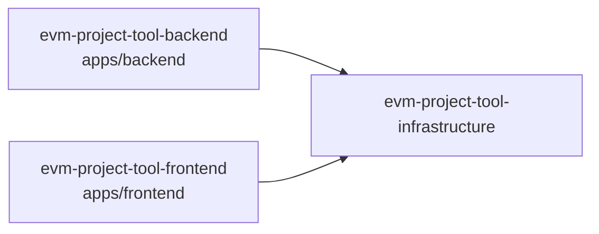

# Specs: apps/infrastructure

> Orquestación Docker Compose del stack completo de EVM Project Tool.

## Grafo de specs

## Tabla de specs

| Spec | Estado | Creación | Paralelizable con | Ruta | Depende de |
|---|:---:|:---:|:---:|---|---|
| evm-project-tool-infrastructure | `Completado` | `Aprobado` | `D` | `evm-project-tool-infrastructure/summary.md` | `../../backend/evm-project-tool-backend/summary.md`, `../../frontend/evm-project-tool-frontend/summary.md` |
