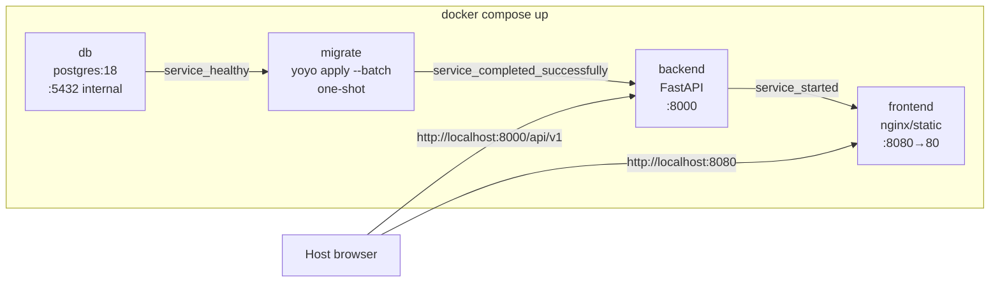

# Design — evm-project-tool-infrastructure

## §1 Metadata

| Campo | Valor |
| :--- | :--- |
| **Spec ID** | `evm-project-tool-infrastructure` |
| **Tipo** | Technical Design Document (TDD) |
| **Alcance de código** | `apps/infrastructure/` exclusivamente |
| **Orquesta (build, no modifica fuente)** | `apps/db/`, `apps/backend/`, `apps/frontend/` |
| **Depende de (diseño)** | [evm-project-tool-db](../../db/evm-project-tool-db/design.md), [evm-project-tool-backend](../../backend/evm-project-tool-backend/design.md), [evm-project-tool-frontend](../../frontend/evm-project-tool-frontend/design.md) |
| **Stack** | Docker Compose V2, PostgreSQL 18, yoyo-migrations 9.0.0 |
| **Objetivo** | Un solo comando (`docker compose up`) levanta base de datos, migraciones, API y frontend para desarrollo local E2E |

---

## §2 Architecture

### 2.1 Enfoque

Este spec define la **capa de orquestación local** del monorepo EVM Project Tool. No contiene lógica de negocio, esquema DDL ni código de aplicación: únicamente `compose.yaml`, variables de entorno, un contenedor one-shot de migraciones y documentación mínima de operación.

**Principios:**

- **Compose como única entrada local:** el desarrollador no ejecuta migraciones, backend ni frontend por separado fuera de Docker para el flujo E2E estándar.
- **Build de contextos hermanos:** `compose.yaml` referencia `build.context` en `../db`, `../backend` y `../frontend` (según el Dockerfile de cada app). El build **copia o monta** artefactos necesarios; **no altera** el código fuente de esas apps.
- **Orden de arranque explícito:** PostgreSQL debe estar healthy antes de migrar; migraciones deben completar con éxito antes del backend; el frontend arranca cuando el backend está started (healthcheck opcional en backend).
- **Secretos fuera del repositorio:** credenciales y URLs sensibles viven en `.env` (gitignored); `.env.example` documenta las claves sin valores reales.

### 2.2 Diagrama de arranque



**Secuencia:** `db` → `migrate` → `backend` → `frontend`

### 2.5 Decisiones cerradas

| ID | Decisión | Justificación |
| :--- | :--- | :--- |
| D-INF-01 | **Docker Compose V2** con archivo `compose.yaml` (no `docker-compose.yml`) | Estándar actual de Docker; un solo manifiesto en `apps/infrastructure/` |
| D-INF-02 | **No duplicar hooks de lefthook** en infrastructure | Los hooks viven a nivel repo; infrastructure no define `lefthook.yml` |
| D-INF-03 | **Secretos vía `.env`** interpolado por Compose | Simplicidad local; `.env` en `.gitignore`, `.env.example` versionado |
| D-INF-04 | Imagen **`postgres:18`** para servicio `db` | Alineado con stack PostgreSQL del spec DB |
| D-INF-05 | Migraciones con **`yoyo apply --batch`** en contenedor one-shot | Sin prompts interactivos; fallo de migrate bloquea backend |
| D-INF-06 | **Sin Kubernetes** en este spec | Alcance = desarrollo local; prod fuera de footprint |
| D-INF-07 | **Orquestar Dockerfiles hermanos**, no redefinir lógica de app | Backend/frontend/db mantienen sus Dockerfiles; infrastructure solo los referencia |

### 2.6 Riesgos

| Riesgo | Impacto | Mitigación |
| :--- | :--- | :--- |
| `migrate` falla y backend arranca contra esquema viejo | Alto | `depends_on: migrate: condition: service_completed_successfully`; `restart: "no"` en migrate |
| `VITE_API_BASE_URL` apunta a hostname interno de Docker | Alto | Build-arg debe usar URL **vista desde el navegador del host** (`http://localhost:8000/api/v1`) |
| CORS rechaza peticiones del frontend | Medio | `CORS_ORIGINS` incluye origen del frontend en host (`http://localhost:8080`) |
| Volúmenes PostgreSQL corruptos tras cambios de versión | Medio | Documentar `docker compose down -v` para reset local; no mezclar major versions |
| Rutas relativas de build context incorrectas | Medio | Paths desde `apps/infrastructure/`: `../backend`, `../frontend`, `./migrate` |
| `.env` no copiado desde `.env.example` | Bajo | README con paso explícito `cp .env.example .env` |

---

## §3 Data

**N/A** para este spec.

Infrastructure no define tablas, índices ni DDL. El esquema lo aplican las migraciones yoyo en `apps/db/migrations/` (spec [evm-project-tool-db](../../db/evm-project-tool-db/design.md)), ejecutadas por el servicio `migrate`. El servicio `db` solo expone PostgreSQL 18 con volumen persistente para datos de desarrollo.

---

## §4 Interfaces y contratos

### 4.1 Servicios Compose (4)

| Servicio | Imagen / Build | Dependencias | Puertos (host:container) | Rol |
| :--- | :--- | :--- | :--- | :--- |
| `db` | `postgres:18` | — | *(ninguno publicado)* `:5432` interno | PostgreSQL; healthcheck `pg_isready` |
| `migrate` | build `./migrate` | `db` healthy | — | One-shot: `yoyo apply --batch` |
| `backend` | build `../backend` | `migrate` completed | `8000:8000` | API REST FastAPI |
| `frontend` | build `../frontend` | `backend` started | `8080:80` | SPA servida por nginx (o equivalente del Dockerfile frontend) |

#### 4.1.1 Servicio `db`

- **Imagen:** `postgres:18`
- **Variables:** `POSTGRES_USER`, `POSTGRES_PASSWORD`, `POSTGRES_DB` desde `.env`
- **Volumen:** persistencia de datos en `postgres_data:/var/lib/postgresql` — contrato cerrado para `postgres:18` (la imagen oficial rechaza el subpath `/var/lib/postgresql/data`; no aplica el layout `/data` de versiones anteriores)
- **Healthcheck:** `pg_isready -U ${POSTGRES_USER} -d ${POSTGRES_DB}`
- **Red:** accesible como hostname `db` desde `migrate` y `backend`

#### 4.1.2 Servicio `migrate`

- **Build context:** `apps/infrastructure/migrate/` (Dockerfile minimal Python 3.14 + yoyo 9.0.0)
- **Migrations path:** montaje de volumen `../db/migrations:/migrations` **o** `COPY` en Dockerfile desde contexto ampliado — preferir **volumen en compose** para no duplicar archivos SQL en la imagen de migrate
- **Comando:** `yoyo apply --batch`
- **Conexión:** `DATABASE_URL=postgresql://${POSTGRES_USER}:${POSTGRES_PASSWORD}@db:5432/${POSTGRES_DB}` (formato libpq/psycopg; yoyo 9.0 y backend FastAPI lo consumen directamente — no usar dialecto SQLAlchemy `postgresql+psycopg://`)
- **Restart:** `"no"` (one-shot)
- **depends_on:** `db` con `condition: service_healthy`

#### 4.1.3 Servicio `backend`

- **Build context:** `../backend` (Dockerfile del spec backend)
- **depends_on:** `migrate` con `condition: service_completed_successfully`
- **Variables:** `DATABASE_URL`, `CORS_ORIGINS`, `LOG_LEVEL`
- **Publish:** `8000:8000`
- **Healthcheck (opcional):** `GET http://localhost:8000/api-docs` o `GET http://localhost:8000/api/v1/projects`

#### 4.1.4 Servicio `frontend`

- **Build context:** `../frontend`
- **Build args:** `VITE_API_BASE_URL=http://localhost:8000/api/v1` (URL accesible desde el **navegador en el host**, no hostname Docker interno)
- **depends_on:** `backend` con `condition: service_started`
- **Publish:** `8080:80`

### 4.2 Variables de entorno (`.env.example`)

| Variable | Consumidor | Descripción | Ejemplo (sin secretos reales) |
| :--- | :--- | :--- | :--- |
| `POSTGRES_USER` | `db`, `migrate`, `backend` | Usuario PostgreSQL | `evm_user` |
| `POSTGRES_PASSWORD` | `db`, `migrate`, `backend` | Contraseña PostgreSQL | `changeme` |
| `POSTGRES_DB` | `db`, `migrate`, `backend` | Nombre de base de datos | `evm_db` |
| `DATABASE_URL` | `migrate`, `backend` | URL libpq/psycopg hacia servicio `db` (yoyo 9.0 + psycopg ConnectionPool; **no** dialecto SQLAlchemy) | `postgresql://evm_user:changeme@db:5432/evm_db` |
| `CORS_ORIGINS` | `backend` | Orígenes permitidos (CSV o JSON según backend) | `http://localhost:8080` |
| `VITE_API_BASE_URL` | `frontend` (build-arg) | Base URL API vista desde el host | `http://localhost:8000/api/v1` |
| `LOG_LEVEL` | `backend` | Nivel de log | `INFO` |

### 4.3 Mapa de puertos

| Puerto host | Servicio | Protocolo | Uso |
| :--- | :--- | :--- | :--- |
| `8080` | `frontend` | HTTP | UI React en navegador |
| `8000` | `backend` | HTTP | API REST / OpenAPI |
| *(no expuesto)* | `db` | TCP 5432 | Solo red interna Compose |

### 4.4 Esqueleto `compose.yaml` (referencia, sin secretos)

```yaml
# apps/infrastructure/compose.yaml
services:
  db:
    image: postgres:18
    environment:
      POSTGRES_USER: ${POSTGRES_USER}
      POSTGRES_PASSWORD: ${POSTGRES_PASSWORD}
      POSTGRES_DB: ${POSTGRES_DB}
    volumes:
      # postgres:18 — mount at /var/lib/postgresql (NOT /var/lib/postgresql/data)
      - postgres_data:/var/lib/postgresql
    healthcheck:
      test: ["CMD-SHELL", "pg_isready -U ${POSTGRES_USER} -d ${POSTGRES_DB}"]
      interval: 5s
      timeout: 5s
      retries: 5

  migrate:
    build:
      context: ./migrate
    environment:
      DATABASE_URL: ${DATABASE_URL}
    volumes:
      - ../db/migrations:/migrations:ro
    command: ["yoyo", "apply", "--batch", "-d", "${DATABASE_URL}", "/migrations"]
    depends_on:
      db:
        condition: service_healthy
    restart: "no"

  backend:
    build:
      context: ../backend
    environment:
      DATABASE_URL: ${DATABASE_URL}
      CORS_ORIGINS: ${CORS_ORIGINS}
      LOG_LEVEL: ${LOG_LEVEL}
    ports:
      - "8000:8000"
    depends_on:
      migrate:
        condition: service_completed_successfully
    # healthcheck:
    #   test: ["CMD", "curl", "-f", "http://localhost:8000/api-docs"]
    #   interval: 10s
    #   retries: 3

  frontend:
    build:
      context: ../frontend
      args:
        VITE_API_BASE_URL: ${VITE_API_BASE_URL}
    ports:
      - "8080:80"
    depends_on:
      backend:
        condition: service_started

volumes:
  postgres_data:
```

> **Nota:** La sintaxis exacta de `yoyo` (flags, ruta de config) debe alinearse con [evm-project-tool-db](../../db/evm-project-tool-db/design.md). El esqueleto ilustra dependencias, puertos y variables; IMPLEMENT ajustará el comando final al contrato yoyo del repo.

### 4.5 Esqueleto `migrate/Dockerfile`

```dockerfile
FROM python:3.14-slim
RUN pip install --no-cache-dir yoyo-migrations==9.0.0 psycopg[binary]
WORKDIR /migrations
# Las migraciones se montan vía volumen en compose; no COPY desde ../db en build
CMD ["yoyo", "apply", "--batch"]
```

---

## §5 Implementation Target Structure

**Footprint exclusivo:** `apps/infrastructure/`. Este spec **no** incluye `lefthook.yml`, contenido de `apps/db/migrations/`, ni código de `apps/backend/` o `apps/frontend/`.

Compose **construye** imágenes desde contextos hermanos (`../db` implícito vía volumen de migrations, `../backend`, `../frontend`) pero **no modifica** el código fuente de esas aplicaciones.

```
apps/infrastructure/
├── compose.yaml
├── .env.example
├── .gitignore          # ignora .env; NO ignora .env.example
├── migrate/
│   └── Dockerfile      # Python 3.14 + yoyo 9.0.0; CMD yoyo apply --batch
└── README.md           # (opcional) docker compose up / down
```

| Artefacto | Origen spec | Notas |
| :--- | :--- | :--- |
| `compose.yaml` | §4.4 | Cuatro servicios, volúmenes, depends_on con conditions |
| `.env.example` | §4.2 | Plantilla versionada |
| `.gitignore` | §7 | Entrada `.env` |
| `migrate/Dockerfile` | §4.5 | Runner minimal; migrations vía volumen |
| `README.md` | §8 | Comandos locales mínimos |

### §5.1 Barrido términos críticos

**sin términos críticos afectados**

---

## §6 Matriz de trazabilidad

| Requisito / objetivo (draft / hermanos) | Artefacto infrastructure | Verificación |
| :--- | :--- | :--- |
| Un comando levanta todo el stack local | `compose.yaml` + `README.md` | `docker compose up` → 4 servicios healthy/started |
| PostgreSQL 18 para datos | Servicio `db` | Imagen `postgres:18`, volumen persistente |
| Migraciones yoyo antes del backend | Servicio `migrate` | Backend no arranca si migrate falla |
| API en puerto 8000 | Servicio `backend` | `curl localhost:8000/api-docs` o `/api/v1/projects` |
| Frontend accesible en navegador | Servicio `frontend` | `http://localhost:8080` carga UI |
| Frontend llama API en host | `VITE_API_BASE_URL` build-arg | Peticiones XHR a `localhost:8000` |
| CORS permite origen frontend | `CORS_ORIGINS` | Preflight desde `localhost:8080` OK |
| Secretos no en repo | `.env.example` + `.gitignore` | `.env` ausente en git |
| Esquema DB (spec DB) | Volumen `../db/migrations` | migrate aplica scripts del spec DB |
| Dockerfiles en apps hermanas | `build.context: ../backend`, `../frontend` | Build exitoso sin copiar lógica a infrastructure |

---

## §7 Errores y seguridad

### 7.1 Manejo de errores operativos

| Escenario | Comportamiento esperado |
| :--- | :--- |
| `db` no healthy | `migrate` no inicia; compose espera o timeout según config |
| `migrate` falla (SQL, conexión) | Exit code ≠ 0; `backend` no arranca (`service_completed_successfully`) |
| `backend` crash loop | Frontend puede estar up pero API inaccesible; revisar logs `docker compose logs backend` |
| Puerto 8000 u 8080 ocupado en host | Compose falla al bind; documentar cambio de puertos en `.env`/compose override |
| `.env` ausente | Compose falla en interpolación; README indica copiar `.env.example` |

### 7.2 Seguridad (alcance local)

- **Credenciales:** solo en `.env` local; valores de ejemplo en `.env.example` no son para producción.
- **Superficie de red:** solo `8000` y `8080` publicados al host; PostgreSQL no expuesto fuera de la red Compose.
- **Migraciones read-only:** volumen `../db/migrations:ro` en `migrate` evita mutación accidental del host desde el contenedor.
- **Producción:** este compose es para **desarrollo local**; hardening (TLS, secrets manager, non-root users) queda fuera de este spec.

---

## §8 Testing

### 8.1 E2E vía Compose (criterio de aceptación infrastructure)

Flujo manual o script CI ligero desde `apps/infrastructure/`:

1. `cp .env.example .env` y ajustar si necesario.
2. `docker compose up --build -d`
3. Esperar: `db` healthy → `migrate` exited 0 → `backend` running → `frontend` running.
4. **Backend:** `GET http://localhost:8000/api-docs` (o endpoint de projects) → 200.
5. **Frontend:** abrir `http://localhost:8080` → UI carga sin error de consola por API base URL.
6. **Integración:** crear/listar proyecto vía UI confirma cadena frontend → backend → db.
7. **Teardown:** `docker compose down` (opcional `-v` para reset de datos).

### 8.2 Fuera de alcance

- Tests unitarios de backend/frontend (specs hermanos).
- Tests de migraciones SQL individuales (spec DB).
- Pipeline CI completo (puede reutilizar §8.1 como job smoke).

---

## §9 Checklist de implementación

- [ ] Crear `apps/infrastructure/compose.yaml` con servicios `db`, `migrate`, `backend`, `frontend`
- [ ] Configurar `depends_on` con conditions: healthy → completed_successfully → started
- [ ] Añadir `migrate/Dockerfile` (Python 3.14, yoyo 9.0.0, psycopg)
- [ ] Montar `../db/migrations` en servicio `migrate` (read-only)
- [ ] Referenciar `build.context: ../backend` y `../frontend` sin duplicar Dockerfiles
- [ ] Publicar puertos `8000:8000` y `8080:80`
- [ ] Crear `.env.example` con las siete variables documentadas en §4.2
- [ ] Crear `.gitignore` que ignore `.env` y **no** ignore `.env.example`
- [ ] Pasar `VITE_API_BASE_URL=http://localhost:8000/api/v1` como build-arg al frontend
- [ ] Incluir `http://localhost:8080` en `CORS_ORIGINS` para el backend
- [ ] (Opcional) `README.md` con `docker compose up`, `down`, `logs`, reset con `-v`
- [ ] Verificar E2E §8.1 en máquina limpia
- [ ] Confirmar que **no** se añade `lefthook.yml` ni código de apps hermanas bajo `apps/infrastructure/`
