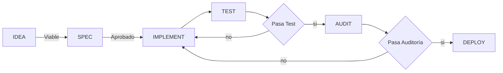

# Introducción y contexto del proyecto

Desarrollé toda la solución utilizando un framework propio que bauticé como `MakIA`: orquestación agéntica, SDD y DDD. El reto pedía una herramienta de gestión de proyectos con cálculo automático de indicadores EVM, Gitflow estricto (`main`, `develop`, `feature/*`, `release/*`) y cuatro unidades (db, backend, frontend, infrastructure).

Flujo global de `MakIA`:



# Herramientas IA

## Agentes y chats

| Herramienta | Uso |
|-------------|-----|
| Claude Code | Flujo inicial SDD, DDD y viabilidad |
| Cursor | Implementación y auditoría |
| Gemini Playground | Investigación |

## LLMs

| Nombre | Razonamiento | Uso |
|--------|-------------|-----|
| Sonnet 5 | Medio/Bajo | Redacción de IDEA y SPEC, orquestador y sub-orquestador, sub-agentes |
| Haiku | Bajo | Sub-agentes, investigación en Internet y MCPs (Context7, GitHub) |
| Grok | Medio | Orquestador, sub-orquestador, sub-agentes, redacción de SPECs, escritura de código, auditoría |
| Composer 2.5 | Bajo | Run test, sub-agentes |

No hay preferencia de marca: eran las herramientas que tenía a mano y con tokens disponibles.

- **Claude Code** arrancó el flujo SDD/DDD/viabilidad con MakIA.
- Cuando se acabó la ventana de 5 h del plan pequeño, pasé a **Cursor** para IMPLEMENT y AUDIT; MakIA retoma la sesión sin importar el agente.
- **Gemini Playground** ya tenía memoria de mi forma de trabajo y de la estructura DDD; lo usé para lenguaje ubicuo y hojas de cálculo.

Los errores durante el desarrollo están documentados en `.makia/error-reports` (no los copio aquí uno a uno).

# Cómo aprendí EVM

Antes de implementar confié en entender las fórmulas por mi cuenta; los tests de pytest vinieron después, no antes.

1. Busqué videos en YouTube con la instrucción `que es valor ganado evm y como funciona`. Me encontré este video: https://www.youtube.com/watch?v=zhoji7SyWXA&t=150s

2. Abrí Gemini en la web y, como ya tiene memoria de la forma en que trabajo y de la estructura de documentos que solicito, le pasé este prompt:

```text
 por favor, crea un archivo .md basado en la estructura de DDD de MakIAcon la información solicitada a continuación, para que sea el lenguaje ubicuo de un proyecto y poder construir un modelo de dominio a partir de esta información


Definir:
- PMI
- Valor Ganado (Earned Value Management), un estándar del PMI 
```

El resultado fue el archivo `.makia/docs/project/lenguaje_ubicuo_evm_pmi.md`.

3. Con una hoja de cálculo me puse a meter datos a lo maldita sea para comprender realmente qué estaba ocurriendo y cómo estaba ocurriendo: https://docs.google.com/spreadsheets/d/1C8eNJ_acspF91dwnIZA5cFz8h6P8zoi5fJp2ehu1VxY/edit?usp=sharing

Los datos no tienen sentido de negocio, pero me sirvieron para entender. Validé las fórmulas ahí **antes** de confiar en que el código las implementara bien.

# Cómo verifiqué que los cálculos son correctos

No me bastó con que el código corriera: quise comprobar que los números cuadraran con PMI y con reglas de consolidado que yo mismo fijé.

1. Video de YouTube (mismo del aprendizaje): https://www.youtube.com/watch?v=zhoji7SyWXA&t=150s — búsqueda `que es valor ganado evm y como funciona`.

2. Prompt a Gemini → `.makia/docs/project/lenguaje_ubicuo_evm_pmi.md` (bloque anterior en la sección anterior).

3. Hoja de cálculo manual “a lo maldita sea” (misma URL de arriba): datos sin sentido de negocio, sí para entender el comportamiento de PV, EV, CPI, SPI, etc.

4. Refiné el prompt para una Sheet de validación API vs fórmulas vía MakIA en VS Code:

```text
por favor, revisa la .makia/docs/project y genera un prompt para que un LLM como gemini (no especifiques gemini en el prompt), tenga como objetivo crear una google sheets con las formulas para validar si los datos son correctos
```

Salida (prompt largo que pegué en Gemini):

```text
# Prompt para generar la Google Sheet de validación EVM

Copia y pega el siguiente bloque completo en el asistente que uses para generar la hoja de cálculo.

---

Actúa como un experto en Google Sheets y en gestión de proyectos con Earned Value Management (EVM). Necesito que generes una **Google Sheets nueva** (indícame las hojas, columnas, celdas y fórmulas exactas que debo crear, o genera directamente el archivo si tienes esa capacidad) cuyo único propósito es **validar que los datos de entrada y los indicadores EVM calculados por un backend son correctos**, comparando el valor que "llega" del backend contra el valor recalculado con fórmulas nativas de Sheets.

## Contexto del dominio

El backend calcula, para cada **actividad** de un **proyecto**, estos indicadores a partir de tres datos base: `BAC` (presupuesto al completar), `% avance planificado`, `% avance real` y `AC` (costo real):

- **PV (Planned Value)** = `% avance planificado × BAC`
- **EV (Earned Value)** = `% avance real × BAC`
- **CV (Cost Variance)** = `EV − AC` (favorable si > 0, neutro si = 0, desfavorable si < 0)
- **SV (Schedule Variance)** = `EV − PV` (adelantado si > 0, neutro si = 0, atrasado si < 0)
- **CPI (Cost Performance Index)** = `EV / AC`
- **SPI (Schedule Performance Index)** = `EV / PV`
- **EAC (Estimate at Completion)** = `BAC / CPI`
- **VAC (Variance at Completion)** = `BAC − EAC`

Reglas especiales de nulidad (deben quedar como celda vacía o texto `null`, **nunca** error `#DIV/0!` ni `Infinity`):

- Si `AC = 0` → `CPI = null`, y en cascada `EAC = null` y `VAC = null`. Interpretación de CPI: `"Sin costo real registrado — CPI no aplicable"`.
- Si `PV = 0` → `SPI = null`. Interpretación de SPI: `"Sin avance planificado a la fecha — SPI no aplicable"`.

Interpretación textual de CPI:

| Condición | Texto |
|---|---|
| `cpi` es null | Sin costo real registrado — CPI no aplicable |
| `cpi > 1` | Bajo presupuesto |
| `cpi = 1` | En presupuesto |
| `cpi < 1` | Sobre presupuesto |

Interpretación textual de SPI:

| Condición | Texto |
|---|---|
| `spi` es null | Sin avance planificado a la fecha — SPI no aplicable |
| `spi > 1` | Adelantado |
| `spi = 1` | En plan |
| `spi < 1` | Atrasado |

**Consolidado a nivel de proyecto (regla crítica):** los indicadores de un proyecto NO se calculan promediando los CPI/SPI de sus actividades. Se calculan sumando las bases de todas las actividades del proyecto (`Σ BAC`, `Σ PV`, `Σ EV`, `Σ AC`) y aplicando después las mismas fórmulas de arriba sobre esos totales. Si el proyecto no tiene actividades, todos los totales son 0 y todos los indicadores derivados (CPI, SPI, EAC, VAC) son `null`, sin error.

Validaciones de negocio adicionales que también hay que verificar:

- `% avance planificado` y `% avance real` deben estar en el rango 0–100 (inclusive). Fuera de rango = dato inválido.
- `BAC` y `AC` deben ser ≥ 0. Negativos = dato inválido.
- `name` (nombre de proyecto o actividad) no puede estar vacío.

## Qué debe contener la hoja de cálculo

### Hoja 1 — "Actividades"

Una tabla donde cada fila es una actividad. Columnas, en este orden:

1. `id` (texto/uuid)
2. `project_id` (texto/uuid)
3. `name`
4. `budget_at_completion` (BAC, dato de entrada)
5. `planned_progress_percentage` (dato de entrada, 0–100)
6. `actual_progress_percentage` (dato de entrada, 0–100)
7. `actual_cost` (AC, dato de entrada)
8. `api_pv`, `api_ev`, `api_cv`, `api_sv`, `api_cpi`, `api_spi`, `api_eac`, `api_vac`, `api_cpi_interpretation`, `api_spi_interpretation` — estas 10 columnas son **valores pegados manualmente** desde la respuesta real de la API (yo los pegaré antes de usar la hoja; déjalas vacías o con datos de ejemplo).
9. `calc_pv`, `calc_ev`, `calc_cv`, `calc_sv`, `calc_cpi`, `calc_spi`, `calc_eac`, `calc_vac`, `calc_cpi_interpretation`, `calc_spi_interpretation` — estas 10 columnas deben tener **fórmulas de Google Sheets** que recalculen cada indicador de forma independiente a partir de las columnas 4–7, replicando exactamente las reglas de arriba (incluyendo los casos null y las interpretaciones). Usa `IF`/`IFERROR` para evitar cualquier error de división por cero.
10. `valid_inputs` — fórmula que devuelve `OK` si BAC≥0, AC≥0, ambos porcentajes están en 0–100 y `name` no está vacío; si no, devuelve un texto describiendo qué regla se incumplió (por ejemplo `"% avance real fuera de rango"`).
11. `match_indicators` — fórmula que compara cada `api_*` contra su `calc_*` correspondiente (con una tolerancia numérica pequeña, p. ej. 0.01, para evitar falsos negativos por redondeo) y devuelve `OK` si todos coinciden, o el nombre de los campos que no coinciden (por ejemplo `"cpi, eac"`).

Aplica formato condicional: fila en rojo/rosa si `valid_inputs` o `match_indicators` no es `OK`; verde si ambas son `OK`.

Incluye, como datos de ejemplo precargados en la hoja (para poder probarla sin depender de la API todavía), una fila por cada uno de estos casos límite, dejando las columnas `api_*` vacías para que yo las complete:

| Caso | Descripción | BAC | % planificado | % real | AC |
|---|---|---|---|---|---|
| EC-01 | AC = 0 → CPI/EAC/VAC null | 1000 | 50 | 50 | 0 |
| EC-02 | PV = 0 → SPI null | 1000 | 0 | 30 | 200 |
| EC-04 | Avance real 0%, AC > 0 → EV=0, CPI=0 | 1000 | 40 | 0 | 150 |
| EC-05 | BAC = 0 | 0 | 0 | 0 | 0 |
| EC-06 | Escenario favorable normal | 2000 | 60 | 70 | 1000 |
| EC-08 | Porcentaje fuera de 0–100 (dato inválido) | 1000 | 50 | 120 | 300 |
| EC-09 | BAC o AC negativos (dato inválido) | -500 | 50 | 50 | 100 |

### Hoja 2 — "Consolidado por proyecto"

Una tabla con una fila por `project_id` distinto presente en la Hoja 1. Columnas:

1. `project_id`
2. `total_bac`, `total_pv`, `total_ev`, `total_ac` — sumas (`SUMIF`/`SUMPRODUCT`) de las columnas base de la Hoja 1 filtradas por `project_id`. **Importante:** estas sumas deben construirse a partir de las columnas base (`budget_at_completion`, etc.) y de `calc_pv`/`calc_ev`, nunca promediando indicadores ya calculados.
3. `calc_cpi`, `calc_spi`, `calc_eac`, `calc_vac`, `calc_cpi_interpretation`, `calc_spi_interpretation` — recalculados a partir de los totales anteriores, con la misma lógica de null que a nivel actividad.
4. `match_consolidated` — igual que `match_indicators` de la Hoja 1, comparando `calc_*` contra `api_*`.

Incluye también una fila para un `project_id` sin actividades, para verificar el caso "proyecto sin actividades": todos los totales deben quedar en 0 y CPI/SPI/EAC/VAC deben quedar en `null`, no en error.

### Hoja 3 — "Leyenda y reglas"

Una hoja de solo texto (sin fórmulas) que documente, en lenguaje claro, cada fórmula usada, las reglas de nulidad, y las tablas de interpretación de CPI y SPI, para que cualquier persona del equipo pueda auditar la hoja sin necesidad de leer las fórmulas.

## Formato de entrega

- Entrega las fórmulas de Google Sheets exactas (sintaxis `=SI(...)`/`=IF(...)`, `=SUMAR.SI.CONJUNTO(...)`/`=SUMIFS(...)`, etc. — indica si usas nomenclatura en español o en inglés) listas para pegar en la celda correspondiente, referenciando las columnas por letra o por nombre si usas rangos con nombre.
- Si puedes generar el archivo directamente (Google Sheets, .xlsx o .csv con fórmulas), genera el archivo. Si no puedes generar el archivo, dame la especificación completa celda por celda para que yo la construya.
- No inventes reglas de negocio adicionales a las descritas arriba; si algo no está especificado (por ejemplo, formato de fecha o moneda), usa un valor razonable y decláralo explícitamente como supuesto.

---
```

5. Regla crítica que forcé en ese prompt: consolidado = suma de bases (Σ BAC, Σ PV, Σ EV, Σ AC), **nunca** promedio de CPI/SPI; si AC = 0 → CPI/EAC/VAC null; si PV = 0 → SPI null; nunca `Infinity`.

6. Después, tests de dominio (~80%+ de cobertura, 53 tests en backend) y E2E: proyecto “E2E Release” con PV = 4000, EV = 3500, AC = 4500 → CPI ≈ 0.7778 (“Sobre presupuesto”), SPI = 0.875 (“Atrasado”). Esos números se comprueban a mano: 3500/4500 y 3500/4000.

# Decisiones donde no seguí a la IA

## 1. Fachada de ramas

MakIA (orquestador) iba a crear ramas `makia/<tipo>/<spec-slug>` y dijo que eso “cumplía el rol de feature/*”. El reto (`draft_base.md`) pide literales `feature/*`, `release/*`, `develop`, `main`. Paré el flujo y pedí máscaras para cumplir Gitflow del reto sin reescribir MakIA: `makia/dev/<idea-slug>` = develop, ramas de spec = `feature/<spec-slug>` (no `feature/<tipo>/...`).

Cuando el orquestador terminó IDEA me devolvió:

```text
Cuando pase a SPEC, cada unit-spec creará su rama como makia/<tipo>/<spec-slug> (no feature/* literal) porque así lo resolvió git.md — esa rama es la que cumple el rol de feature/* en este proyecto, no un nombre distinto. Y antes de cualquier merge a develop, release/* o main te muestro el resumen de cambios y espero tu confirmación, tal como pediste.
```

Ahí vi que la estructura de ramas no estaba correcta. Pedí detener sub-agentes y replantear:

```text
debemos para y replantear el tema de las ramas, porque este proyecto debe cumplir un estandar
```

Iteración con la IA y mi respuesta (conservo el texto tal cual):

```text
El documento del reto (draft_base.md) pide literalmente ramas feature/* y release/*. git.md actual mapea ese rol a la convención interna de MakIA (makia/<tipo>/<spec-slug>) en vez de usar el prefijo literal "feature/". ¿Cómo quieres resolverlo?

debes hacer una adaptación tipo fachada para que MakIA siga funcionando sin problemas y respete la estructura que el proyecto establece

makia/dev/<idea-slug> = develop
makia/<tipo>/<spec-slug> = feature/<tipo>/<spec-slug>

MI RESPUESTA: 
En este proyecto usaremos esas mascaras con la estructura que exige Gitflow del proyecto. pero no cambia nada en MakIA, solo son mascaras de nombre de ramas
```

Usé el término `máscaras` porque es parte del lenguaje ubicuo de MakIA y así me entendió. La idea fue fachada de nombres, no cambiar el motor de MakIA.

## 2. No rebase; solo PR a develop

Tras mergear db a develop, el orquestador preguntó si seguía con **rebase** de `feature/evm-project-tool-backend` sobre develop. No acepté esa vía: exigí Gitflow con PR a develop y resolver conflictos antes del PR.

```text
el PR anterior ya está en develop, hay que hacer pull en develop.
```

```text
solo PR, a develop y resolver conflictos antes de crear el PR
```

```text
por qué usaste rebaso?
```

El agente respondió que “rebaso” fue error de redacción y que en realidad hizo `git merge origin/develop`. El punto es que no seguí la sugerencia de rebase.

# Decisión de arquitectura

Decidí una arquitectura cliente-servidor para toda la solución: la vi como un MVP que puede ir escalando y lo que buscaba al inicio era validar la funcionalidad dura (cálculo EVM).

Esto es independiente de lo que MakIA trae por defecto:

- **Backend dueño de las fórmulas**; el frontend solo captura, envía y pinta.
- **Sin ORM**; migraciones con yoyo.
- **Cuatro unidades** en cadena: db → backend → frontend → infrastructure.
- **Compose local**, no cloud: el MVP corre en localhost con un solo comando.

La hexagonal en backend es convención de MakIA que acepté; no la vendo como algo 100 % inventado por mí, pero encaja con separar dominio de infraestructura.

# Desarrollo

Omití notificaciones automáticas del host y duplicados accidentales. Abajo van los prompts que marcan el historial real, en orden cronológico.

## Arranque del proyecto (Claude Code)

Claude Code ejecutó este prompt:

```text
Ante de iniciar, lee el documento:
@.makia/docs/project/lenguaje_ubicuo_evm_pmi.md
Después de leer el documento, puedes entender el negocio de la solución que vamos a construir.
Inicia el flujo MakIA y ayúdame a construir la aplicación descrita en @.makia/docs/project/draft_base.md: una herramienta de gestión de proyectos con cálculo automático de indicadores de Valor Ganado (EVM).
Antes de escribir una sola línea de código:

1. Lee `@draft_base.md` completo y confírmame que entendiste el alcance: base de datos (Postgres/Docker), backend (FastAPI + Python 3.14, sin ORM, migraciones con yoyo), frontend (React + TS + Vite, sin lógica de negocio), e infraestructura (docker-compose que levante todo con un solo comando).
2. `.makia/config/git.md` si todavía no existe. Créalo como parte del flujo MakIA, tomando como única fuente la sección "Gitflow estricto" al final de `draft_base.md`: estructura de ramas (`main`, `develop`, `feature/*`, `release/*`), la regla de integrar cada feature a `develop` vía Pull Request, y el formato de mensajes de commit (imperativo, descriptivo, sin `fix`/`wip`/`cambios`). No inventes reglas adicionales que el documento no mencione.

Durante el desarrollo:

* Respeta la separación de responsabilidades: toda la lógica de negocio y validaciones viven en el backend; el frontend es solo capa de presentación (captura, envío, recepción y pintado de datos).
* Cada feature (DB, backend, frontend, infraestructura) va en su propia rama `feature/*`, se integra a `develop` vía Pull Request (aunque trabajes en solitario), y antes de mergear a una rama protegida (`develop`, `release/*`, `main`) muéstrame el resumen de cambios y espera mi confirmación.
* Cubre con pruebas unitarias toda la lógica de cálculo EVM (PV, EV, CV, SV, CPI, SPI, EAC, VAC), incluyendo los casos borde mencionados en el documento (AC = 0, sin actividades, avance real = 0), con cobertura mínima del 80% en la capa de negocio, más al menos un test de integración por endpoint.
* Documenta el API con OpenAPI/Swagger accesible localmente, y entrega un `README.md` con los comandos para correr el proyecto y ejecutar los tests.

Deploy: el objetivo de este MVP es correrlo en `localhost` vía `docker-compose`. El código final debe quedar integrado en `main` únicamente después de pasar por `release/*`, siguiendo el flujo de ramas exigido. No merges directo a `main`.
```

### Error 1 — Ramas

Como no cargué a tiempo la configuración personalizada de Gitflow, seguí el proceso y el orquestador creó commits en `main` y `develop`. Antes de SPEC avisó:

```text
He lanzado IDEA (sub-agente-orquestador aislado) sobre la rama develop para procesar la idea completa: viabilidad, draft.md con la descomposición en 4 unit-specs (DB, backend, frontend, infraestructura), diseño de datos (db-design.dbml) y learning.md. Va a delegar a su vez a LEARN/EDITOR/CODE de forma aislada, como exige el contrato de MakIA.

Esto corre en segundo plano — te aviso en cuanto termine con el veredicto de viabilidad y el resumen de draft.md antes de avanzar a SPEC.
```

Al terminar reportó (ver decisión 1 arriba). Mientras aplicaba la corrección, realizó commits en develop porque no tenía la configuración en contexto y se desvió del flujo MakIA que pide commits en ramas `makia/<tipo>/<capacidad>-<unidad>` — la esencia de MakIA es ejecutar specs en paralelo en distintos worktrees.

Confirmación del orquestador:

```text
EDITOR confirma: git.md actualizado y pusheado en de13f54 con la máscara feature/<tipo>/<spec-slug> → makia/<tipo>/<spec-slug> documentada en la tabla de roles y en la nueva sección "Máscara de nombres de rama (fachada)". Sin tocar los artefactos de IDEA (siguen en curso).

Todavía espero a que IDEA termine con viability.md/draft.md/db-design.dbml/learning.md.
```

Después de aquí todo salió con la estructura esperada.

### Error 2 — Ruta specs/

Indiqué mal una ruta por ir con prisa; MakIA la hubiera inferido:

```text
me equivoque indicándote las rutas en .makia/docs/project/draft_base.md

es .makia/docs/specs/apps/<slug>/<spec-name> y no .makia/docs/apps/<slug>/<spec-name> 

hay que corregir esto para que los sub-agentes no se confundan
```

El orquestador respondió (extracto relevante):

```text
Ya envié la corrección a SPEC: mover domain-model.md a la ruta correcta .makia/docs/specs/apps/backend/domain-model.md (con el segmento specs/) y arreglar la referencia relativa rota en design.md, antes de crear INDEX.md.

Voy a corregir draft_base.md y .makia/idea/evm-project-tool/draft.md (ambos en develop) por separado, pero espero a que SPEC termine su trabajo en feature/nuevo/evm-project-tool-db para no chocar cambiando de rama en el mismo directorio de trabajo compartido. Te aviso cuando ambas correcciones queden cerradas.

Rechecked spec branch state after notification

El agente terminó sin aplicar la corrección que le pedí (el segundo mensaje quedó en cola pero no llegó a procesarse antes de que cerrara su turno). El repo confirma que domain-model.md sigue en la ruta incorrecta y no hay INDEX.md... espera, sí hay INDEX.md ya creado (.makia/docs/specs/apps/db/INDEX.md), así que terminó todo el flujo sin aplicar el fix. Voy a reenviar la corrección.

Mensaje a @ae9fd9d850e6916b3
Domain-model.md path fix still not applied

Reenviada la corrección a SPEC, esta vez con permiso explícito para hacerla directamente (mover archivo + arreglar la ruta rota) en vez de re-delegar, ya que es un fix mecánico de una ruta mal indicada, no redacción nueva. Espero confirmación del commit.

Mensaje a @ae9fd9d850e6916b3
Confirmed: deliberate override, execute the move

Confirmé la anulación deliberada a SPEC y aclaré por qué la ruta correcta es .makia/docs/specs/apps/backend/domain-model.md (dentro del árbol de specs, no del código fuente). Está aplicando el fix ahora. En paralelo, cuando termine, corrijo draft_base.md y draft.md en develop, y genero el error-report D-14 correspondiente por la corrección del USUARIO a una decisión que IDEA daba por cerrada.

Buscado código, ejecutado 13 comandos, leyó y editado design.md, ejecutado un agente
+1
-1

SPEC ya cerró evm-project-tool-db con la ruta corregida en su rama. Ahora corriendo en background: EDITOR corrigiendo draft_base.md y draft.md en develop, más la creación del error-report ER-001 (D-14) documentando esta corrección de origen.

Mientras eso termina: evm-project-tool-db está listo para tu revisión. El requirements.md define: esquema PostgreSQL (projects/activities), migraciones yoyo-migrations, constraints de integridad, y lefthook.yml, con reglas RN-01 a RN-05, requerimientos REQ-01 a REQ-04 en EARS, y 5 edge cases — autosuficiente para tu aprobación. ¿Lo apruebas para pasar a evm-project-tool-backend, o quieres verlo primero?
```

## Cambio de agente (Claude Code → Cursor)

Se consumió la ventana de 5 h del plan pequeño de Claude. Cambié a Cursor; MakIA retoma la sesión sin importar agente o LLM (no fue capricho, fue cuota).

### SPEC e integración (Cursor)

Aprobación de requirements de db y paso a backend:

```text
aprobado requirements.md de evm-project-tool-db, confirmo para avanzar a evm-project-tool-backend
```

Requirements de backend (11:09):

```text
aprobado
```

Requirements de frontend (11:18):

```text
aprobado
```

Requirements de infrastructure (11:26); cierra SPEC de las cuatro unidades:

```text
aprobado
```

Integrar db / seguir (11:45):

```text
confirmo
```

Tras merge de db a develop — pull y PR, no rebase (ver decisión 2):

```text
el PR anterior ya está en develop, hay que hacer pull en develop.
```

```text
solo PR, a develop y resolver conflictos antes de crear el PR
```

```text
por qué usaste rebaso?
```

PR de backend mergeado:

```text
ya está el el PR mergeado en develop
```

Siguiente paso:

```text
que sigue?
```

Seguir con frontend (12:33):

```text
si
```

Sub-agentes bloqueados pidiendo aprobación al usuario:

```text
los sub-agentes estan pidiendo aprobación del usuario, esto debe autorizarlo el sub-orquestador
```

Confirmación (1:37):

```text
si
```

Merge listo:

```text
listo, ya está el merge
```

Autorización para no bloquear el flujo:

```text
si y tienes autorización para actuar sin pedir permiso, autoriza a los sub-orquestadores y sub-agentes para que no se bloqueen ni detengan el proceso
```

### AUDIT frontend — ciclo 1 RECHAZADA

Durante frontend, la auditoría ciclo 1 fue **RECHAZADA**: H-01 no había UI CRUD de proyectos; H-02 delete en tabla sin lock. Se corrigió y ciclo 2 **PASA**. Documentado en `.makia/error-reports/ER-013-evm-project-tool-frontend.md`. Esto no se mezcla con los H-01..H-04 de infrastructure.

### AUDIT infrastructure — PASA_CON_OBSERVACIONES

Infrastructure quedó **PASA_CON_OBSERVACIONES** (volumen postgres:18 `/var/lib/postgresql`, `DATABASE_URL` `postgresql://`, README migrate, uvicorn en Dockerfile):

```text
las observaciones se pueden solucionar con otra iteración?
```

Respondió:

```text
Sí. Con PASA_CON_OBSERVACIONES MakIA permite una iteración fuera del ciclo de RECHAZADA: se corrigen las observaciones y luego hay re-AUDIT obligatorio. El spec ya está Completado; esa pasada no reabre alcance de negocio.
```

| Hallazgo | Qué haría la iteración | ¿En esta unidad? |
|---|---|---|
| **H-01** volumen PG | Dejar el mount que funciona en `postgres:18` (`/var/lib/postgresql`) y **actualizar `design.md`** — forzar `/data` rompió E2E | Sí (docs) |
| **H-02** `DATABASE_URL` | Dejar `postgresql://` (yoyo + backend) y **cerrar el contrato en `design.md`** | Sí (docs) |
| **H-03** README | Añadir troubleshooting de fallo de `migrate` (REQ-10.4) | Sí |
| **H-04** uvicorn en compose | Quitar el override: el **Dockerfile del backend** debe incluir `fastapi[standard]` o `CMD` con uvicorn | Mejor en `apps/backend/` (hermano) |

```text
H-01, H-02 y H-03 se cierran en infrastructure. H-04 queda limpio solo si se toca el backend (el PR #4 puede mergearse igual; el override es un parche de orquestación).

Si quieres esa iteración ahora, la lanzo: CODE/EDITOR en infra (+ backend si incluimos H-04) y re-AUDIT ciclo 2.
```

Mi respuesta:

```text
si, por favor aplica la corrección y deja cerrado el spec
```

PR de correcciones en develop:

```text
ya está aplicado el PR en develop
```

### E2E, README y release

Prueba E2E y documentación:

```text
por favor, ayúdame realizando una prueba e2e si todo pasa, limpia el README.md y documenta como levantar el proyecto
```

PR a main solo por README:

```text
crea el PR a main para aplicar los cambios de README.md
```

PR aplicado:

```text
ya está aplicado el PR
```

Release, E2E y deploy a main:

```text
por favor, realiza el paso a release/*, ejecuta la prueba e2e y si todo pasa correctamente, DEPLOY (main)
```

Confirmación del PR a main:

```text
creaste el PR ahcia main?
```

El orquestador respondió:

```text
EVM Project Tool v0.1.0 está en main.

Release: se usó release/evm-project-tool (mismo árbol que main tras el PR #5).
E2E: stack y API PASS; UI del navegador no verificada (el MCP no abrió pestaña). Con eso se autorizó el deploy.
Deploy: no hay .makia/config/deploy.md (no hay cloud). La promoción fue PR a main + tag + GitHub Release.
```

| Qué | Dónde |
| --- | --- |
| PR a `main` | https://github.com/pablo3dev/evm_calculator/pull/6 (merged, `b3eda21`) |
| Release | https://github.com/pablo3dev/evm_calculator/releases/tag/v0.1.0 |
| Backport a `develop` (README + notas) | https://github.com/pablo3dev/evm_calculator/pull/7 (merged) |

```text
Evidencia E2E: primer docker compose up --build, migrate exit 0, HTTP 200 en /api-docs, /api/v1/projects y :8080; proyecto E2E Release con CPI ~0.78 (sobre presupuesto) y SPI 0.875 (atrasado); persistencia tras down/up. Stack local ya bajado.
```

Al final le pedí al orquestador que hiciera el flujo para dejar el documento AI_PROCESS.md en main.

```
Por favor, ejecuta el flujo DEPLOY para dejar el documento AI_PROCESS.md en PROD
```

Ultima actualización de mejora:

```
Por favor, ayúdame a implementar una mejora en el forntend.  contexto del desarrollo actual: .makia\docs\specs\apps\frontend\evm-project-tool-frontend

Los indicadores actualmente son difíciles de memorizar y recordar para el usuario.

Los nombres de las abreviaturas  de indicadores deben seguir en inglés sin importar el idioma Pero los nombres en claro en el idioma seleccionado. 
También se deben agregar tooltips reutilizables para todas las convenciones de la UI con el nombre en español, Inglés  y una descripción de lo que es, con la formula si es necesario, para que el usuario pueda siempre tener claridad de qué está viendo y que está editando. 

Actualmente no se visualiza el botón de cambiar idioma a Español/English como lo establecen las reglas de Frontend de MakIA en CODE
```

# Reflexión

Cuando uso SDD y DDD el código sale preciso y predecible con la calidad esperada. El problema es que aumenta el tiempo revisando y aprobando documentos. Eso me consumió parte importante del tiempo: empecé ~10:00 y el correo pedía entrega a las 14:00 del mismo día. No llegué a esa meta de reloj, pero el proyecto queda escalable: specs y modelo de dominio son la fuente de verdad y el código es la materialización. Es un flujo de desarrollo empresarial/corporativo donde la IA es parte del proceso.

### Lo que haría diferente

Mi error inicial fue no leer el email cuando lo recibí: solo confirmé el recibido y no me percaté que la entrega era al día siguiente a las 2:00 pm, di prioridad a compromisos familiares y no arranqué la prueba. Perdí medio día y arranqué la prueba el mismo día de la entrega a las 10:00 am y no alcancé a finalizar a las 2:00 pm como lo indicaba el correo.

Si repitiera el ejercicio:

- Cargaría `git.md` / fachada de ramas **antes** de IDEA, no después de ver commits raros en `main`.
- No indicaría a mano rutas que MakIA ya infiere (como el `/specs/` que omití).
- No aceptaría rebase cuando el reto exige Gitflow con PR a `develop`.
- El cambio Claude → Cursor a mitad fue por cuota del plan, no porque Cursor me pareciera “mejor” por defecto.
